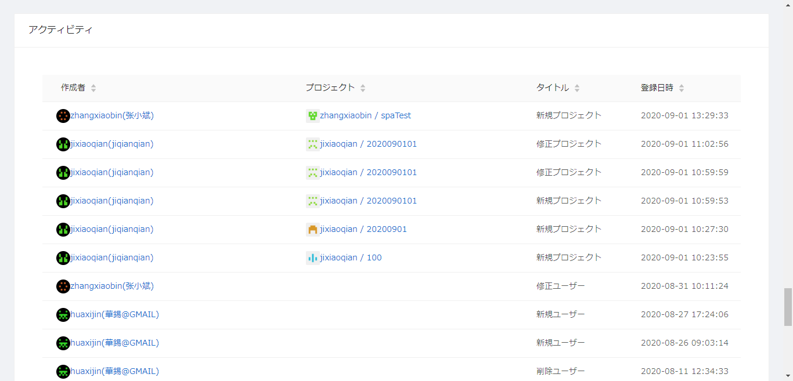
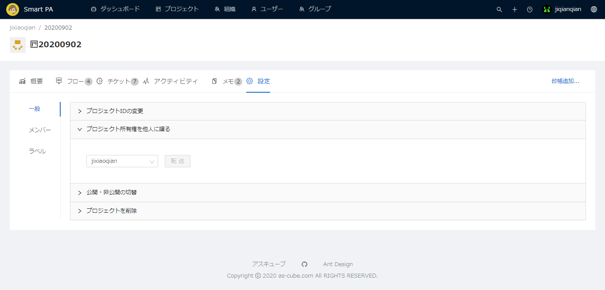
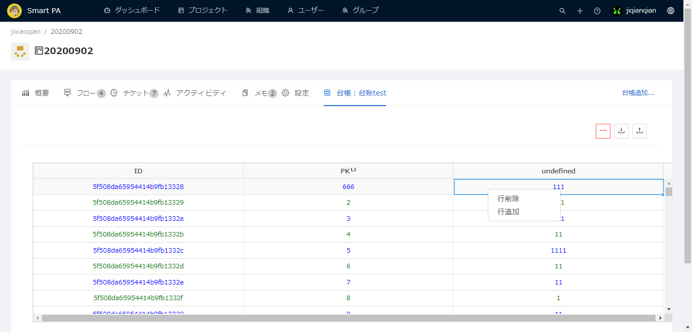

# 1.ログイン

## 1.1ログインインターフェース

◆ SPAオンラインカスタマーサービスログインインターフェイスディスプレイ.

◆ 内容はメール入力ボックス、確認コード入力ボックス、確認コード取得ボタン、ログインボタンです.

## 1.2ログイン手順

◆ 登録した従業員の個人用メールを入力してください.

◆ [コードを取得]ボタンをクリックします.

◆ 個人コードにログインして確認コードを取得します.

◆ 確認コード入力ボックスに確認コードを入力します.

◆ ログインボタンをクリックしてください.

◆ ログイン成功メインインターフェースに入る.

# 2.ダッシュボード

## 2.1チケット状況

◆ 過去半か月のチケット生成ステータスを表示します.

◆ チケットのステータスには、詳細な番号を示すすべてと不完全なものが含まれます.

## 2.2最近1ヶ月間チケット状況

◆ データは円グラフと表で構成されています.

◆ 円グラフとリストで表された、過去1か月の発券作業のステータスを表示します.

◆ 円グラフ--先月の支払い状況と先月の警告状況分布を表示（対応中、警告なし、対応終了を含む3つの状況があります）.

◆ いずれかのケースをクリックすると、ケースの割合グラフが円グラフに表示されます.

◆ 表グラフ--先月のチケット状況を表示（対応中、警告なし、対応終了、キャンセルを含む4つの状況があります）そして警告と数.

◆ プロジェクト名をクリックすると、プロジェクトの詳細なインターフェースにジャンプします. 

## 2.3アイテムリスト

◆ 私のプロジェクト--作成したすべてのプロジェクトを表示します.パブリックプロジェクトとプライベートプロジェクトの2種類があります.プロジェクト名をクリックすると、プロジェクトの詳細なインターフェースにジャンプします.

◆ 関連プロジェクト--関連したすべてのプロジェクトを表示.プロジェクト名をクリックすると、プロジェクトの詳細なインターフェースにジャンプします.

## 2.4フローリスト

◆ よく使われているフロー--頻繁に使用するプロセスを表示し（包括的なビジネスプロセス名、開示、ラベル、ステータス）.プロセスをクリックすると、そのプロセスの詳細なインターフェイスにジャンプします.

◆ 最近更新したフロー--最近更新されたプロセスを表示し.プロセスをクリックすると、そのプロセスの詳細なインターフェイスにジャンプします.

## 2.5アクティビティ

◆ コンテンツには作成者、プロジェクト、タイトル、登録日時が含まれます.

◆ 作成者をクリックすると、作成者詳細インターフェイスにジャンプします.

◆ アイテムをクリックすると、アイテム詳細インターフェイスにジャンプします.

# 3.プロジェクト

◆ プロジェクトには3つのモジュールが含まれています：私のプロジェクト、関連プロジェクト、公開プロジェクトします.

## 3.1私のプロジェクト

◆ コンテンツには検索ボックス、新規、が含まれます.

◆ 検索バー--プロジェクト名その他の情報を検索し、右側の虫眼鏡ボタンをクリックしてプロジェクトを検索します.

◆ 新規--[新規]ボタンをクリックして、新しいプロジェクトインターフェイスにジャンプします.

.png)

◆ マウスをプロジェクト名に移動すると、画面にアバター、プロジェクト名、コメント情報が表示されます.

◆ クリエーターをクリックすると、クリエーター詳細インターフェイスにジャンプします.

◆ プロジェクトをクリックすると、詳細なプロジェクトインターフェースにジャンプします.

.png)

◆ 前面のラジオボタンをクリックして、単一またはすべての選択で削除します.

### 3.1.1プロジェクト新規

◆ [新規]ボタンをクリックして、新しいプロジェクトインターフェイスにジャンプします.

.png)

◆ ここで新しいプロジェクトを作成できます.

◆ プロジェクトID--必須フィールド、ここにプロジェクトIDを入力してください.プロジェクトIDを繰り返すことはできません.プロジェクトが正常に作成された後、プロジェクトIDは変更できません.

◆ メモ--ここに関連するメモを入力できます.

◆ 公開--プロジェクトを作成するにはパブリックまたはプライベートの2つの方法があります.パブリックとは、誰でもプロジェクトを表示できることを意味します.非パブリックとは、あなただけがプロジェクトを表示できることを意味します.

◆ 保存--すべてのプロジェクト情報を入力したら、[保存]をクリックしてプロジェクトを保存します.プロジェクトに表示されます.

◆ 保存されました，プロジェクトの詳細インターフェイスにジャンプします.

### 3.1.2プロジェクト詳細ページ

.png)

◆ プロジェクトIDをクリックすると、画面がプロジェクト詳細インターフェイスにジャンプします.

◆ 内容：概要、フロー、チケット、アクティビティ、メモ、設定、台帳追加.

#### 3.1.2.1概要

.png)

◆ プロジェクトID--プロジェクIDが表示され、変更できません.

◆ 所有者--プロジェクト作成者詳細画面にジャンプ.

◆ 更新日--最終更新日を表示する.

◆ メモ--ここに注意事項が表示されています.

◆ 公開--プロジェクトがパブリックかプライベートかをここで指定します.

◆ 編集--詳細編集画面にジャンプ.

.png)

◆ 所有者--プロジェクト作成者を表示、所有者名をクリックすると、画面がユーザー詳細インターフェイスにジャンプします.

.png)

◆ 画面に「編集」ジャンプページが表示されます.

◆ プロジェクトID--プロジェクトIDが表示され、変更できません.

◆ メモ--メモの内容を表示、追加または変更可能.

◆ 公開--ここに表示されるアイテムはパブリックまたはプライベートであり、自由に変更できます.

◆ 無効にする--アイテムが無効化されているかどうかがここに表示され、自由に変更できます.

◆ 変更が必要なプロジェクトのコンテンツを変更したら、[保存]ボタンをクリックして、変更したプロジェクトのコンテンツを保存します.

#### 3.1.2.2フロー

.png)

◆ 検索バー--フロー名やその他の情報を検索し、右側の虫眼鏡ボタンをクリックしてアイテムを検索します.

◆ ラベル--関連タグを表示.

◆ [新規]ボタンをクリックして、新しいフローインターフェイスにジャンプします.

.png)

◆ リスト情報には業務フロー名称、公開が含まれます.

◆ マウスをビジネスフロー名に移動すると、画面にビジネスフロー名とフローステータスが表示されます.

◆ 業務フロー名をクリックすると、画面がフロー詳細ページにジャンプします.

.png)

◆ 前面のラジオボタンをクリックして、単一またはすべての選択で削除します.

##### 3.1.2.2--1フロー作成

.png)

◆ [新規]ボタンをクリックして、新しいフローインターフェイスにジャンプします.

.png)

◆ プロジェクト--プロジェクト名このプロジェクトの下に新しいフローを作成します.

◆ 業務フロー名称--フロー名をもう一度入力して、新しいフローを作成します.

◆ フローコメント--ここに関連するコメントを記入できます.

◆ 全体処理時間--全体の処理時間はここで調整できます.

◆ 保存ボタンをクリックして、作成した新しいフローを保存します.

.png)

◆  画面がフロー詳細インターフェイスにジャンプします.

##### 3.1.2.2--2フロー編集

.png)

◆「編集」をクリックして、詳細の編集画面にジャンプします.

.png)

◆ プロジェクト--プロジェクト名このプロジェクトの下に新しいフローを作成します.

◆ 業務フロー名称--フロー名をもう一度入力して、新しいフローを作成します.

◆ フローコメント--ここに関連するコメントを記入できます.

◆ 全体処理時間--全体の処理時間はここで調整できます.

◆ 保存ボタンをクリックして、作成した新しいフローを保存します.

##### 3.1.2.2--3フローエディター

◆ フローエディター--ワークフローエディターをクリックして、ワークフローエディターの詳細画面にジャンプします.

###### ◆ ボタン紹介

◆ これはプロセスプロセッサの詳細画面です.

◆ クラウドへ保存--ボタンをクリックしてフローをクラウドに保存します.

◆ クラウドから取得--ボタンをクリックしてクラウドからフローを取得します.

◆ Undo--ボタンをクリックして前の操作を元に戻します.

◆ Redo--ボタンをクリックして再操作します.

◆ Copy--ボタンをクリックしてオペレーションをコピーします.

◆ Paste--ボタンをクリックして操作を貼り付けます.

◆ Delete--ボタンをクリックして操作を削除します.

◆ ズームイン--ボタンをクリックして内容を拡大します.

◆ ズームアウト--ボタンをクリックして内容を減らします.

◆ フィットマップ--ボタンをクリックして、適切なマップモードに切り替えます.

◆ ズームをリセット--ボタンをクリックしてズーム操作をリセットします.

◆ 全画面--ボタンをクリックして全画面モードに切り替えます.

◆ 試験実行--ボタンをクリックして、テストチケット画面にジャンプします.

###### ◆ノード紹介

◆ 開始--ノードの始まりとして.

◆ 一般--ノードのプロファイル情報がここに表示されます.

◆ ラベル--タグを追加または変更できます.

◆ 目標時間--ターゲット時間を追加または変更できます.

◆ メモ--備考を追加または変更できます.

◆ 作業内容--あなたは仕事の内容の詳細を追加することができます、ツールは言葉に似ています.

◆ アクション--アクションスクリプトを追加または変更できます.

◆ ラベル--タグを追加または変更できます.

◆ コード--関連するコードを追加または変更できます.

◆ 権限--フローを使用する個々の従業員または組織の権限を追加します.

◆ ユーザー追加--ユーザー権限を追加する.

◆ グループ追加--組織の権限を追加する.

◆ 処理--処理ノードは開始ノードと同じです.

◆ メーラー--メールボックス送信ノード.

◆ 一般--ノードのプロファイル情報がここに表示されます.

◆ ラベル--タグを追加または変更できます.

◆ 目標時間--ターゲット時間を追加または変更できます.

◆ メモ--備考を追加または変更できます.

◆ メーラー--CC受信者を追加して、メールの内容を入力できます.

◆ 宛先--受取人を記入.

◆ CC--CC受信者を入力します.

◆ BCC--BCC受信者を入力します.

◆ 添付--添付ファイル情報を追加する.

◆ 件名--ファイル名を追加.

◆ 本文--メールの具体的な内容を入力してください.

◆ 権限--フローを使用する個々の従業員または組織の権限を追加します.

◆ ユーザー追加--ユーザー権限を追加する.

◆ グループ追加--組織の権限を追加する.

◆ 入力--ノードの入力部分として.

◆ 一般--ノードのプロファイル情報がここに表示されます.

◆ ラベル--タグを追加または変更できます.

◆ 目標時間--ターゲット時間を追加または変更できます.

◆ メモ--備考を追加または変更できます.

◆ 作業内容--あなたは仕事の内容の詳細を追加することができます、ツールは言葉に似ています.

◆ 入力項目--入力項目を追加できます.

◆ 権限--フローを使用する個々の従業員または組織の権限を追加します.

◆ ユーザー追加--ユーザー権限を追加する.

◆ グループ追加--組織の権限を追加する.

◆ 判断--ノードの判断部分として.

.png)

◆ 一般--ノードのプロファイル情報がここに表示されます.

◆ ラベル--タグを追加または変更できます.

◆ 目標時間--ターゲット時間を追加または変更できます.

◆ メモ--備考を追加または変更できます.

◆ 作業内容--あなたは仕事の内容の詳細を追加することができます、ツールは言葉に似ています.

◆ アクション--アクションスクリプトを追加または変更できます.

◆ ラベル--タグを追加または変更できます.

◆ コード--関連するコードを追加または変更できます.

◆ 判断--関連する判断を追加する.

◆ 権限--フローを使用する個々の従業員または組織の権限を追加します.

◆ ユーザー追加--ユーザー権限を追加する.

◆ グループ追加--組織の権限を追加する.

◆ 終了--終了ノードは開始ノードと同じです.

###### ◆ セットアップ紹介

◆ ボタンをクリックして設定ボックスを開きます.

◆ 一般--ワークフローの設定ファイル情報が表示されます.

◆ チャート名称--ここにチャート名を入力します,これは必須です.

◆ インポート--関連するアイコンファイルをアップロードできます.

◆ エクスポート--ダウンロード可能な関連アイコンファイル.

◆ 変数--関連する変数値を追加できます.

◆ バージョン--変更されたバージョンを表示.

##### 3.1.2.2--4チケット作成

◆ チケットを作成し、チケットの値を編集できます.

◆ ここでチケット関連の値を編集できます.

◆ [OK]をクリックすると、画面がチケット作成の詳細画面にジャンプします.

◆ チケット番号--チケット名は変更または追加できます.

◆ プロジェクト--クリエーターとプロジェクト名が表示され、クリエーターをクリックするとクリエーター詳細画面に、アイテムをクリックするとプロジェクト詳細画面にジャンプできます.

◆ フロー--フロー名を表示し、クリックしてフロー詳細画面にジャンプします.

◆ 目標時間--目標時間を表示.

◆ 作成者--作成者の名前を表示し、クリックして作成者の詳細画面にジャンプします.

◆ 作成時刻--正確な作成時間を表示する.

◆ 類似チケット--虫眼鏡ボタンをクリックして、類似するすべての関連チケットを検索します.

◆ ステータス--現在のワークフローノードを表示する.

◆ 経過時間--発券開始から現在までの時間を表示、時間はリアルタイムで変化.

◆ 一時停止--現在のチケットプロセスを一時停止し、必要に応じて再開することを選択できます.

◆ 取消--特別な理由により、現在生成されているチケットをキャンセルすることを選択できます.

◆ 復活--チケットプロセスが終了した後でも、チケットを復活させることを選択できます.

◆ キャンセルには3つの理由があります.1、チケットは違反2、自動解決は3、その他の理由.

◆ 作業ログ--作業ログをダウンロードできます.

###### ◆ 作業詳細

◆ 作業詳細--チケット操作の詳細なプロセスはここに示され、スタッフはチケットの特定のプロセスをここに接続します.

◆ 番号とノード情報を表示する.

◆ 経過時間--プロセスでノードが経過した時間を表示し、時間をリアルタイムで変更および更新します.

◆ 目標時間--ノードの目標設定の処理時間を表示します.

◆ 開始時刻--ノードの開始時間を表示します.

◆ 完了時刻--ノードの完了時間を表示します.

◆ 作業内容--ノードの詳細なジョブコンテンツを表示する.

◆ 操作者--ノードのオペレーターを表示する.

◆ 次ヘ--【次ヘ】ボタンをクリックして、チケット処理を次のステップに進めます.

◆ 閉じる--完了したチケットプロセス.[閉じる]をクリックして、チケットプロセスの終了を表示できます.

###### ◆ フロー図 

◆ 業務フロー図--ビジネスプロセス図の図面をここに示します.

##### 3.1.2.2--5転送

◆ 転送--をクリックして、プロセスに関連するすべてのトラブルチケットを別のプロジェクトに移動します.

##### 3.1.2.2--6概要

◆ 概要--グリッドは年間フローの全体的な概要を示しています

##### 3.1.2.2--7分析

◆ 分析--年次プロファイル分析を表示.

##### 3.1.2.2--8チケット

◆ チケット--フローによって生成されたチケットを表示する.

◆ IDをクリックすると画面がチケット詳細インターフェースにジャンプします.

##### 3.1.2.2--9トリガー

◆ IMAPアカウント.

◆ ホスト、ユーザー、パスワードなどを入力してください.

◆ IMAPアカウントを監視、指定される条件を満たすメール、指定されるパーサー方法でこのメールを解析して、チケットを作成する.

#### 3.1.2.3チケット

◆ リスト情報にはID、チケット名称、ステータス、フロー、作成日、ラベルが含まれます.

◆ ID--IDをクリックすると、チケットの詳細画面にジャンプします.

◆ フロー--フローをクリックすると、フローの詳細画面にジャンプします.

◆ 前面のラジオボタンをクリックして、単一またはすべての選択で削除します.

#### 3.1.2.4アクティビティ

◆ アクティビティ--過去のアクションを表示.

#### 3.1.2.5メモ

◆ メモ--メモを表示、追加または変更できます.

◆ コンテンツには検索ボックス、新規が含まれます.

◆ 検索バー--タイトルの情報を検索し、右側の虫眼鏡ボタンをクリックしてノートを検索します.

◆ 新規--「新規」ボタンをクリックして、新しいノートインターフェースにジャンプします.

◆ リスト情報には作成者、タイトル、登録日時が含まれます.

##### 3.1.2.5--1新規

◆ 新規 --[新規]ボタンをクリックすると、ページが[新規]画面にジャンプします.

◆ プロジェクト--ここにプロジェクト名が表示されます.

◆ タイトル--ここにメモのタイトルを入力してください.

◆ メモ--ここに注意が必要な事項の内容説明を記入してください.

◆ 作成が完了したら、[保存]をクリックして作成したメモを保存します.

◆ 正常に保存され、画面がメモの詳細インターフェイスにジャンプします.

◆ プロジェクト--ここにプロジェクト名が表示されます.特定のプロジェクト名をクリックすると、ページがプロジェクト詳細ページにジャンプします.

◆ タイトル--メモのタイトルがここに表示されます.

◆ 作成者--通知の作成者はここに表示されます.

◆ 更新日--通知の最終変更日はここに表示されます.

◆ メモ--ここに示す注意事項の具体的な内容.

##### 3.1.2.5--2メモ編集

◆ [編集]をクリックすると、ノート編集の詳細ページにジャンプします.

#### 3.1.2.6設定

◆ 設定には一般、メンバー、ラベルの3つのメインコンテンツが含まれます.

##### 3.1.2.6--1一般

◆ コンテンツにはプロジェクトのIDの変更、プロジェクトのすべてのヒを人に譲る、公用と私用の入れ替え、および4つの主要モジュールの削除が含まれます.

◆ プロジェクトIDの変更--ここでプロジェクトIDを変更できますが、作成したプロジェクトIDは使用できません.

◆ IDの変更を確認したら、[改名]ボタンをクリックしてプロジェクトIDを変更します.

◆ プロジェクト所有権を他人に譲る--ここではプロジェクトのすべてのコンテンツを他の責任あるユーザーに転送できます.

◆ 転送するユーザーを選択し、進むをクリックしてプロジェクトのすべてのコンテンツをユーザーに転送します.

◆ 公開・非公開の切替--ここではプロジェクトのステータスがプライベートかパブリックかを選択できます.

◆ プライベートまたはパブリックを選択し、スイッチをクリックして達成します.

◆ プロジェクトを削除--ここでアイテムを削除できます.

◆ 削除されたプロジェクトは復元できません！

◆ プロジェクトを除去すると、そのリポジトリと、課題、マージリクエストなどを含むすべての関連リソースが削除されます.

##### 3.1.2.6--2メンバー

◆ メンバー招待--対応するメンバーに権限を設定する.

◆ メンバーを選択し、このプロジェクトに一緒に参加するように招待し、対応する権限を与えることができます.

◆ メンバーIDまたはメール--会員番号を入力するか、ここにメールで送信してください.

◆ 権限--ここで対応する機能の下でユーザーが使用できる権限を選択します.

◆ 招待するメンバーとメンバーの権限を選択したら、[招待]をクリックすると、メンバーが正常に参加します.

◆ 成功したメンバーの情報、参加プロジェクトの権限、および関連するプロジェクト機能が以下に表示されます.

◆ 上の画像は特定のプロジェクト権限を示しています.

◆ ここでプロジェクトにグループを招待できます.

◆ グループID--対応するグループIDを入力し、プロジェクトを入力する必要があるグループを追加します.

◆ 権限-組織が利用できる権限を、対応する機能の下で選択します.

◆ 招待する組織とその権限を選択したら、[招待]をクリックすると、組織が正常に参加します.

◆ 以下に成功した組織、プロジェクトへの参加許可、および関連するプロジェクト機能に関する情報を示します.

◆ 上の画像は特定のプロジェクト権限を示しています.

##### 3.1.2.6--3ラベル

◆ コンテンツには、フローとチケットの2つの部分が含まれます.

◆ 追加--[追加]をクリックすると、追加ボックスがポップアップします.

◆ タグ色--ラベルの色は自由に選択できます.

◆ ラベル--ラベルを自由に記入.

◆ 説明--説明を入力または変更します.

◆ 操作--保存またはキャンセルを選択できます.

◆ 追加--[追加]をクリックすると、追加ボックスがポップアップします.

◆ タグ色--ラベルの色は自由に選択できます.

◆ ラベル--ラベルを自由に記入.

◆ 説明--説明を入力または変更します.

◆ 操作--保存またはキャンセルを選択できます.

#### 3.1.2.7台帳

◆ 台帳追加--ここに新しい台帳を追加できます.

◆ 台帳のタイトルを入力し、をクリックして新しい元帳を追加します.

◆ 台帳削除--削除ボタンをクリックして、元帳を削除します.

◆ 台帳ダウンロード--台帳の内容をダウンロードするには、ダウンロードボタンをクリックします.

◆ 台帳アップロード--アップロードボタンをクリックして、ドキュメントの元帳のコンテンツを選択してアップロードします.

◆ 台帳変更--フォームをダブルクリックして、元帳情報を変更します.

◆ ID変更不可、ユーザーID、ユーザー名、メールアドレス、電話番号、備考変更可.

◆ 行を削除または追加するにはマウスを右クリックします.

## 3.2関連プロジェクト

◆ 関連プロジェクトがここに表示されます.プロジェクトは自分で作成し、一部は参加するように指定できます.

◆ コンテンツには検索ボックス、新規、密度、フルスクリーン、更新、列設定が含まれます.

◆ 検索バー--プロジェクト名その他の情報を検索し、右側の虫眼鏡ボタンをクリックしてプロジェクトを検索します.

◆ 新規--[新規]ボタンをクリックして、新しいプロジェクトインターフェイスにジャンプします.

◆ リスト情報にはプロジェクトID、メモ、登録日時が含まれます.

◆ プロジェクトをクリックすると、プロジェクトの詳細ページに移動します.

◆ 詳細は「私のプロジェクト」と同じ.

## 3.3公開プロジェクト

◆ 公開プロジェクトがここに表示され、自分や他の人が作成したパブリックプロジェクトがここに表示されます.

◆ コンテンツには検索ボックス、新規、密度、フルスクリーン、更新、列設定が含まれます.

◆ 検索バー--プロジェクト名その他の情報を検索し、右側の虫眼鏡ボタンをクリックしてプロジェクトを検索します.

◆ 新規--[新規]ボタンをクリックして、新しいプロジェクトインターフェイスにジャンプします.

◆ リスト情報にはプロジェクトID、メモ、登録日時が含まれます.

◆ プロジェクトをクリックすると、プロジェクトの詳細ページに移動します.

◆ 詳細は「私のプロジェクト」と同じ.

# 4.組織

◆ 2つの大きなブロック、ツリー図と組織の詳細な関連付け状況に分かれています.

## 4.1新規

◆ 新規--[新規]をクリックして、新しい組織画面にジャンプします.

◆ 新しい組織の詳細画面を表示し、情報を入力して新しい組織を作成します.

◆ 組織ID--組織IDを入力してください、繰り返しはできません.

◆ 組織--繰り返しではなく、組織の名前を入力してください.

◆ 上級組織--上位組織を選択できます.

◆ メモ--記入上の注意.

◆ 保存--詳細を入力したら、[保存]をクリックして新しい組織を生成します.

◆ 保存に成功すると、画面が組織のホームページに戻り、新しく作成した組織がホームページのツリー図に表示されます.

## 4.2概要

◆ ツリービューで任意の組織をクリックして、概要の詳細を表示します.

◆ 組織ID--組織IDを表示.

◆ 組織名--組織名を表示.

◆ 作成日--組織の正確な日付を表示する.

◆ メモ--この組織のメモを表示.

### 4.2.1編集

◆ 編集ボタンをクリックして、組織の編集詳細画面にジャンプします.

◆ 組織編集--組織情報を編集する.

◆ 組織ID--組織IDは変更できません.

◆ 組織--組織名を変更できます.

◆ 上級組織--親組織を変更して置き換えることができます.

◆ メモ--変更可能なメモ.

◆ 保存--変更が完了したら、保存ボタンをクリックして、変更された新しい組織情報を保存します.

### 4.2.2新規(サブ組織)

◆ 新規--サブ組織を作成できます.

◆ 新しい組織の詳細画面を表示し、情報を入力して新しい組織を作成します.

◆ 組織ID--組織IDを入力してください、繰り返しはできません.

◆ 組織--繰り返しではなく、組織の名前を入力してください.

◆ 上級組織--親組織はデフォルト組織であり、変更できます.

◆ メモ--記入上の注意.

◆ 保存--詳細を入力したら、[保存]をクリックして新しい組織を生成します.

◆ 保存に成功すると、画面が組織のホームページに戻り、新しく作成した組織がホームページのツリー図に表示されます.

## 4.3関連ユーザー

◆ 関連ユーザーを表示.

◆ 検索バー--関連ユーザーの情報を検索し、右側の虫眼鏡ボタンをクリックして関連ユーザーを検索します.

◆ 追加--関連ユーザーを追加できます.

◆ リストのコンテンツにはユーザーID，ユーザー名称，メールアドレス，登録日時が含まれます.

◆ ユーザーID--ユーザーIDをクリックすると、ユーザー詳細画面にジャンプします.

◆ 追加-- [追加]をクリックして、関連するユーザーの詳細を追加する画面にジャンプします.

◆ ユーザーを追加--関連付ける関連ユーザーを選択し、[追加]をクリックして関連する新しいユーザーを追加します.

## 4.4サブ組織

◆ 本社の下位組織を表示.

◆ 検索バー--サブ組織の情報を検索し、右側の虫眼鏡ボタンをクリックしてサブ組織を検索します.

◆ リストのコンテンツには組織ID，上級組織，組織名，ユーザー数，登録日時が含まれます.

◆ 組織ID--組織IDをクリックすると組織詳細画面にジャンプします.

◆ 上級組織--上級組織をクリックすると組織詳細画面にジャンプします.

## 4.5組織詳細画面

◆ 組織の要約とリストの2つの部分を含む.

◆ 組織ID--組織IDを表示.

◆ 組織名--組織名を表示.

◆ 作成日--組織の正確な日付を表示する.

◆ メモ--この組織のメモを表示.

◆ 編集，新規(サブ組織)，関連ユーザーサブ組織同上.

# 5.ユーザー

◆ コンテンツには検索ボックス、新規、ダウンロード、アップロード、が含まれます.

◆ 検索バー--ユーザーID、ユーザー名称、ユーザーメールボックスなどのユーザー情報を入力し、右側の虫眼鏡ボタンをクリックしてユーザーを検索します.

◆ 新規--[新規]ボタンをクリックして、新しい規制のユーザーインターフェイスにジャンプします.

◆ ダウンロード--ダウンロードボタンをクリックして、すべてのユーザー情報をダウンロードします.

◆ アップロード--アップロードボタンをクリックし、ダウンロードしたフォームに従ってアップロードするマルチユーザー情報を入力します、アップロードできます.

◆ リスト情報にはユーザーID、ユーザー名称、メールアドレス、ロール、登録日時が含まれます.

◆ ダウンロードボタンをクリックすると、現在のすべてのユーザー情報をExcelフォームに追加できます.

◆ 上の画像はダウンロードしたフォームを示しています.

◆ リスト情報にはユーザーID、ユーザー名、メールアドレス、ロール、登録日時が含まれます.

◆ 以前にダウンロードしたフォームを入力し、ユーザーコンテンツを入力して、[アップロード]をクリックします.ユーザー情報をワンクリックでアップロードできます.

## 5.1新規

◆ [新規]ボタンをクリックして、新しい規制のユーザーインターフェイスにジャンプします.

◆ 新しいユーザーを作成する.

◆ ユーザーID--必須フィールド、正常に登録されたユーザーIDとして、正常に登録されると、変更できません.

◆ メールアドレス--必須フィールド、1つのメールボックスに登録できるユーザーは1人だけです.

◆ ロール--必須フィールド、権限にはシステム管理者と一般管理者の2つのオプションがあります.システム管理者は広範な権限を持ち、システムの内容全体を表示できます. ゼネラルマネージャーには狭い権限があり、ダッシュボードとプロジェクトのみを表示できます.

◆ ユーザー名称--必須フィールド、ユーザー名を入力してください.登録が成功したら、名前を変更できます.

◆ 画像--ユーザーのアバターとして使用する写真をアップロードします.

◆ 携帯番号--ユーザーの携帯電話番号を入力します.

◆ 備考--備考情報を記入.

◆ 保存--新しいユーザー情報の作成が完了したら、[保存]ボタンをクリックして保存が成功したことを表示し、画面がユーザーの詳細インターフェイスにジャンプします.

## 5.2ユーザー詳細画面

◆ プロファイルをクリックして、ロガーのプロファイルの詳細ページに入ります.

### 5.2.1編集

◆ 編集--編集ボタンをクリックします，詳細の編集インターフェイスに移動できます.

◆ 上の画像はログイン詳細の編集インターフェースを示しています.

◆ ユーザーID--ユーザーのIDがここに表示され、変更できません.

◆ メールアドレス--メールアドレスはここに表示され、変更できません.

◆ ロール--ユーザー権限がここに表示され、権限を変更できます.

◆ ユーザー名称--ユーザー名はここに表示され、変更できます.

◆ 画像--ユーザーのアバターがここに表示されます.これは任意に変更できます.

◆ 携帯番号--ユーザーの携帯電話番号がここに表示されます.これは変更できます.

◆ 備考--備考はここに表示されます.備考を追加または変更できます.

◆ 無効にする--無効がここに表示されます.無効にするかどうかを選択します.

◆ 変更が完了したら、[保存]ボタンをクリックして新しいユーザー情報を保存します.

### 5.2.2詳細

◆ ユーザープロフィールはページの左側にあります.

◆ ID--ユーザーIDを表示.

◆ メール--ユーザーのメールを表示.

◆ ロール--ユーザー権限を表示.

◆ 名前--ユーザーの名前が表示され.

◆ 携帯番号--ユーザーの携帯電話番号がここに表示されます.

◆ 作成日--ユーザーの正確な日付を表示する.

◆ メモ--ユーザーメモはこちら.

### 5.2.3概要

◆ これは過去1年間の発券プロセスと登録者の作業の概要です.

◆ 視覚化されたグラフ表現、効果はより明白です.

### 5.2.4所属グループ

◆ 登録者が所属グループを表示.

◆ このページは所属グループのインターフェースと同じです.

◆ グループID--グループIDをクリックすると、そのグループの詳細画面にジャンプします.

◆ 上位グループ--親グループIDをクリックして、グループの親グループにジャンプします詳細画面をクリックします.

### 5.2.5プロジェクト

◆ 登録者が作成または参加しているすべてのプロジェクトを表示する.

◆ インターフェースはプロジェクトのインターフェースと同じです.

◆ プロジェクト--プロジェクト名をクリックすると、ページがプロジェクトの詳細ページにジャンプします.

### 5.2.6フロー

◆ 登録者が作成または参加したすべてのフロー情報を表示します.

◆ ページはフローホームページと同じです.

◆ フロー名称--業務フローをクリックして、フローインターフェースにジャンプします.

◆ プロジェクト名称--プロジェクト名称をクリックすると、ページがプロジェクトの詳細ページにジャンプします.

◆ プロジェクト--プロジェクト名をクリックすると、ページがプロジェクトの詳細ページにジャンプします.

### 5.2.7チケット

◆ 登録者が作成および参加されたチケットを表示する.

◆ このページはチケットの詳細ページと同じです.

◆  ID--IDをクリックしてチケットの詳細ページに入ります.

◆ フロー--業務フローをクリックして、フローインターフェースにジャンプします.

### 5.2.8アクティビティ

◆ 登録者の最近の活動の詳細を表示.

### 5.2.9メモ

◆ 登録者の作成と参加に関する注意事項の詳細を表示する.

◆ このページは注意の詳細ページと同じです.

◆ プロジェクト--プロジェクトをクリックすると、プロジェクトの詳細ページにジャンプします.

◆ タイトル--タイトルをクリックして、メモの詳細ページに入ります.

# 6.グループ

◆ 2つの大きなブロック、ツリー図とグループの詳細な関連付け状況に分かれています.

## 6.1新規

◆ 新規--[新規]をクリックして、新しいグループ画面にジャンプします.

◆ 上図：新しい組織ページの作成.

◆ グループID--必須フィールド、新しい組織が正常に作成されると、組織IDを変更できなくなります.

◆ タイトル--必須フィールド、新しい組織の名前を入力します.これは、作成が成功した後で変更できます.

◆ 上位グループ--上位組織を選択できます、企業が企業レベルのものをより効率的に管理できるようにします.

◆ メモ--備考が必要な内容を記入.

## 6.2概要

◆ ツリービューで任意のグループをクリックして、概要の詳細を表示します.

◆ グループID--グループIDを表示.

◆ グループ名--グループ名を表示.

◆ 作成日--グループの正確な日付を表示する.

◆ メモ--このグループのメモを表示.

### 6.2.1編集

◆ 編集ボタンをクリックして、グループの編集詳細画面にジャンプします.

◆ 上記のように、組織IDをクリックして、組織の詳細インターフェイスにジャンプします.

◆ グループID--変わらない.

◆ タイトル--組織のタイトルを変更できます.

◆ 上位グループ--ここで上位組織を選択できます.

◆ メモ--ここに組織の説明を入力できます.

◆ 保存--変更が完了したら、[保存]ボタンをクリックして変更した内容を保存します.

### 6.2.2新規(サブグループ)

◆ 新規--サブグループを作成できます.

◆ 上図：新しい組織ページの作成.

◆ グループID--必須フィールド、新しい組織が正常に作成されると、組織IDを変更できなくなります.

◆ タイトル--必須フィールド、新しい組織の名前を入力します.これは、作成が成功した後で変更できます.

◆ 上位グループ--デフォルトの組織を表示、上位組織を選択できます、企業が企業レベルのものをより効率的に管理できるようにします.

◆ メモ--備考が必要な内容を記入.

### 6.2.3関連ユーザー

◆ 関連ユーザーを表示.

◆ 検索バー--関連ユーザーの情報を検索し、右側の虫眼鏡ボタンをクリックして関連ユーザーを検索します.

◆ 追加--関連ユーザーを追加できます.

◆ リストのコンテンツにはユーザーID，ユーザー名称，メールアドレス，登録日時が含まれます.

◆ ユーザーID--ユーザーIDをクリックすると、ユーザー詳細画面にジャンプします.

◆ 追加-- [追加]をクリックして、関連するユーザーの詳細を追加する画面にジャンプします.

◆ ユーザーを追加--関連付ける関連ユーザーを選択し、[追加]をクリックして関連する新しいユーザーを追加します.

### 6.2.4サブグループ

◆ 本社の下位グループを表示.

◆ 検索バー--サブグループの情報を検索し、右側の虫眼鏡ボタンをクリックしてサブグループを検索します.

◆ リストのコンテンツにはグループID，上級グループ，グループ名，ユーザー数，登録日時が含まれます.

◆ グループID--グループIDをクリックすると組織詳細画面にジャンプします.

◆ 上級グループ--上級グループをクリックすると組織詳細画面にジャンプします.

### 6.2.5関連プロジェクト

◆ リストの内容にはプロジェクトID、ロールのが含まれています.

◆ プロジェクトID--プロジェクトIDをクリックすると、画面がプロジェクト詳細インターフェイスにジャンプします.

# 7.ナビゲーションバー

◆ システムナビゲーションバーの詳細を表示する.

## 7.1 検索

◆ 検索--プロジェクト、ユーザー、フロー、組織などのコンテンツを取得できます.

## 7.2新規プロジェクト

◆ 新規プロジェクト--[新規]ボタンをクリックして、新しいプロジェクトインターフェイスにジャンプします.

.png)

◆ ここで新しいプロジェクトを作成できます.

◆ プロジェクトID--必須フィールド、ここにプロジェクトIDを入力してください.プロジェクトIDを繰り返すことはできません.プロジェクトが正常に作成された後、プロジェクトIDは変更できません.

◆ メモ--ここに関連するメモを入力できます.

◆ 公開--プロジェクトを作成するにはパブリックまたはプライベートの2つの方法があります.パブリックとは、誰でもプロジェクトを表示できることを意味します.非パブリックとは、あなただけがプロジェクトを表示できることを意味します.

◆ 保存--すべてのプロジェクト情報を入力したら、[保存]をクリックしてプロジェクトを保存します.プロジェクトに表示されます.

## 7.3マニュアル

◆ マニュアル--システム詳細紹介マニュアル.

## 7.4個人データ管理

◆ 登録者のユーザープロファイルがここに表示され、表示、変更、編集できます.

### 7.4.1プロファイル

◆ プロファイル--プロファイルをクリックして、ロガーのプロファイルの詳細ページに入ります.

### 7.4.2設定

◆ 設定--コンテンツには個人情報とトークン管理が含まれます.

#### 7.4.2.1個人情報

◆ 個人情報はここで変更できます.

◆ メールアドレス--メールアドレスはここに表示され、変更できません.

◆ ユーザー名称--ユーザー名はここに表示され、変更できます.

◆ メモ--変更のための変更可能なメモ.

◆ 携帯番号--ここに携帯電話番号が表示されます.これは変更可能で.必須ではありません.

◆ 画像--ポートレートをアップロードまたは削除できます.

◆ 変更が必要な情報を入力したら、[更新]をクリックして、最近変更した登録者の個人情報を保存します.

#### 7.4.2.2トークン管理

◆ サードパーティのインターフェースに接続されているトークン管理ページがここに表示されます.

◆ サードパーティのインターフェースとのインターフェース.

### 7.4.3ログアウト

◆ ログアウト--[ログアウト]をクリックしてログアウトし、ログインインターフェイスに戻ります.

## 7.5言語切り替え

◆ 言語はここで切り替えることができます.現在英語と日本語の2つの言語があります.