# 1.ログイン

## 1.1ログインインターフェース

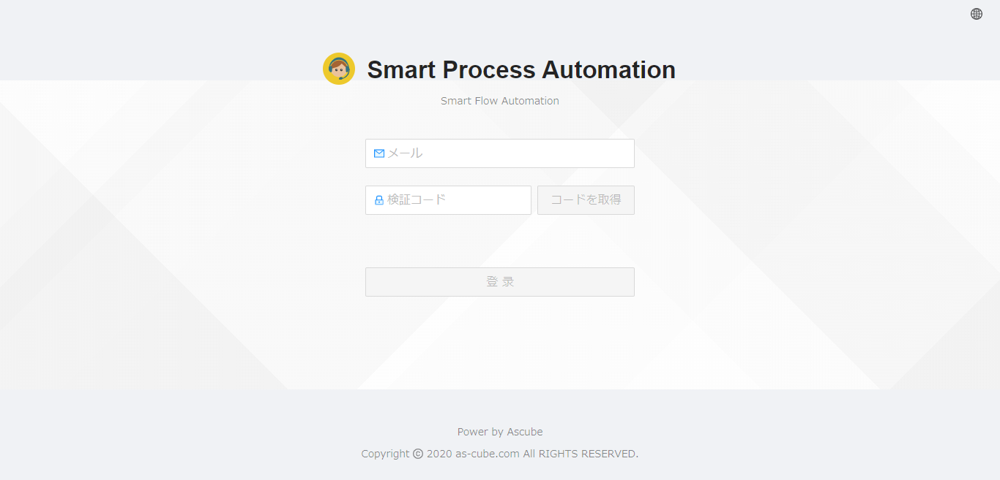

◆ SPAオンラインカスタマーサービスログインインターフェイスディスプレイ.

◆ 内容はメール入力ボックス、確認コード入力ボックス、確認コード取得ボタン、ログインボタンです.

## 1.2ログイン手順

.png)

◆ 登録した従業員の個人用メールを入力してください.

◆ [コードを取得]ボタンをクリックします.

.png)

◆ 個人コードにログインして確認コードを取得します.

◆ 確認コード入力ボックスに確認コードを入力します.

◆ ログインボタンをクリックしてください.

◆ ログイン成功メインインターフェースに入る.

# 2.ダッシュボード

## 2.1  アイテムリスト

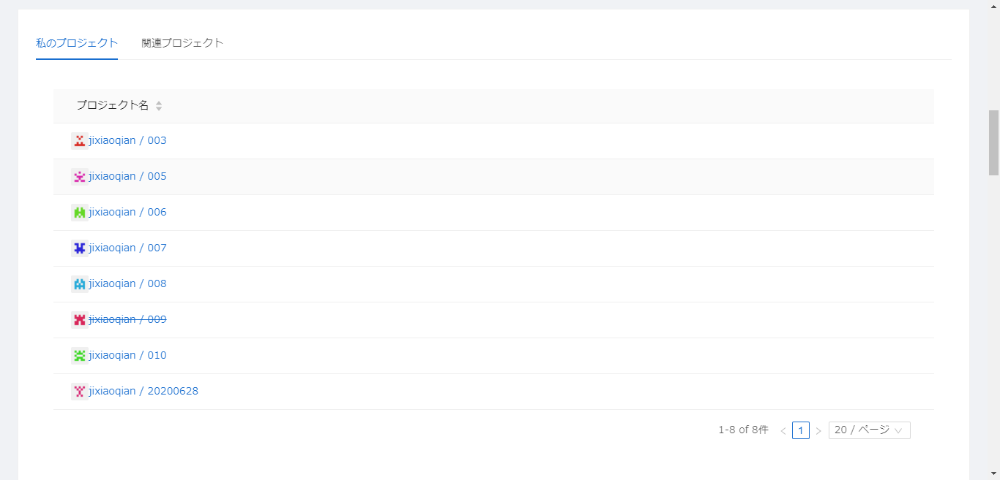

◆   私のプロジェクト--作成したすべてのプロジェクトを表示します.パブリックプロジェクトとプライベートプロジェクトの2種類があります.プロジェクト名をクリックすると、プロジェクトの詳細なインターフェースにジャンプします.

◆   関連プロジェクト--関連したすべてのプロジェクトを表示.プロジェクト名をクリックすると、プロジェクトの詳細なインターフェースにジャンプします.

## 2.2フローリスト

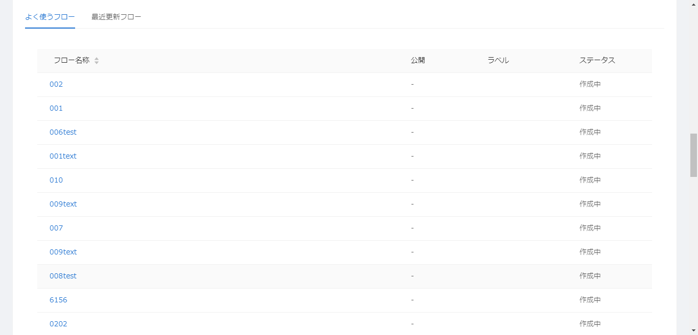

◆   よく使われているフロー--頻繁に使用するプロセスを表示し（包括的なビジネスプロセス名、開示、ラベル、ステータス）.プロセスをクリックすると、そのプロセスの詳細なインターフェイスにジャンプします.

◆   最近更新したフロー--最近更新されたプロセスを表示し.プロセスをクリックすると、そのプロセスの詳細なインターフェイスにジャンプします.

## 2.3未完了チケット状況

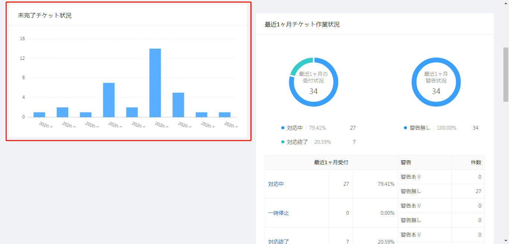

◆   過去1週間の未処理の請求書のステータスを示す棒グラフ.

## 2.4最近1ヶ月チケット作業状況

◆   円グラフとリストで表された、過去1か月の発券作業のステータスを表示します.

◆   円グラフ--先月の支払い状況と先月の警告状況分布を表示（対応中、警告なし、対応終了を含む3つの状況があります）.

◆   いずれかのケースをクリックすると、ケースの割合グラフが円グラフに表示されます.

◆   表グラフ--先月のチケット状況を表示（対応中、警告なし、対応終了、キャンセルを含む4つの状況があります）そして警告と数.

◆   プロジェクト名をクリックすると、プロジェクトの詳細なインターフェースにジャンプします.

## 2.5アクティビティ

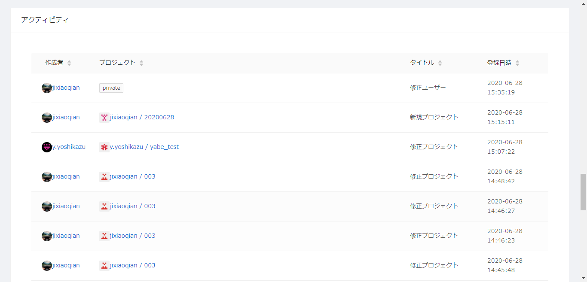

◆ コンテンツには作成者、プロェクト、タイトル、ログイン日時が含まれます.

◆ 作成者をクリックすると、作成者詳細インターフェイスにジャンプします.

◆ アイテムをクリックすると、アイテム詳細インターフェイスにジャンプします.

# 3.ユーザー

## 3.1ユーザーホームページ

.png)

◆ コンテンツには検索ボックス、新規、ダウンロード、アップロード、密度、フルスクリーン、更新、列設定が含まれます.

◆ 検索バー--ユーザーID、ユーザー名、ユーザーメールボックスなどのユーザー情報を入力し、右側の虫眼鏡ボタンをクリックしてユーザーを検索します.

◆ 新規--[新規]ボタンをクリックして、新しい規制のユーザーインターフェイスにジャンプします.

◆ ダウンロード--ダウンロードボタンをクリックして、すべてのユーザー情報をダウンロードします.

◆ アップロード--アップロードボタンをクリックし、ダウンロードしたフォームに従ってアップロードするマルチユーザー情報を入力します、アップロードできます.

◆ 密度--デフォルト、ミディアム、コンパクトの3タイプを選択できます.

◆ フルスクリーン--全画面ボタンをクリックして、ユーザーインターフェイスの全画面を表示します.

◆ 更新--更新ボタンをクリックして画面を更新し、最新の情報を更新します.

◆ 列設定--表示する必要のある列情報を選択できます.オプションには列の表示、ユーザーID、ユーザー名称、メールアドレス、ロール、登録日時、およびリセットが含まれます.

◆ リスト情報にはユーザーID、ユーザー名、メールアドレス、ロール、登録日時が含まれます.

.png)

◆ マウスを任意のユーザーIDに移動して、ユーザーの名前、ユーザーのメールボックス、およびコメントを表示します.

◆ ユーザーIDをクリックすると、ページがユーザーの詳細ページにジャンプします.

### 3.1.1検索バー

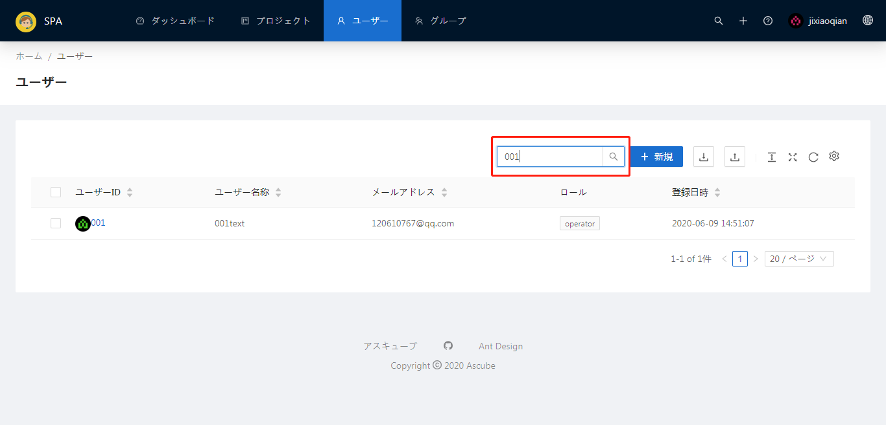

◆ ユーザーID、ユーザー名、ユーザーメールボックスなどのユーザー情報を入力し、右側の虫眼鏡ボタンをクリックしてユーザーを検索します.

◆ 検索結果は上に表示されています.

### 3.1.2ユーザー新規

.png)

◆ [新規]ボタンをクリックして、新しい規制のユーザーインターフェイスにジャンプします.

.png)

◆ 新しいユーザーを作成する.

◆ 上図：新しいユーザーページの作成.

◆ ユーザーID--必須フィールド、正常に登録されたユーザーIDとして、正常に登録されると、変更できません.

◆ メールアドレス--必須フィールド、1つのメールボックスに登録できるユーザーは1人だけです.

◆ ロール--必須フィールド、権限にはシステム管理者と一般管理者の2つのオプションがあります.システム管理者は広範な権限を持ち、システムの内容全体を表示できます. ゼネラルマネージャーには狭い権限があり、ダッシュボードとプロジェクトのみを表示できます.

◆ ユーザー名称--必須フィールド、ユーザー名を入力してください.登録が成功したら、名前を変更できます.

◆ 画像--ユーザーのアバターとして使用する写真をアップロードします.

◆ 携帯番号--ユーザーの携帯電話番号を入力します.

◆ 備考--備考情報を記入.

◆ 保存--新しいユーザー情報の作成が完了したら、[保存]ボタンをクリックして保存が成功したことを表示し、画面がユーザーの詳細インターフェイスにジャンプします.

### 3.1.3ダウンロード

.png)

◆ ダウンロードボタンをクリックすると、現在のすべてのユーザー情報をExcelフォームに追加できます.

.png)

◆ 上の画像はダウンロードしたフォームを示しています.

◆ リスト情報にはユーザーID、ユーザー名、メールアドレス、ロール、登録日時が含まれます.

### 3.1.4アップロード

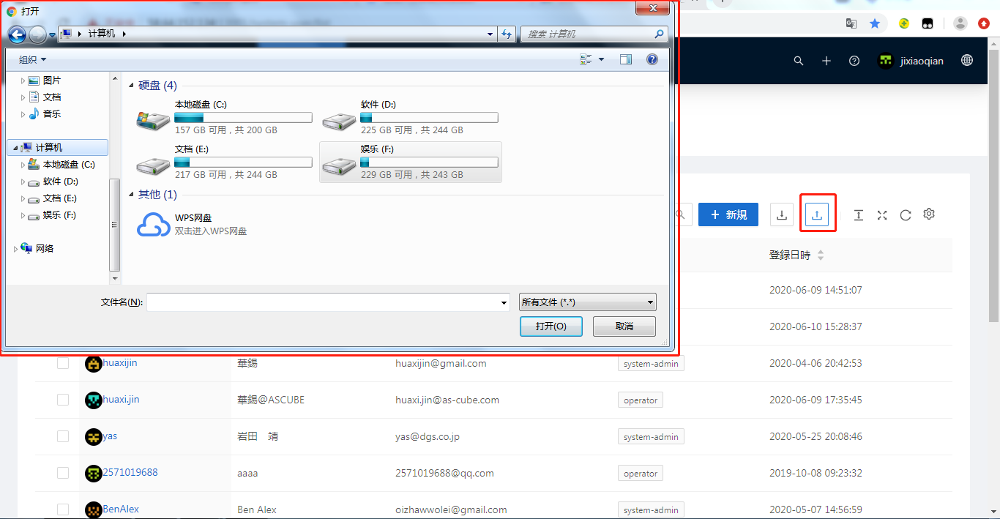

◆ 以前にダウンロードしたフォームを入力し、ユーザーコンテンツを入力して、[アップロード]をクリックします.ユーザー情報をワンクリックでアップロードできます.

### 3.1.5密度

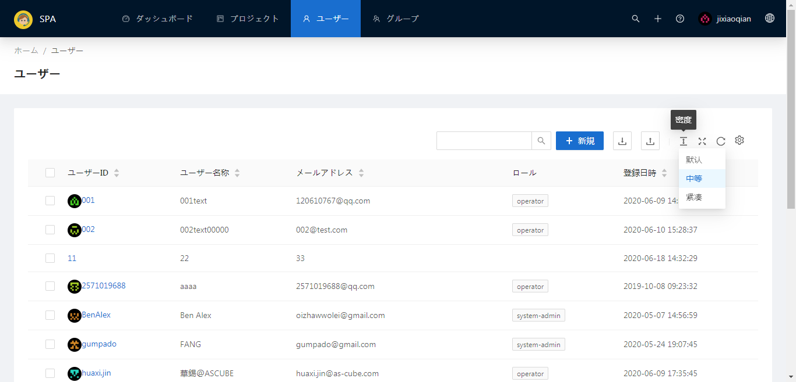

◆ デフォルト、ミディアム、コンパクトの3タイプを選択できます.

◆ 必要に応じてリストの表示密度を変更できます.

### 3.1.6フルスクリーン

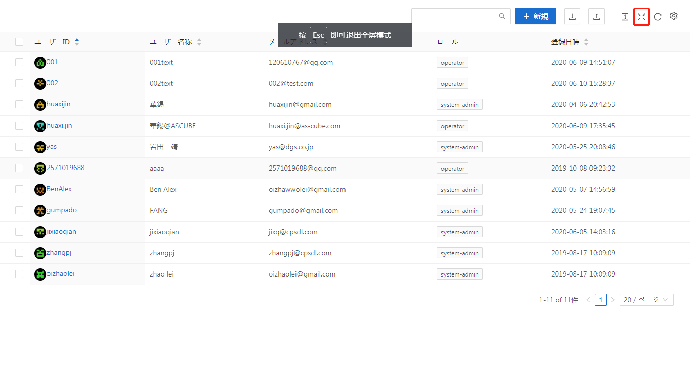

◆ 全画面をクリックすると、フォームが全画面に展開されます.

◆ Escキーを押して、全画面モードを終了します.

### 3.1.7更新

◆ 更新ボタンをクリックして画面を更新し、最新の情報を更新します.

### 3.1.8列設定

.png)

◆ 列展示--列表示をクリックして、すべてを選択するかどうかを選択します.

.png)

◆ マウスを任意のオプションに移動すると、「プッシュピン」ロゴが右側に表示されます.左側または右側のどちらに固定するかを選択できます.

.png)

◆ 選択後、固定を解除することもできます.

.png)

◆ リセット-データを初期値に戻すには、リセットボタンをクリックします.

## 3.2ユーザーインテリジェンスページ

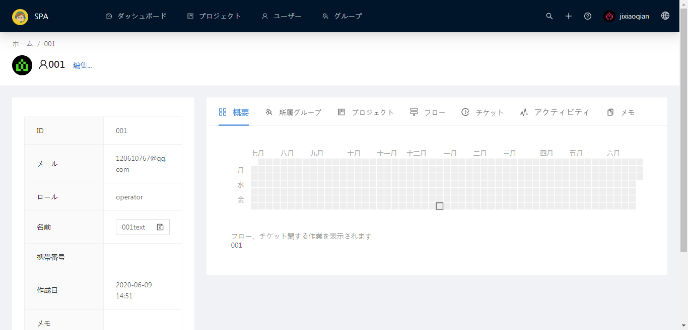

◆ プロファイルをクリックして、ロガーのプロファイルの詳細ページに入ります.

### 3.2.1ユーザー編集

.png)

◆ ここをクリックして編集します.詳細の編集インターフェイスに移動できます.

.png)

◆ 上の画像はログイン詳細の編集インターフェースを示しています.

◆ ユーザーID--ユーザーのIDがここに表示され、変更できません.

◆ メールアドレス--メールアドレスはここに表示され、変更できません.

◆ ロール--ユーザー権限がここに表示され、権限を変更できます.

◆ ユーザー名称--ユーザー名はここに表示され、変更できます.

◆  画像--ユーザーのアバターがここに表示されます.これは任意に変更できます.

◆ 携帯番号--ユーザーの携帯電話番号がここに表示されます.これは変更できます.

◆ 備考--備考はここに表示されます.備考を追加または変更できます.

◆ 無効にする--無効がここに表示されます.無効にするかどうかを選択します.

◆ 変更が完了したら、[保存]ボタンをクリックして新しいユーザー情報を保存します.

### 3.2.2左側のユーザー詳細リスト

.png)

◆ ID--ユーザーIDを表示.

◆ メール--ユーザーのメールを表示.

◆ ロール--ユーザー権限を表示.

.png)

◆ 名前--ユーザーの名前が表示され、変更できます.変更後、画面のどこかをクリックすると自動的に保存されます.

◆ 携帯番号--ユーザーの携帯電話番号がここに表示されます.

◆ メモ--ユーザーメモはこちら.

### 3.2.3右側のユーザー参加の詳細

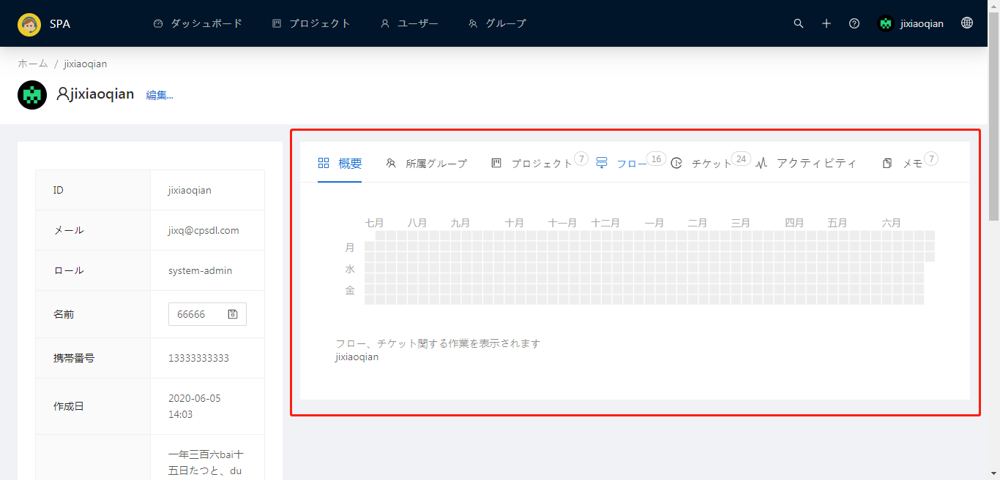

◆ プロジェクトへのユーザーの参加の詳細とプロジェクトの関連コンテンツはここに表示されます.

◆ コンテンツには概要、組織、プロジェクトへの参加、フローへの参加、チケットへの参加、アクティビティ、注意が必要な事項が含まれます.

#### 3.2.3.1概要

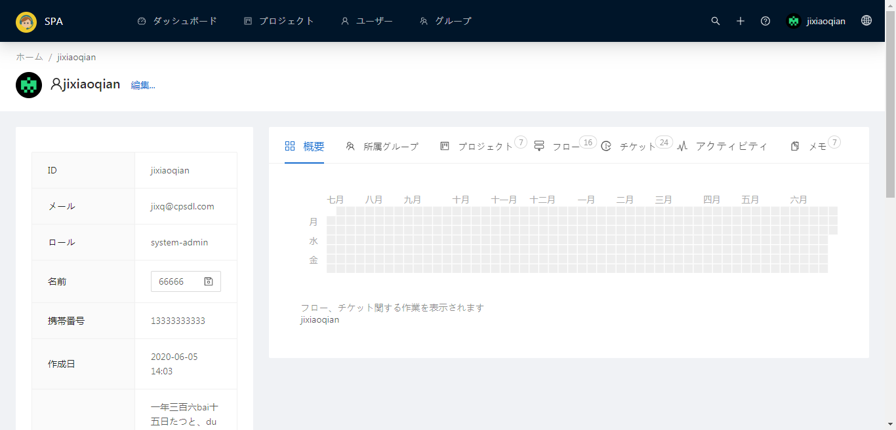

◆ これは過去1年間の発券プロセスと登録者の作業の概要です.

◆ 視覚化されたグラフ表現、効果はより明白です.

#### 3.2.3.2所属グループ

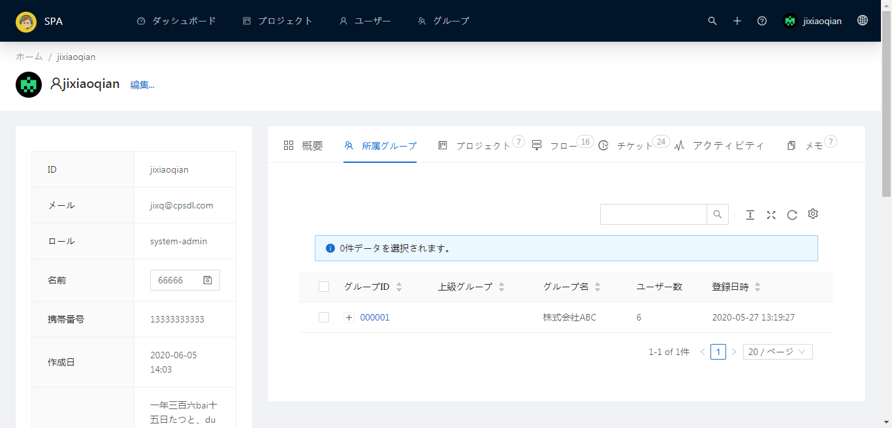

◆ 登録者が所属する組織を表示.

◆ このページは組織のインターフェースと同じです.

.png)

◆ 組織IDをクリックすると、ページが組織の詳細インターフェイスにジャンプします.

#### 3.2.3.3プロジェクト

.png)

◆ 登録者が作成または参加しているすべてのプロジェクトを表示する.

◆ インターフェースはプロジェクトのインターフェースと同じです.

.png)

◆ プロジェクト名をクリックすると、ページがプロジェクトの詳細ページにジャンプします.

#### 3.2.3.4フロー

.png)

◆ 登録者が作成または参加したすべてのフロー情報を表示します.

◆ ページはフローホームページと同じです.

.png)

◆ プロジェクト名をクリックすると、ページがプロジェクトの詳細ページにジャンプします.

.png)

◆ 業務フローをクリックして、フローインターフェースにジャンプします.

#### 3.2.3.5 チケット

.png)

◆ 登録者が作成および参加されたチケットを表示する.

◆ このページはチケットの詳細ページと同じです.

.png)

◆ IDをクリックしてチケットの詳細ページに入ります.

.png)

◆ 業務フローをクリックして、フローインターフェースにジャンプします.

#### 3.2.3.6アクティビティ

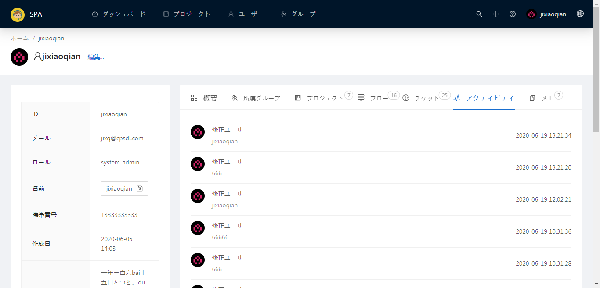

◆ 登録者の最近の活動の詳細を表示.

#### 3.2.3.7メモ

.png)

◆ 登録者の作成と参加に関する注意事項の詳細を表示する.

◆ このページは注意の詳細ページと同じです.

.png)

◆ プロジェクトをクリックすると、プロジェクトの詳細ページにジャンプします.

.png)

◆ タイトルをクリックして、メモの詳細ページに入ります.

# 4.グループ

## 4.1グループホームページ

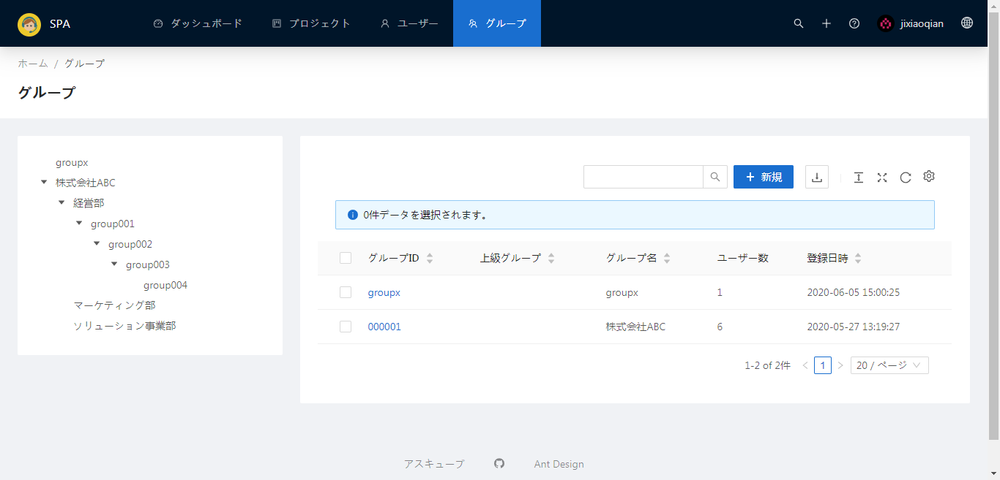

◆  コンテンツには検索ボックス、新規、ダウンロード、密度、フルスクリーン、更新、列設定が含まれます.

◆  検索バー--グループID、グループ名、その他の情報を検索し、右側の虫眼鏡ボタンをクリックしてユーザーを検索します.

◆  新規--[新規]ボタンをクリックして、新しいグループインターフェイスにジャンプします.

◆  ダウンロード--ダウンロードボタンをクリックして、すべての組織情報をダウンロードします.

◆  密度--デフォルト、ミディアム、コンパクトの3タイプを選択できます.

◆  フルスクリーン--[フルスクリーン]ボタンをクリックして、組織インターフェイスのフルスクリーンを表示します.

◆  更新--更新ボタンをクリックして画面を更新し、最新の情報を更新します.

◆  列設定--表示する必要のある列情報を選択できます.オプションには列の表示、グループID、上级グループ、グループ名、ユーザー数、登録日時、およびリセットが含まれます.

◆  リスト情報にはグループID、上级グループ、グループ名、ユーザー数、登録日時が含まれます.

◆  組織IDをクリックすると、ページが組織の詳細ページに移動します.

◆  親組織をクリックすると、ページが親組織の詳細ページに移動します.

### 4.1.1グループ検索バー

◆  グループID、グループ名、その他の情報を検索し、右側の虫眼鏡ボタンをクリックしてユーザーを検索します.

◆  上の画像は検索結果です.

### 4.1.2グループ新規

.png)

◆  新しい規制をクリックすると、新しい規制組織の詳細なインターフェースにジャンプします.

.png)

◆  上図：新しい組織ページの作成.

◆  新しい組織を作成する.

◆  グループID--必須フィールド、新しい組織が正常に作成されると、組織IDを変更できなくなります.

◆  タイトル--必須フィールド、新しい組織の名前を入力します.これは、作成が成功した後で変更できます.

.png)

◆  上位グループ--上位組織を選択できます、企業が企業レベルのものをより効率的に管理できるようにします.

◆  説明--備考が必要な内容を記入.

### 4.1.3ダウンロード

.png)

◆  ダウンロードボタンをクリックして、現在のすべての組織情報をExcelフォームにダウンロードします.

.png)

◆  上記のダウンロードしたフォーム.

◆  フォームの内容には、組織IDと組織名が含まれます.

### 4.1.4密度

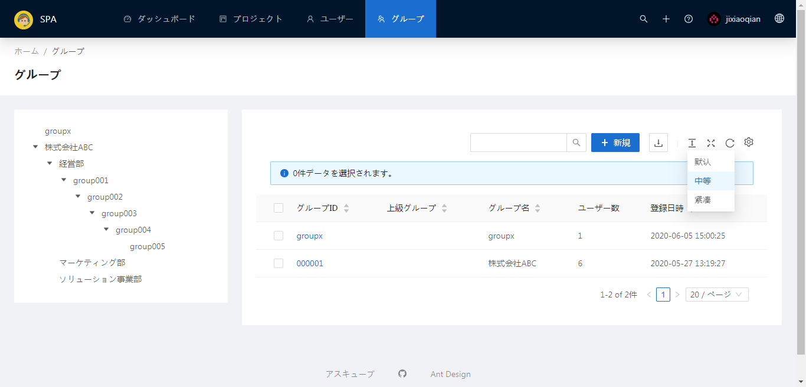

◆  デフォルト、ミディアム、コンパクトの3タイプを選択できます.

◆  必要に応じてリストの表示密度を変更できます.

### 4.1.5フルスクリーン

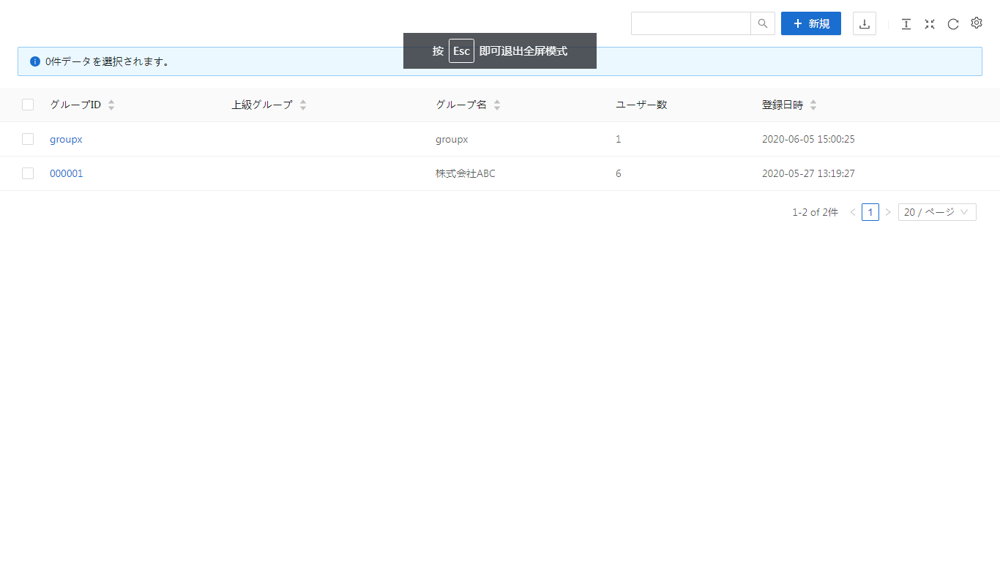

◆  全画面をクリックすると、フォームが全画面に展開されます.

◆  Escキーを押して、全画面モードを終了します.

### 4.1.6 更新

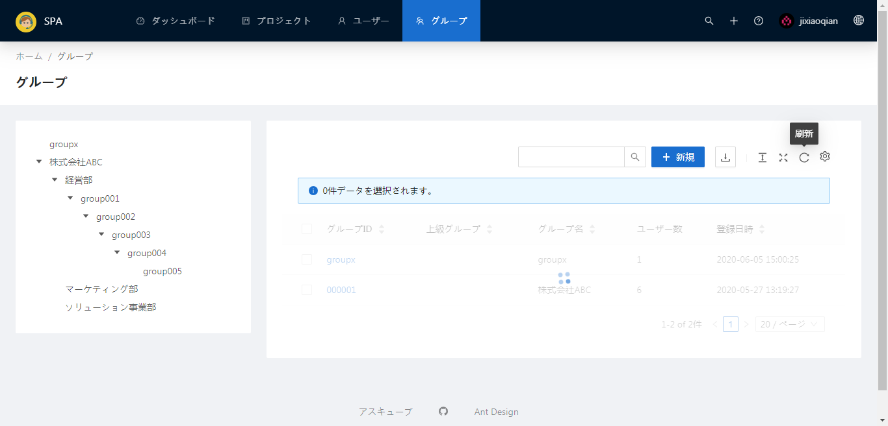

◆   更新ボタンをクリックして画面を更新し、最新の情報を更新します.

### 4.1.7列設定

.png)

◆   列展示--列表示をクリックして、すべてを選択するかどうかを選択します.

.png)

◆   マウスを任意のオプションに移動すると、「プッシュピン」ロゴが右側に表示されます.左側または右側のどちらに固定するかを選択できます.

.png)

◆   選択後、固定を解除することもできます.

.png)

◆   リセット-データを初期値に戻すには、リセットボタンをクリックします.

## 4.2グループ詳細ページ

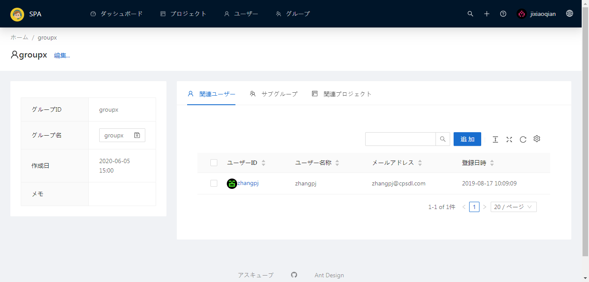

◆   上記のように、組織IDをクリックして組織の詳細ページにジャンプします.

### 4.2.1グループ編集

.png)

◆   組織の名前を表示し、右側に[編集]があります.

.png)

◆   上記のように、組織IDをクリックして、組織の詳細インターフェイスにジャンプします.

◆   ここで組織情報を変更できます！

◆   グループID--変わらない.

◆   タイトル--組織のタイトルを変更できます.

png.png)

◆   上位グループ--ここで上位組織を選択できます.

◆   説明--ここに組織の説明を入力できます.

◆   保存--変更が完了したら、[保存]ボタンをクリックして変更した内容を保存します.

### 4.2.2左側のグループ詳細リスト

.png)

◆   内容：グループID、グループ名、作成日、メモ.

.png)

◆   編集ボックスをクリックして組織名を編集し、完了したらマウスの任意の場所をクリックして、自動的に正常に保存します.

### 4.2.3右側のグループ詳細リスト

.png)

◆   内容は關連ユーザー、サブグループ、關連プロジェクト次のとおりです.

#### 4.2.3.1 關連ユーザー

.png)

◆   コンテンツには検索ボックス、追加、密度、フルスクリーン、更新、列設定が含まれます.

◆   検索バー--ユーザーID、ユーザー名、ユーザーメールボックスなどのユーザー情報を入力し、右側の虫眼鏡ボタンをクリックしてユーザーを検索します.

.png)

◆   追加--[追加]をクリックして、関連するユーザーを追加します.

◆   密度--デフォルト、ミディアム、コンパクトの3タイプを選択できます.

◆   フルスクリーン--全画面ボタンをクリックして、ユーザーインターフェイスの全画面を表示します.

◆   更新--更新ボタンをクリックして画面を更新し、最新の情報を更新します.

◆   列設定--表示する必要のある列情報を選択できます.オプションには列の表示、ユーザーID、ユーザー名称、メールアドレス、ロール、登録日時、およびリセットが含まれます.

◆   リスト情報にはユーザーID、ユーザー名称、メールアドレス、登録日時が含まれます.

.png)

◆   マウスを任意のユーザーIDに移動して、ユーザーの名前、ユーザーのメールボックス、およびコメントを表示します.

◆   ユーザーIDをクリックすると、ページがユーザーの詳細ページにジャンプします.

#### 4.2.3.2サブグループ

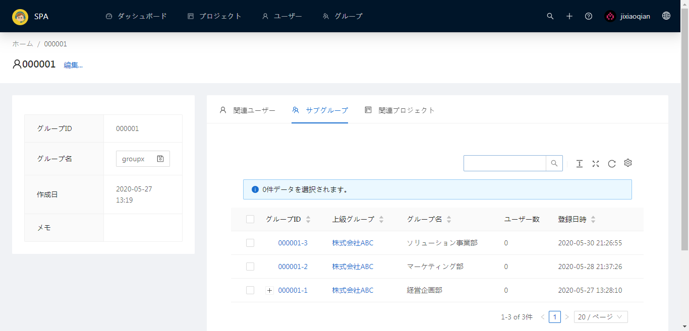

◆   コンテンツには検索ボックス、密度、フルスクリーン、更新、列設定が含まれます.

◆   検索バー--グループID、グループ名情報を入力し、右側の虫眼鏡ボタンをクリックしてグループを検索します.

◆   密度--デフォルト、ミディアム、コンパクトの3タイプを選択できます.

◆   フルスクリーン--全画面ボタンをクリックして、ユーザーインターフェイスの全画面を表示します.

◆   更新--更新ボタンをクリックして画面を更新し、最新の情報を更新します.

◆   列設定--表示する必要のある列情報を選択できます.オプションには列の表示、グループID、上级グループ、グループ名、ユーザー数、登録日時、およびリセットが含まれます.

◆   リスト情報にはグループID、上级グループ、グループ名、ユーザー数、登録日時が含まれます.

◆   組織IDをクリックすると、ページが組織の詳細ページに移動します.

◆   親組織をクリックすると、ページが親組織の詳細ページに移動します.

#### 4.2.3.3關連プロジェクト

.png)

◆   密度--デフォルト、ミディアム、コンパクトの3タイプを選択できます.

◆   フルスクリーン--全画面ボタンをクリックして、ユーザーインターフェイスの全画面を表示します.

◆   更新--更新ボタンをクリックして画面を更新し、最新の情報を更新します.

◆   列設定--表示する必要のある列情報を選択できます.オプションには列の表示、プロジェクト名、ロールおよびリセットが含まれます.

◆   リストの内容にはプロジェクト名、ロールのが含まれています.

.png)

◆   プロジェクト名にカーソルを合わせると、アバター、プロジェクト名、メモが表示されます.

◆   プロジェクト名をクリックすると、画面がプロジェクト詳細インターフェイスにジャンプします.

# 5.プロジェクト

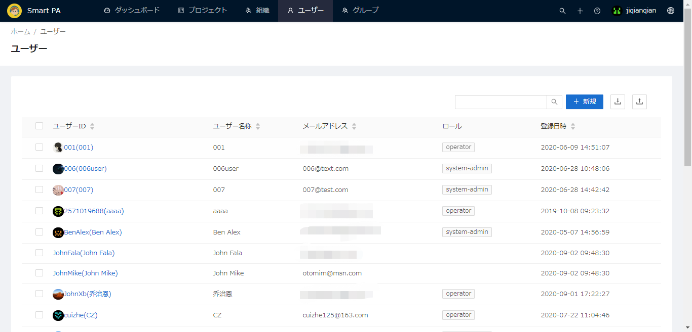

◆   プロジェクトには3つのモジュールが含まれています：私のプロジェクト、関連プロジェクト、公開プロジェクトします.

## 5.1私のプロジェクト

.png)

◆   コンテンツには検索ボックス、新規、密度、フルスクリーン、更新、列設定が含まれます.

.png)

◆   検索バー--プロジェクト名その他の情報を検索し、右側の虫眼鏡ボタンをクリックしてプロジェクトを検索します.

◆   新規--[新規]ボタンをクリックして、新しいプロジェクトインターフェイスにジャンプします.

◆   密度--デフォルト、ミディアム、コンパクトの3タイプを選択できます.

◆   フルスクリーン--[フルスクリーン]ボタンをクリックして、組織インターフェイスのフルスクリーンを表示します.

◆   更新--更新ボタンをクリックして画面を更新し、最新の情報を更新します.

◆   列設定--表示する必要のある列情報を選択できます.オプションには列の表示、プロジェクト名、登録日時、およびリセットが含まれます.

◆   リスト情報にはプロジェクト名、登録日時が含まれます.

◆   プロジェクトをクリックすると、プロジェクトの詳細ページに移動します.

.png)

◆   マウスをプロジェクト名に移動すると、画面にアバター、プロジェクト名、コメント情報が表示されます.

◆   親組織をクリックすると、ページが親組織の詳細ページに移動します.

### 5.1.1プロジェクト新規

.png)

◆   [新規]ボタンをクリックして、新しいプロジェクトインターフェイスにジャンプします.

.png)

◆   ここで新しいプロジェクトを作成できます.

◆   上記の新しいプロジェクトインターフェース.

◆   プロジェクト名--必須フィールド、ここにプロジェクト名を入力してください.プロジェクト名を繰り返すことはできません.プロジェクトが正常に作成された後、プロジェクト名は変更できません.

◆   備考--備考関連コンテンツをこちらに記入.

◆   公開--プロジェクトを作成するにはパブリックまたはプライベートの2つの方法があります.パブリックとは、誰でもプロジェクトを表示できることを意味します.非パブリックとは、あなただけがプロジェクトを表示できることを意味します.

◆   保存--すべてのプロジェクト情報を入力したら、[保存]をクリックしてプロジェクトを保存します.プロジェクトに表示されます.

### 5.1.2プロジェクト詳細ページ

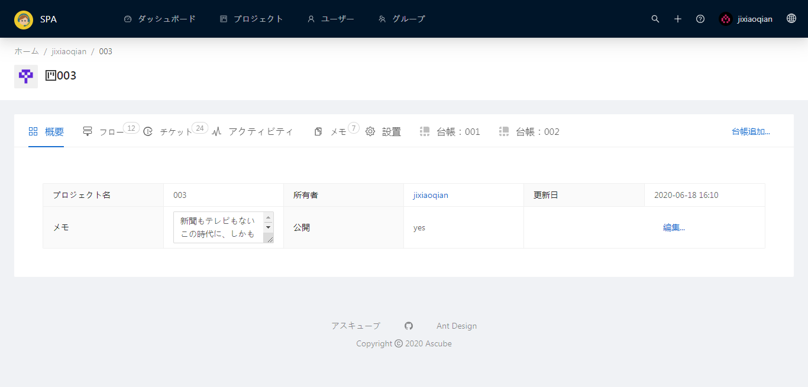

◆   プロジェクト名をクリックすると、画面がプロジェクト詳細インターフェイスにジャンプします.

◆   内容：概要、フロー、チケット、アクティビティ、メモ、設置、元帳、台帳名称、台帳追加.

#### 5.1.2.1概要

◆   プロジェクト名--プロジェクト名が表示され、変更できません.

.png)

◆   所有者--プロジェクト作成者を表示、所有者名をクリックすると、画面がユーザー詳細インターフェイスにジャンプします.

◆   更新日--最終更新日を表示する.

.png)

◆   メモ--ここに注意事項が表示されています.

◆   公開--プロジェクトがパブリックかプライベートかをここで指定します.

.png)

◆   画面に「編集」ジャンプページが表示されます.

◆   プロジェクト名--プロジェクト名が表示され、変更できません.

◆   備考--メモの内容を表示、追加または変更可能.

◆   公開--ここに表示されるアイテムはパブリックまたはプライベートであり、自由に変更できます.

◆   無効にする--アイテムが無効化されているかどうかがここに表示され、自由に変更できます.

◆   変更が必要なプロジェクトのコンテンツを変更したら、[保存]ボタンをクリックして、変更したプロジェクトのコンテンツを保存します.

#### 5.1.2.2フロー

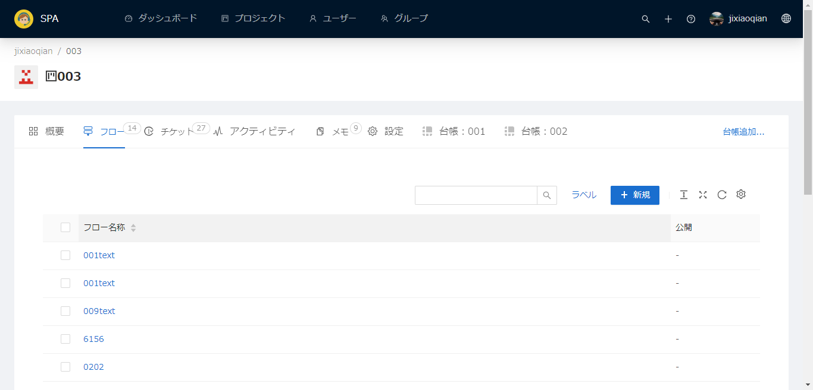

◆   検索バー--フロー名やその他の情報を検索し、右側の虫眼鏡ボタンをクリックしてアイテムを検索します.

◆   [新規]ボタンをクリックして、新しいフローインターフェイスにジャンプします.

◆   密度--デフォルト、ミディアム、コンパクトの3タイプを選択できます.

◆   フルスクリーン--[フルスクリーン]ボタンをクリックして、組織インターフェイスのフルスクリーンを表示します.

◆   更新--更新ボタンをクリックして画面を更新し、最新の情報を更新します.

◆   列設定-表示する必要のある列情報を選択できます.オプションには列の表示、ビジネスフロー名、パブリック、およびリセットが含まれます.

◆   リスト情報には業務フロー名称、公開が含まれます.

.png)

◆   マウスをビジネスフロー名に移動すると、画面にビジネスフロー名とフローステータスが表示されます.

◆   業務フロー名をクリックすると、画面がフロー詳細ページにジャンプします.

##### 5.1.2.2.1 フローを作成する

.png)

◆   [新規]ボタンをクリックして、新しいフローインターフェイスにジャンプします.

.png)

◆   プロジェクト--プロジェクト名このプロジェクトの下に新しいフローを作成します.

◆   業務フロー名称--フロー名をもう一度入力して、新しいフローを作成します.

◆   保存ボタンをクリックして、作成した新しいフローを保存します.

.png)

◆    画面がフロー詳細インターフェイスにジャンプします.

.png)

◆    左上にフロー名が表示されます.

◆    フロー名--プロセス名を表示する.

◆   編集ボックスをクリックしてストリーム名を編集します。変更後、マウスの任意の場所をクリックして正常に保存します.

◆    作成者--フローを作成した人.

◆    更新日--最終改訂更新日.

◆    メモ--ここに注意事項が表示されています.

◆    全体処理時間--全体の処理時間がここに表示されます.

◆    作成済み--作るかしないかを選択できます.

##### 5.1.2.2.2プロセスエディター

.png)

◆    プロセスエディターをクリックして、プロセスエディターの詳細インターフェイスに入ります.

.png)

◆    上の画像はフローエディターの初期インターフェイスを示しています.

.png)

◆    アイコンをクリックしてフロー詳細画面を表示します.

◆    フローページをダブルクリックして、このページを表示します.

.png)

###### ◆    一般：

.png)

◆    フロー名称--必須フィールド、フロー名を変更できます.

◆    全体処理時間--全体の処理時間を選択できます、最小単位は1時間です.

◆    作成済み--ここではそれが確立されているかどうかを選択でき、作成されたフローはチケットを生成できます.

◆    フローコメント--ビジネスプロセスのコメントをここに入力できます.

###### ◆     変数:

.png)

◆    追加--ここでプロパティ名とプロパティ値を追加できます.

◆    右側の円をクリックして、付加価値を削除します.

###### ◆    バージョン

.png)

◆    ここにバージョンラベルを表示.

##### 5.1.2.2.3図面の詳細

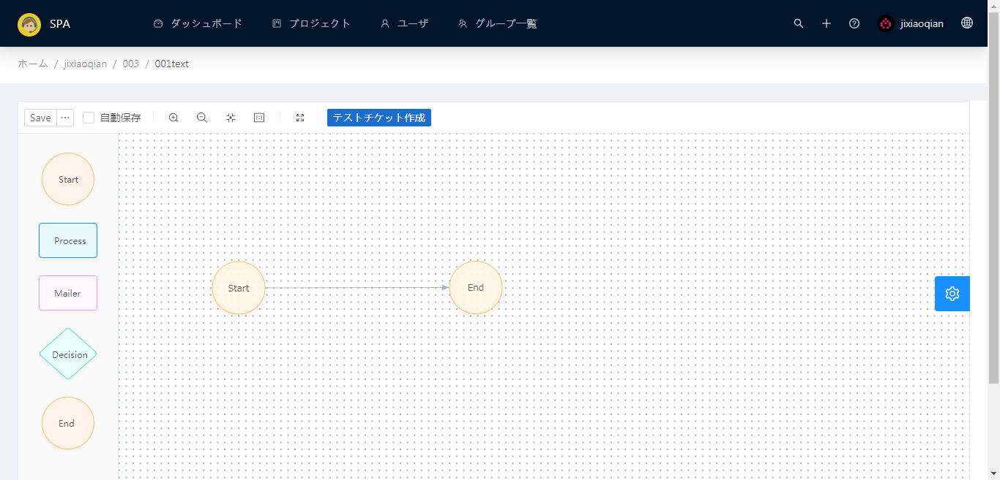

◆   この画面はフローチャートの描画を示しています.

◆   ノードはStart、Process、Mailer、Decision、Endしています.

◆   Save保存--フローチャートを描いた後、「保存」をクリックして現在のページのフローチャートを保存します.

◆   自動保存--自動的に保存するオプションをオンにすることができます、次回フローチャートを終了または再作成するときに、手動で保存する必要はありません.

◆   Zoom In--クリックしてノードを拡大します.

◆   Zoom Out--クリックしてノードを縮小します.

◆    Fit Map--クリックしてノードを拡大し、最大化します.

◆   Actual Size--クリックしてノードを拡大して正規化します.

◆   Full Screen--クリックして全画面でフロー描画を表示または作成します.

.png)

◆   ノードをダブルクリックすると、ページにノードの詳細画面が表示されます.

###### ◆   一般

.png)

◆   ラベル--ノードラベルを表示.

◆   目標時間--目標時間を表示し、ノードプロセスのプロセス時間を与えます.

◆   コメント--コメントを表示、追加または変更可能.

###### ◆   作業内容

.png)

◆   ここで宿題コンテンツを追加または変更します.ツールは使いやすいです.

###### ◆   アクション

.png)

◆   ラベル--ここに商品変更ラベルを記入できます.

◆   コード--ここに商品修正コードを記入.

###### ◆   権限

.png)

◆   ここにユーザーまたは組織の権限を追加できます.

◆   下記の何れかユーザーまたはグループは該当ノードを操作しかできません.

.png)

◆   ユーザー追加--追加する権限を追加する必要があるユーザーを選択します.

.png)

◆   組織追加--追加する権限を追加する必要がある組織を選択します.

###### ◆   テストチケット作成テキスト

.png)

◆   テストチケット作成--テストチケットを生成できます.

.png)

◆   上の写真はテストチケットを示しています.

##### 5.1.2.2.4チケット作成

.png)

◆   チケット作成の詳細インターフェースにジャンプするには、ここをクリックしてください.

.png)

◆   上の画像はチケット詳細インターフェースです.

◆   ディレクトリを表示.

.png)

◆   チケット番号とチケット名を表示する.

◆   編集ボックスをクリックしてチケット名を編集し、マウスの任意の場所をクリックして、変更後のチケットを通常どおり保存します.

.png)

◆   プロジェクト--ここに作成者とプロジェクト名が表示され.

◆   マウスをプロジェクト名に移動すると、画面にアバター、プロジェクト名、コメント情報が表示されます.

◆   上位のプロジェクトをクリックして、ページをプロジェクトの詳細ページに移動します.

.png)

◆   業務フロー--業務フロー名がここに表示されます.

◆   フロー名の上にマウスを移動すると、画面にポップアップウィンドウが表示され、フロー名、番号、完了ステータスが示されます.

.png)

◆   目標時間--ここに示されているのは全体の処理時間です.

.png)

◆   作成者--ここに表示されるチケット作成者.

◆   作成者にマウスを移動し、ポップアップボックスを表示します.コンテンツには、名前、アバター、メール、備考が含まれます.

◆   クリエーターをクリックすると、画面がユーザー詳細インターフェースにジャンプします.

.png)

◆   作成時刻--このチケットの詳細な時間を分と秒まで正確に表示します.

.png).png)

◆   類似チケット--ここで同様のチケットを見つけることができます.

.png)

◆   ステータス--チケットのステータスはここに表示されます.

.png)

◆   経過時間--ここには現在の経過時間が表示され、時計はカウントダウン状態になっています.リアルタイム計算は処理時間です.

###### ◆   作業詳細

.png)

◆   作業詳細--チケット操作の詳細なプロセスはここに示され、スタッフはチケットの特定のプロセスをここに接続します.

◆   番号とノード情報を表示する.

◆   経過時間--プロセスでノードが経過した時間を表示し、時間をリアルタイムで変更および更新します.

◆   目標時間--ノードの目標設定の処理時間を表示します.

◆   開始時刻--ノードの開始時間を表示します.

.png)

◆   次ヘ--【次ヘ】ボタンをクリックして、チケット処理を次のステップに進めます.

.png)

◆   ノードの選択は「はい」または「いいえ」で、次のステップに進みます.

.png)

.png)

◆   作業口グ--[作業口グ]をクリックすると編集ボックスがポップアップし、このノードでチケットのメモ情報を編集できます.

◆   作業メモの追加--編集が完了したら[メモの追加]をクリックすると、正常に追加および保存できます.

.png)

◆   【次ヘ】ボタンプロセスは次のステップに進みます.

◆     マウスをバー領域に移動して、目標時間と経過時間を表示します.目標時間と時間範囲内ではバーは青で表示され、目標時間を超えていると、バーは赤で表示されます.

.png)

◆     ここから再開--【ここから再開】をクリックして、ここからチケット手続きを開始します.

.Png)

◆     閉じる--完了したチケットプロセス.[閉じる]をクリックして、チケットプロセスの終了を表示できます.

###### ◆    業務フロー図

.png)

◆     業務フロー図--ビジネスプロセス図の図面をここに示します.

##### 5.1.2.2.5 転送

.png)

◆     [転送]をクリックして、プロセスに関連するすべてのトラブルチケットを別のプロジェクトに移動します.

.png)

◆     移動とコピーには2つの主要な機能があります.

◆     移動先のプロジェクトの名前を入力し、[OK]ボタンをクリックして、現在のフローのすべてのコンテンツをプロジェクトに移動します.

◆     [キャンセル]ボタンをクリックして、現在の操作をキャンセルします.

.png)

◆    コピー先のプロジェクトの名前を入力し、[OK]ボタンをクリックして、現在のフローのすべてのコンテンツをプロジェクトにコピーします.

◆    [キャンセル]ボタンをクリックして、現在の操作をキャンセルします.

##### 5.1.2.2.6 概要

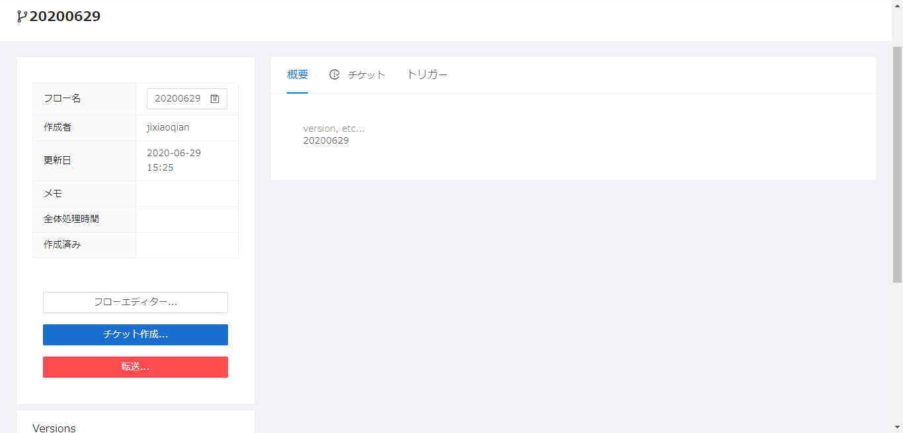

◆    現在表示されているバージョン情報を表示します.

##### 5.1.2.2.7チケット

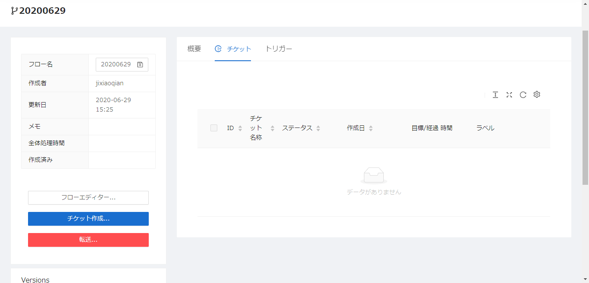

◆    密度--デフォルト、ミディアム、コンパクトの3タイプを選択できます.

◆    フルスクリーン--全画面ボタンをクリックして、ユーザーインターフェイスの全画面を表示します.

◆    更新--更新ボタンをクリックして画面を更新し、最新の情報を更新します.

◆    列設定--表示する必要のある列情報を選択できます.オプションには列の表示、ID、チケット名称、ステータス、作成日、目標/経過 時間、およびリセットが含まれます.

◆    リスト情報にはID、チケット名称、ステータス、作成日、目標/経過 時間が含まれます.

◆    IDをクリックすると、ページがチケット詳細ページにジャンプします.

#### 5.1.2.3チケット

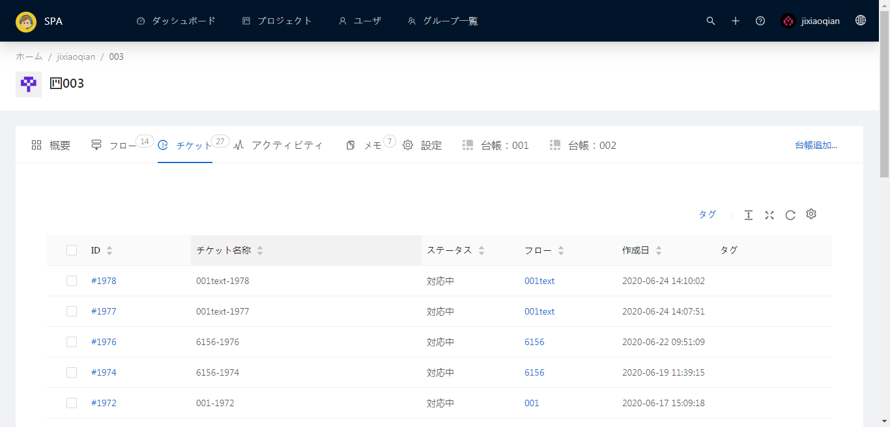

◆    密度--デフォルト、ミディアム、コンパクトの3タイプを選択できます.

◆    フルスクリーン--全画面ボタンをクリックして、ユーザーインターフェイスの全画面を表示します.

◆    更新--更新ボタンをクリックして画面を更新し、最新の情報を更新します.

◆    列設定--表示する必要のある列情報を選択できます.オプションには列の表示、ID、チケット名称、ステータス、作成日、目標/経過 時間、およびリセットが含まれます.

◆    リスト情報にはID、チケット名称、ステータス、作成日、目標/経過 時間が含まれます.

.png)

◆    IDをクリックすると、ページがチケット詳細ページにジャンプします.

.png)

◆    フローをクリックすると、ページがフロー詳細ページにジャンプします.

#### 5.1.2.4アクティビティ

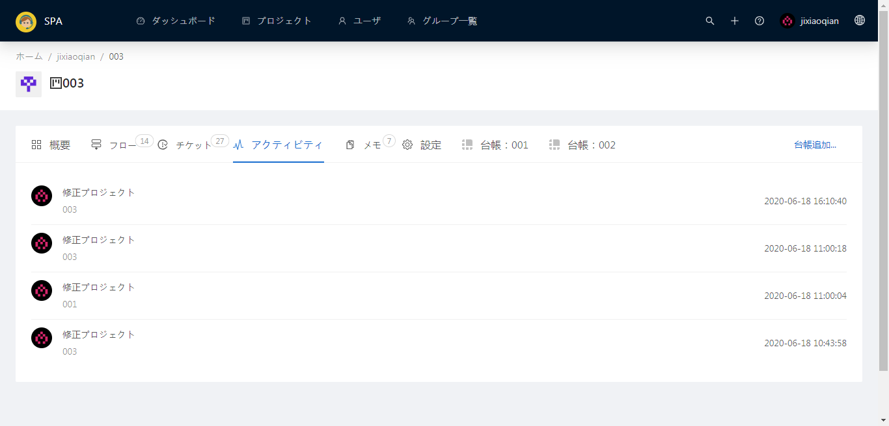

◆    ここにアクティビティの流れを示します.

#### 5.1.2.5メモ

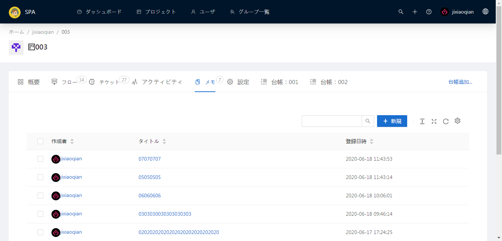

◆    コンテンツには検索ボックス、新規、密度、フルスクリーン、更新、列設定が含まれます.

◆    検索バー--タイトルの情報を検索し、右側の虫眼鏡ボタンをクリックしてノートを検索します.

◆    新規--「新規」ボタンをクリックして、新しいノートインターフェースにジャンプします.

◆    密度--デフォルト、ミディアム、コンパクトの3タイプを選択できます.

◆    フルスクリーン--[フルスクリーン]ボタンをクリックして、組織インターフェイスのフルスクリーンを表示します.

◆    更新--更新ボタンをクリックして画面を更新し、最新の情報を更新します.

◆    列設定--表示する必要のある列情報を選択できます.オプションには列の表示、作成者、タイトル、登録日時、およびリセットが含まれます.

◆   リスト情報には作成者、タイトル、登録日時が含まれます.

.png)

◆   作成者をクリックして、ユーザー詳細インターフェイスにジャンプします.

.png)

◆   タイトルをクリックすると、ページがメモ編集画面にジャンプします.

###### ◆   検索バー

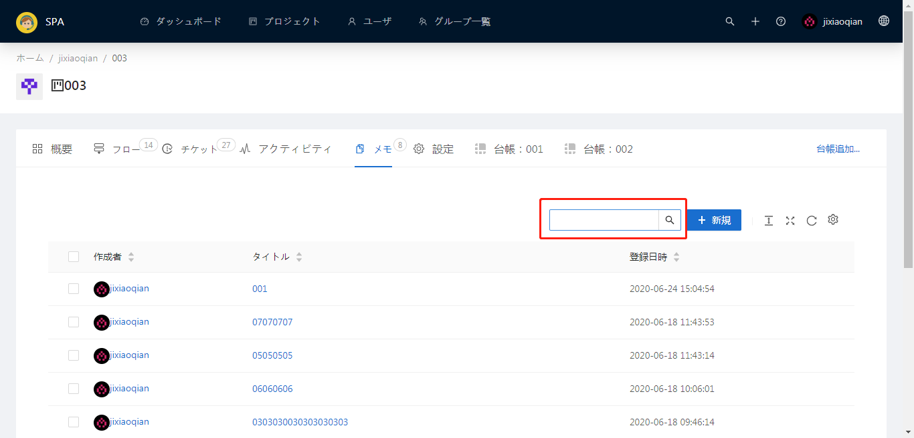

◆   タイトルの情報を検索し、右側の虫眼鏡ボタンをクリックしてノートを検索します.

###### ◆   新規

.png)

◆   [新規]ボタンをクリックすると、ページが[新規]画面にジャンプします.

.png)

◆   プロジェクト--ここにプロジェクト名が表示されます.

◆   タイトル--ここにメモのタイトルを入力してください.

◆   説明--ここに注意が必要な事項の内容説明を記入してください.

◆   作成が完了したら、[保存]をクリックして作成したメモを保存します.

###### ◆   メモ詳細ページ

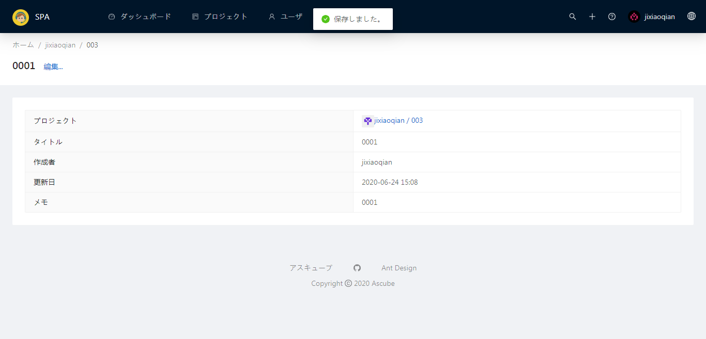

◆   正常に保存され、画面がメモの詳細インターフェイスにジャンプします.

◆   プロジェクト--ここにプロジェクト名が表示されます.特定のプロジェクト名をクリックすると、ページがプロジェクト詳細ページにジャンプします.

◆   タイトル--メモのタイトルがここに表示されます.

◆   作成者--通知の作成者はここに表示されます.

◆   更新日--通知の最終変更日はここに表示されます.

◆   メモ--ここに示す注意事項の具体的な内容.

.png)

.png)

◆   [編集]をクリックすると、ノート編集の詳細ページにジャンプします.

#### 5.1.2.6設定

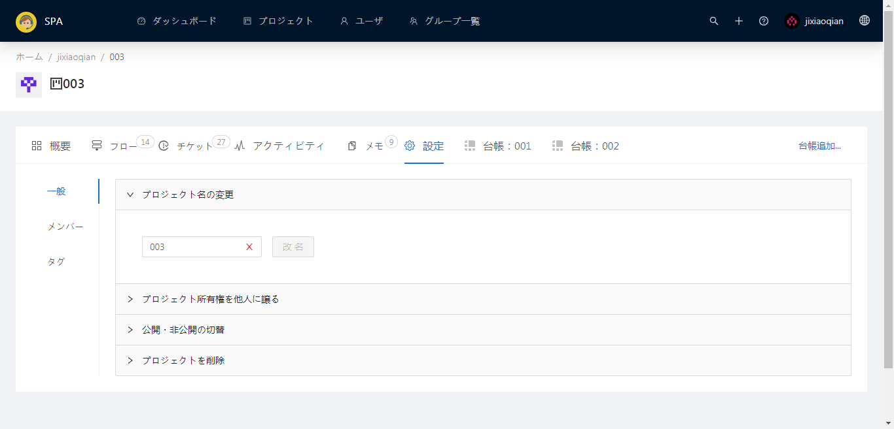

◆   設定には一般、メンバー、タグの3つのメインコンテンツが含まれます.

##### 5.1.2.6.1 一般

◆   コンテンツにはプロジェクトの名前の変更、プロジェクトのすべてのヒを人に譲る、公用と私用の入れ替え、および4つの主要モジュールの削除が含まれます.

.png)

◆   プロジェクト名の変更--ここでプロジェクト名を変更できますが、作成したプロジェクト名は使用できません.

◆   名前の変更を確認したら、[改名]ボタンをクリックしてプロジェクト名を変更します.

.png)

◆   プロジェクト所有権を他人に譲る--ここではプロジェクトのすべてのコンテンツを他の責任あるユーザーに転送できます.

◆   転送するユーザーを選択し、進むをクリックしてプロジェクトのすべてのコンテンツをユーザーに転送します.

.png)

◆   ここではプロジェクトのステータスがプライベートかパブリックかを選択できます.

◆   プライベートまたはパブリックを選択し、スイッチをクリックして達成します.

.png)

◆   プロジェクトを削除--ここでアイテムを削除できます.

◆   削除されたプロジェクトは復元できません！

◆   プロジェクトを除去すると、そのリポジトリと、課題、マージリクエストなどを含むすべての関連リソースが削除されます.

 

##### 5.1.2.6.2メンバー

###### ◆   メンバー招待

.png)

◆   コンテンツには2つのモジュールが含まれています：グループメンバーの招待と組織の招待.

.png)

◆   メンバーを選択し、このプロジェクトに一緒に参加するように招待し、対応する権限を与えることができます.

◆   メンバーIDまたはメール--会員番号を入力するか、ここにメールで送信してください.

.png)

◆   権限--ここで対応する機能の下でユーザーが使用できる権限を選択します.

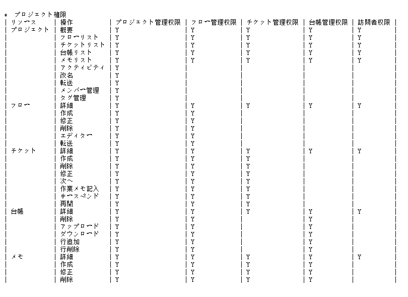

◆   上の画像は特定のプロジェクト権限を示しています.

.png)

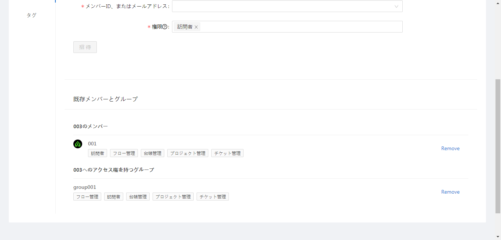

◆   招待するメンバーとメンバーの権限を選択したら、[招待]をクリックすると、メンバーが正常に参加します.

◆   成功したメンバーの情報、参加プロジェクトの権限、および関連するプロジェクト機能が以下に表示されます.

◆   Remove--参加したユーザーを削除できます.

###### ◆   グループ招待

.png)

◆   ここでプロジェクトにグループを招待できます.

◆   グループID--対応するグループIDを入力し、プロジェクトを入力する必要があるグループを追加します.

.png)

◆   権限-組織が利用できる権限を、対応する機能の下で選択します.

.png)

◆   上の画像は特定のプロジェクト権限を示しています.

.png)

.png)

◆   招待する組織とその権限を選択したら、[招待]をクリックすると、組織が正常に参加します.

◆   以下に成功した組織、プロジェクトへの参加許可、および関連するプロジェクト機能に関する情報を示します.

◆   削除-参加した組織を削除できます.

##### 5.1.2.6.3 タグ

.png)

◆   コンテンツには、フローとチケットの2つの部分が含まれます.

###### ◆   フロー

.png)

◆   追加--[追加]をクリックすると、追加ボックスがポップアップします.

.png)

◆   タグ色--ラベルの色は自由に選択できます.

◆   ラベル--ラベルを自由に記入.

◆   説明--説明を入力または変更します.

◆   操作--保存またはキャンセルを選択できます.

###### ◆   チケット

.png)

◆   追加--[追加]をクリックすると、追加ボックスがポップアップします.

.png)

◆   タグ色--ラベルの色は自由に選択できます.

◆   ラベル--ラベルを自由に記入.

◆   説明--説明を入力または変更します.

◆   操作--保存またはキャンセルを選択できます.

#### 5.1.3.7台帳

.png)

◆   追加、削除、ダウンロード、アップロード、変更などのアカウント情報がここに表示されます.

.png)

◆  台帳追加--ここに新しい台帳を追加できます.

◆  元帳のタイトルを入力し、[OK]をクリックして新しい元帳を追加します.

.png)

◆  台帳削除--削除ボタンをクリックして、元帳を削除します.

.png)

◆  台帳ダウンロード--台帳の内容をダウンロードするには、ダウンロードボタンをクリックします.

.png)

◆  台帳アップロード--アップロードボタンをクリックして、ドキュメントの元帳のコンテンツを選択してアップロードします.

.png)

◆   台帳変更--フォームをダブルクリックして、元帳情報を変更します.

◆   ID変更不可、ユーザーID、ユーザー名、メールアドレス、電話番号、備考変更可.

.png)

◆   行を削除または追加するにはマウスを右クリックします.

## 5.2関連プロジェクト

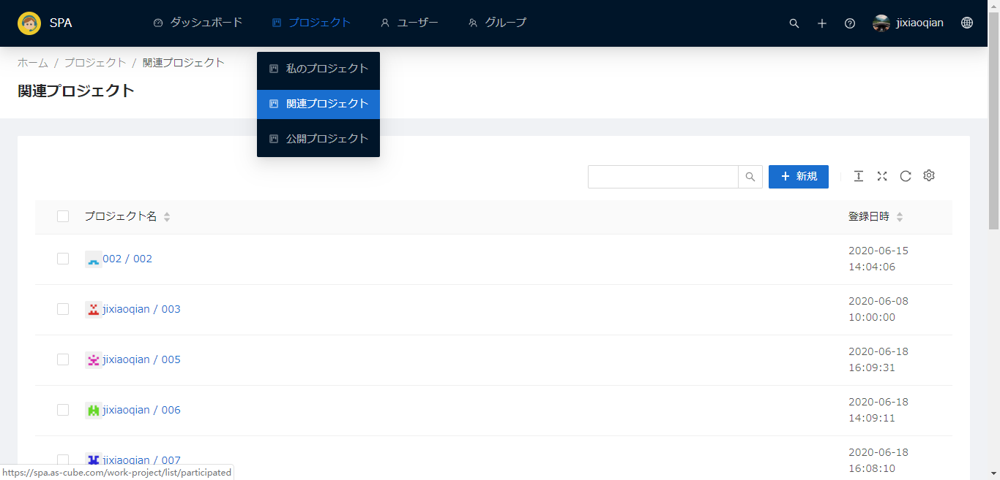

◆   関連プロジェクトがここに表示されます.プロジェクトは自分で作成し、一部は参加するように指定できます.

◆   コンテンツには検索ボックス、新規、密度、フルスクリーン、更新、列設定が含まれます.

◆   検索バー--プロジェクト名その他の情報を検索し、右側の虫眼鏡ボタンをクリックしてプロジェクトを検索します.

◆   新規--[新規]ボタンをクリックして、新しいプロジェクトインターフェイスにジャンプします.

◆   密度--デフォルト、ミディアム、コンパクトの3タイプを選択できます.

◆   フルスクリーン--[フルスクリーン]ボタンをクリックして、組織インターフェイスのフルスクリーンを表示します.

◆   更新--更新ボタンをクリックして画面を更新し、最新の情報を更新します.

◆   列設定--表示する必要のある列情報を選択できます.オプションには列の表示、プロジェクト名、登録日時、およびリセットが含まれます.

◆   リスト情報にはプロジェクト名、登録日時が含まれます.

◆    プロジェクトをクリックすると、プロジェクトの詳細ページに移動します.

◆    詳細は「私のプロジェクト」と同じ.

## 5.3公開プロジェクト

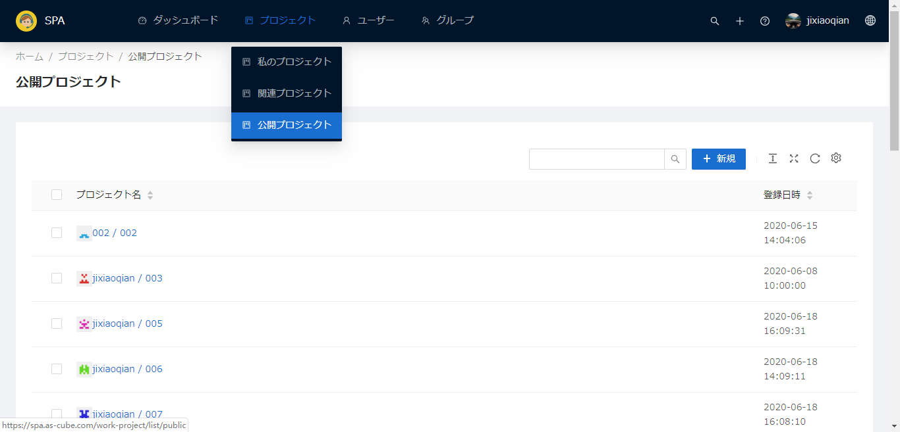

◆   公開プロジェクトがここに表示され、自分や他の人が作成したパブリックプロジェクトがここに表示されます.

◆   コンテンツには検索ボックス、新規、密度、フルスクリーン、更新、列設定が含まれます.

◆    検索バー--プロジェクト名その他の情報を検索し、右側の虫眼鏡ボタンをクリックしてプロジェクトを検索します.

◆    新規--[新規]ボタンをクリックして、新しいプロジェクトインターフェイスにジャンプします.

◆    密度--デフォルト、ミディアム、コンパクトの3タイプを選択できます.

◆   フルスクリーン--[フルスクリーン]ボタンをクリックして、組織インターフェイスのフルスクリーンを表示します.

◆    更新--更新ボタンをクリックして画面を更新し、最新の情報を更新します.

◆   列設定--表示する必要のある列情報を選択できます.オプションには列の表示、プロジェクト名、登録日時、およびリセットが含まれます.

◆   リスト情報にはプロジェクト名、登録日時が含まれます.

◆   プロジェクトをクリックすると、プロジェクトの詳細ページに移動します.

◆    詳細は「私のプロジェクト」と同じ.

# 6.個人データ管理

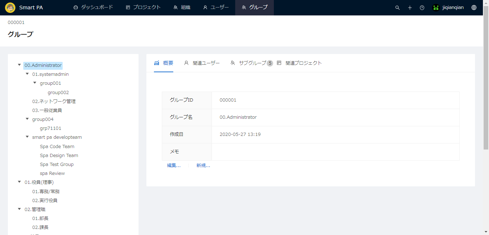

◆    登録者のユーザープロファイルがここに表示され、表示、変更、編集できます.

## 6.1プロファイル

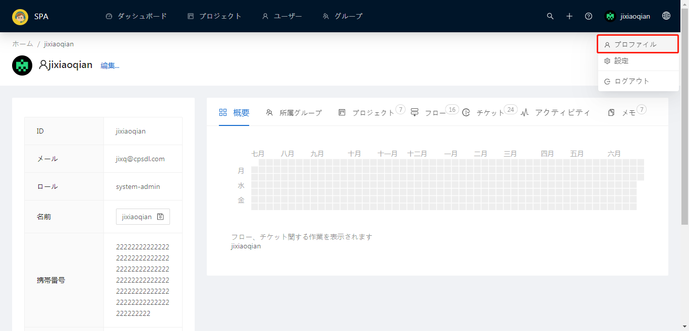

◆    プロファイルをクリックして、ロガーのプロファイルの詳細ページに入ります.

### 6.1.1個人情報編集

.png)

◆    ここをクリックして編集します.詳細の編集インターフェイスに移動できます.

.png)

◆    上の画像はログイン詳細の編集インターフェースを示しています.

◆    ユーザーID--ユーザーのIDがここに表示され、変更できません.

◆    メールアドレス--メールアドレスはここに表示され、変更できません.

◆    ロール--ユーザー権限がここに表示され、権限を変更できます.

◆    ユーザー名称--ユーザー名はここに表示され、変更できます.

◆    画像--ユーザーのアバターがここに表示されます.これは任意に変更できます.

◆    携帯番号--ユーザーの携帯電話番号がここに表示されます.これは変更できます.

◆    備考--備考はここに表示されます.備考を追加または変更できます.

◆    無効にする--無効がここに表示されます.無効にするかどうかを選択します.

◆    変更が完了したら、[保存]ボタンをクリックして新しいユーザー情報を保存します.

### 6.1.2左側のユーザー詳細リスト

.png)

◆     ID--ユーザーIDを表示.

◆     メール--ユーザーのメールを表示.

◆     ロール--ユーザー権限を表示.

.png)

◆     名前--ユーザーの名前が表示され、変更できます.変更後、画面のどこかをクリックすると自動的に保存されます.

◆     携帯番号--ユーザーの携帯電話番号がここに表示されます.

◆     メモ--ユーザーメモはこちら.

### 6.1.3右側のユーザー参加の詳細

.png)

◆     プロジェクトへのユーザーの参加の詳細とプロジェクトの関連コンテンツはここに表示されます.

◆     コンテンツには概要、組織、プロジェクトへの参加、フローへの参加、チケットへの参加、アクティビティ、注意が必要な事項が含まれます.

#### 6.1.3.1概要

◆     これは過去1年間の発券プロセスと登録者の作業の概要です.

◆     視覚化されたグラフ表現、効果はより明白です.

#### 6.1.3.2所属グループ

.png)

◆     登録者が所属する組織を表示.

◆     このページは組織のインターフェースと同じです.

.png)

◆     組織IDをクリックすると、ページが組織の詳細インターフェイスにジャンプします.

#### 6.1.3.3プロジェクト

.png)

◆    登録者が作成または参加しているすべてのプロジェクトを表示する.

◆    インターフェースはプロジェクトのインターフェースと同じです.

.png)

◆    プロジェクト名をクリックすると、ページがプロジェクトの詳細ページにジャンプします.

#### 6.1.3.4フロー

.png)

◆    登録者が作成または参加したすべてのフロー情報を表示します.

◆    ページはフローホームページと同じです.

.png)

◆    プロジェクト名をクリックすると、ページがプロジェクトの詳細ページにジャンプします.

.png)

◆    業務フローをクリックして、フローインターフェースにジャンプします.

#### 6.1.3.5チケット

.png)

◆    登録者が作成および参加されたチケットを表示する.

◆    このページはチケットの詳細ページと同じです.

.png)

◆    IDをクリックしてチケットの詳細ページに入ります.

.png)

◆    業務フローをクリックして、フローインターフェースにジャンプします.

#### 6.1.3.6アクティビティ

◆    登録者の最近の活動の詳細を表示.

#### 6-6.1.3.7メモ

.png)

◆    登録者の作成と参加に関する注意事項の詳細を表示する.

◆    このページは注意の詳細ページと同じです.

.png)

◆    プロジェクトをクリックすると、プロジェクトの詳細ページにジャンプします.

.png)

◆    タイトルをクリックして、メモの詳細ページに入ります.

## 6.2設定

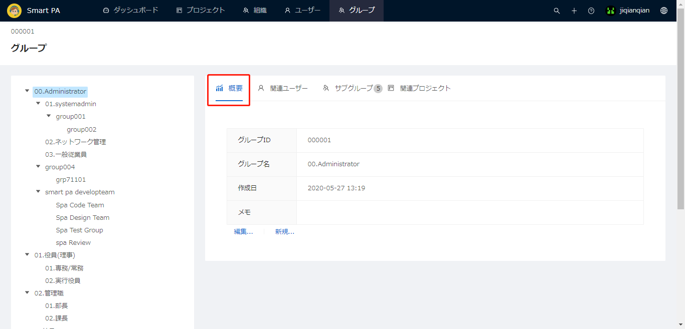

◆    コンテンツには個人情報とトークン管理が含まれます.

### 6.2.1個人情報

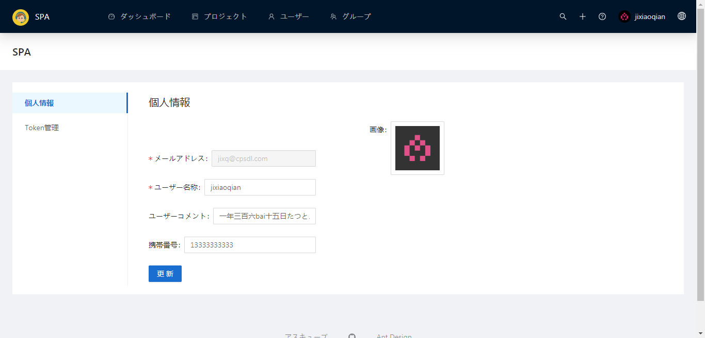

◆    個人情報はここで変更できます.

◆    メールアドレス--メールアドレスはここに表示され、変更できません.

◆    ユーザー名称--ユーザー名はここに表示され、変更できます.

◆    ユーザーコメント--ユーザーのコメントはここに表示され、必須ではありません.

◆    携帯番号--ここに携帯電話番号が表示されます.これは変更可能で.必須ではありません.

◆    画像--ポートレートをアップロードまたは削除できます.

◆    変更が必要な情報を入力したら、[更新]をクリックして、最近変更した登録者の個人情報を保存します.

### 6.2.2 Token管理

.png)

◆    サードパーティのインターフェースに接続されているトークン管理ページがここに表示されます.

.png)

◆    サードパーティのインターフェースとのインターフェース.

# 7.言語切り替え

◆    言語はここで切り替えることができます.現在英語と日本語の2つの言語があります.

# 8.ログアウト

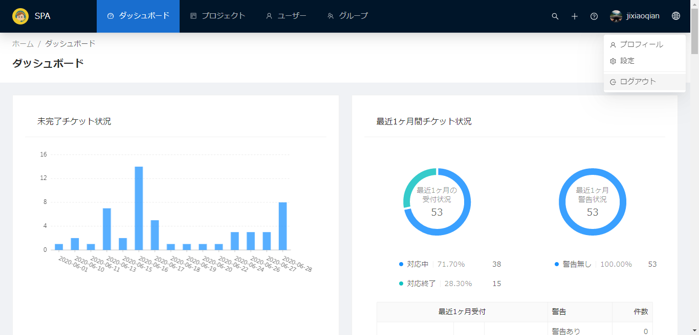

◆    [ログアウト]をクリックしてログアウトし、ログインインターフェイスに戻ります.