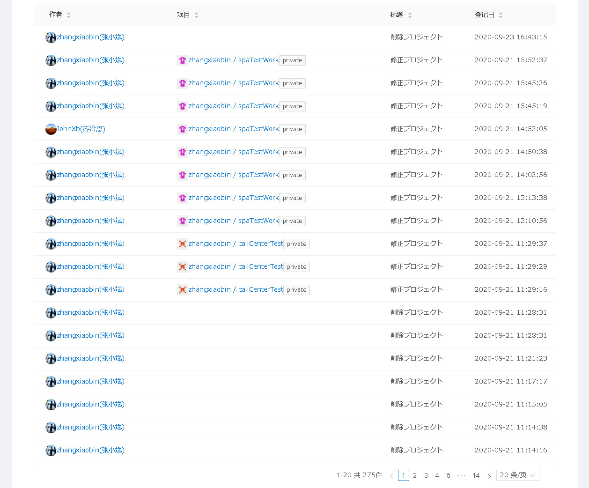

---
#指标面板
---
指标面板是登陆系统后显示的第一个画面，在此画面，可以查看工单完成情况、
现有项目、常用工作流和最近更新的工作流、最近的操作记录。

##1 进入指标面板
登陆系统后，显示的第一个画面即为指标面板。
如果已经进入别的画面，则点击页面顶部菜单栏的 <u>指标面板</u> ，即可进入指标面板画面。  

如图所示，指标面板包含以下内容：
- 工单状态：最近一个月每日工单数
- 上个月工单状态：上个月工单完成情况
- 项目：个人项目和相关项目列表
- 工作流：常用工作流列表和最近更新的工作流列表
- 活动：操作记录列表

##2 工单状态
工单状态用柱状图显示最近一个月每日的工单完成情况。
横柱为日期，起始日为当日一个月前的日期，终止日为当日。
纵柱为工单数，蓝色纵柱为每日工单总数，绿色纵柱为每日未完成的工单数。

###2.1 全部与未完成
初始时柱状图上，每日的总工单数和未完成工单数全都显示。
如果仅仅想显示其中一种，可通过点选全部和未完成两个复选框来实现。

(1) 仅显示全部工单
通过点击全部和未完成两个复选框，使全部复选框为选中状态，未完成复选框为非选中状态，即可仅显示全部工单的纵柱。

(2) 仅显示未完成工单
通过点击全部和未完成两个复选框，使未完成复选框为选中状态，全部复选框为非选中状态，即可仅显示未完工工单的纵柱。

(3) 全部工单和未完成工单全都显示
如果想要全部工单和未完成工单都显示，则点选全部复选框和未完成复选框使其均为选中状态即可。

###2.2 查看某日工单完成情况
若要查看某日工单的完成情况，则将鼠标移至要查看的日期的纵柱上，即可显示此日的工单完成情况。

##3 上月工单状态
上月工单状态，是将最近一个月的工单，按照完成、对应中、暂停、取消的四种状态进行分类统计。

###3.1 在环状图上仅显示部分状态的工单
初期时在环状图上，各不同状态的工单是全都显示的。若只想显示部分状态的工单，则通过点选各分类状态的复选框即可。
例如只想将完成和取消的工单显示在环状图上，则通过点击状态复选框，使得完成和取消为选中状态，其它的复选框为未选中状态即可。

###3.2 在环状图上查看各不同状态工单的比率
在环状图的旁边，有各不同状态的工单的数量和比率的列表。

同时在环状图上，也可以查看各状态的工单的比率。例如要在环状图上查看取消的工单的比率，则将鼠标移至取消部分，即可显示其比率。

###3.3 查看某类状态的工单一览
如果想查看某类状态的工单一览，则点击最近一月工单列表里的第一列(状态列)，即可进入对应的状态工单一览画面。

##4 项目
项目这一部分，分为我的项目和相关项目两部分，在此可以查看和用户有关的项目列表。
我的项目是项目所属权为当前用户的项目。相关项目是项目成员里包括当前用户的项目。

如果想查看某项目的详细信息，则点击一览里的项目编号，即可进入项目的综合信息管理画面。

##5 工作流
工作流这一部分，分为常用工作流和最近更新工作流，在此可以查看和用户的工作流列表。
常用工作流是最近经常使用的工作流。最近更新的工作流是最近新建或修改过的工作流。

如果想查看某工作流的详细信息，则点击一览里的工作流名称，即可进入工作流的综合信息管理画面。

##6 活动
活动这一部分，是最近的操作历史记录。在此可查看操作者、操作项目、操作类型、操作日期。

如果要查看操作项目的具体信息，可点击一览里的项目一列，即可进入项目综合信息管理画面。

如果要查看操作着的具体信息，可点击一览里的项目一列，即可进入用户综合信息管理画面。

