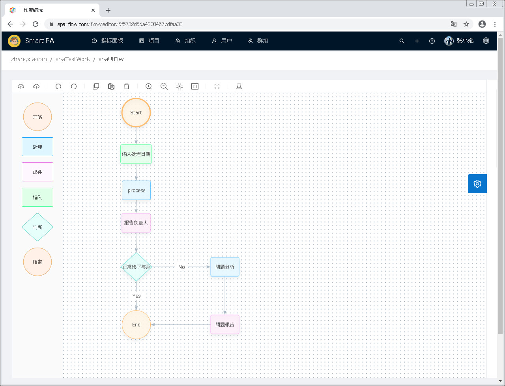
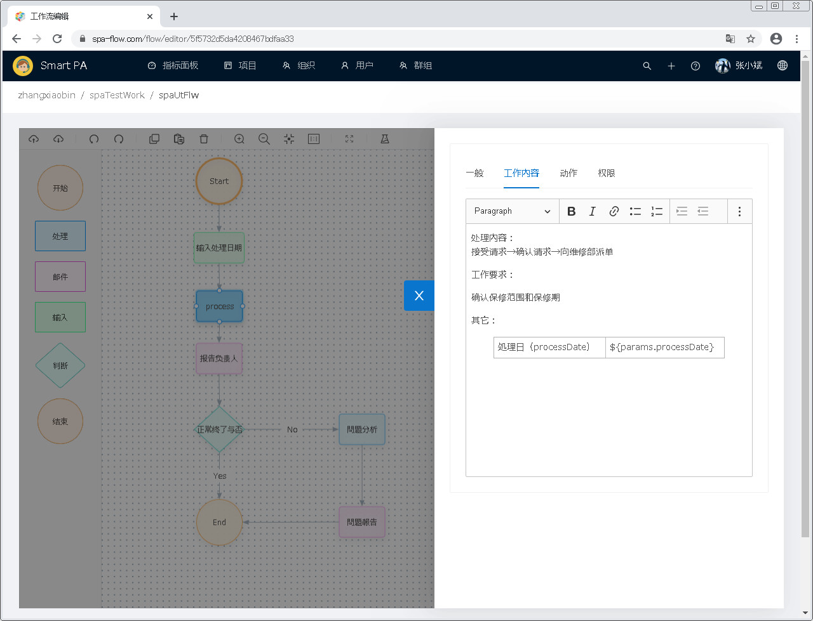
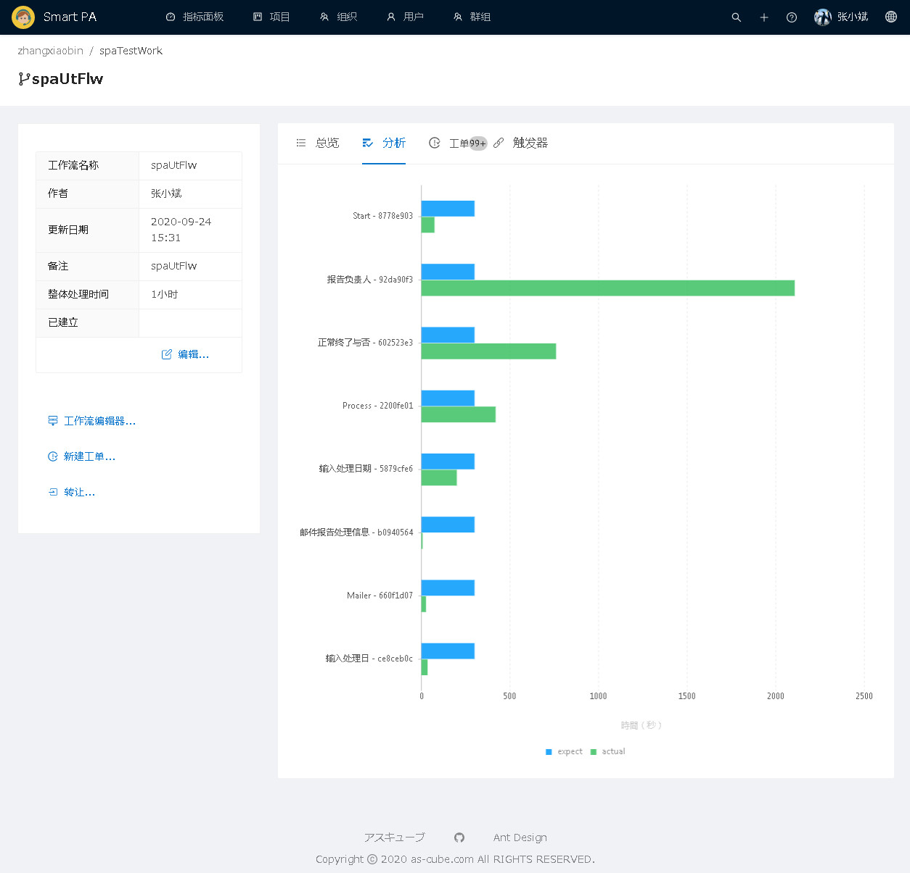
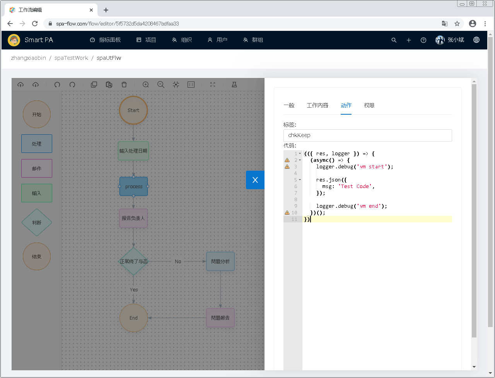
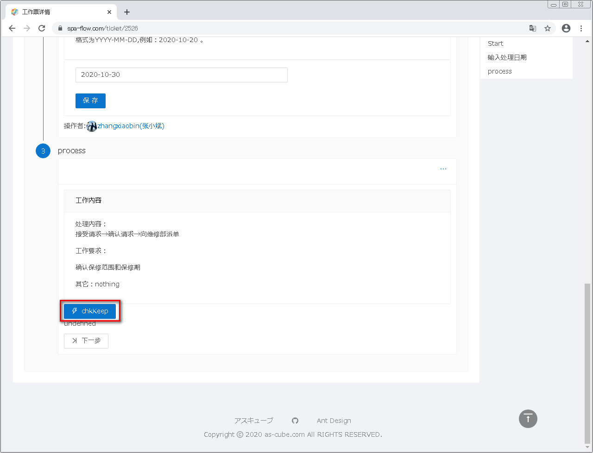

---
#开始使用
---

## 写在前面

Smart PA 是一款企业级的工作管理解决方案。普通的流程定义是以文字描述流程的，而Smart PA则是在Web页面上
以图形的方式制作和显示流程图，可以直观而灵活的定义流程图。

##功能内容
Smart PA 具有以下功能：
```text
- 组织管理
  - 公司各级别组织的管理
  - 公司各级别组织下属组织的管理
  - 各级别组织所属人员的管理
- 用户管理
  - 用户管理
  - 用户综合信息管理
    - 用户所属群组管理
    - 用户项目、工作流和工单的管理
- 群组管理
  - 群组的管理
  - 群组下级群组的管理
  - 群组成员的管理
  - 群组关联项目的管理
- 项目管理
  - 个人项目、关联项目和公开项目的管理
  - 项目综合信息管理
    - 项目工作流和工单的管理
    - 项目成员及群组的管理
- 指标面板
  - 柱状图和环形图显示近一月的工单完成情况
  - 列表显示用户项目
  - 列表显示常用工作流
  - 列表显示最近用户操作历史
```
##功能特点
Smart PA具有以下与众不同的特点：
- 图形化的流程制作
- 计算工作流程中各节点平均用时，分析工作流程中最费时的节点
- 对于繁琐费时的工作节点，通过此系统独有的动作设定，以自动化程序替代人工提高效率

###图形化的流程制作
如下图，使用工作流程图编辑器，以图形化方式制定工作流程。

并且可在记述各节点的工作内容、设定节点的期待工时等。


###分析工作流程中各节点用时
如下图，以柱状图显示各节点的期待用时和实际平均用时。可直观的显示各节点规划用时和实际用时的差距，
并且可找出最为费时的部分，之后分析差距的原因，便可改善工作流程。


###用自动化程序提高工效
通过各节点的用时分析，找出最为费时工作部分，可编写代码实现程序自动化，以替代人工，提高工效。
如下图，在工作节点设定中，有动作的设定。其中的标签是动作按钮的名字，而代码则可实现一定功能，以替代人工。

之后，在工单的此节点中，便会出现所设定动作的按钮，点击此按钮，便可执行动作代码的功能。


##适用者
此解决方案适用于工作流程繁多费时的公司，例如集团公司Call Center。
此解决方案最初也是为一公司的Call Center而设计的。

##前序准备
您只需要在电脑上安装浏览器(推荐谷歌浏览器)即可使用此系统。


