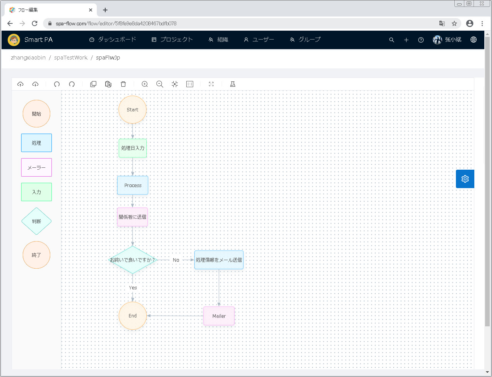
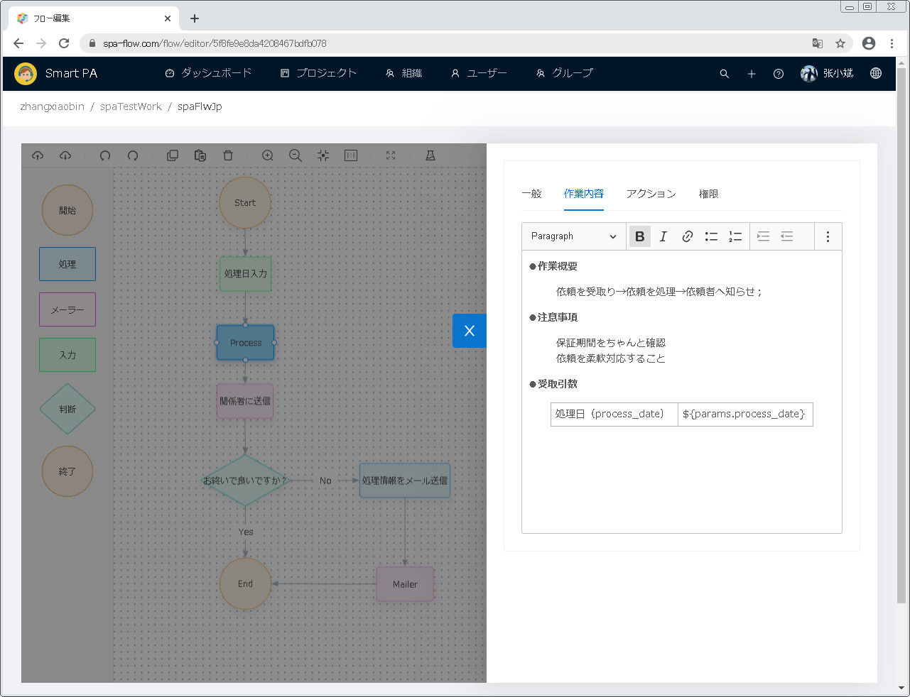
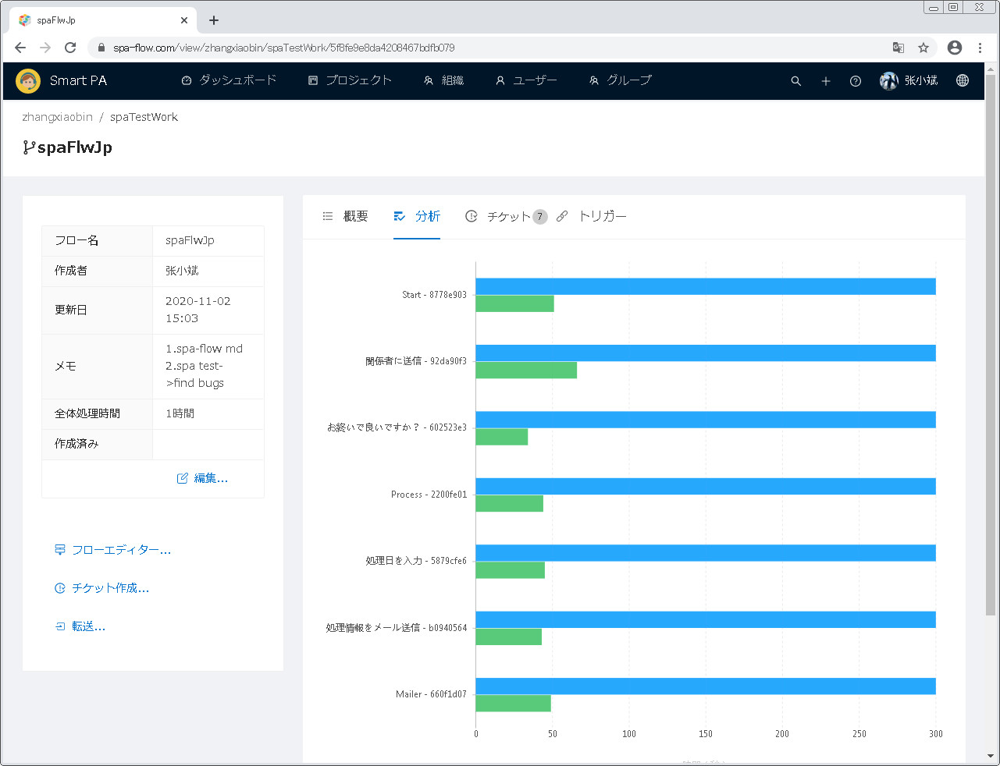
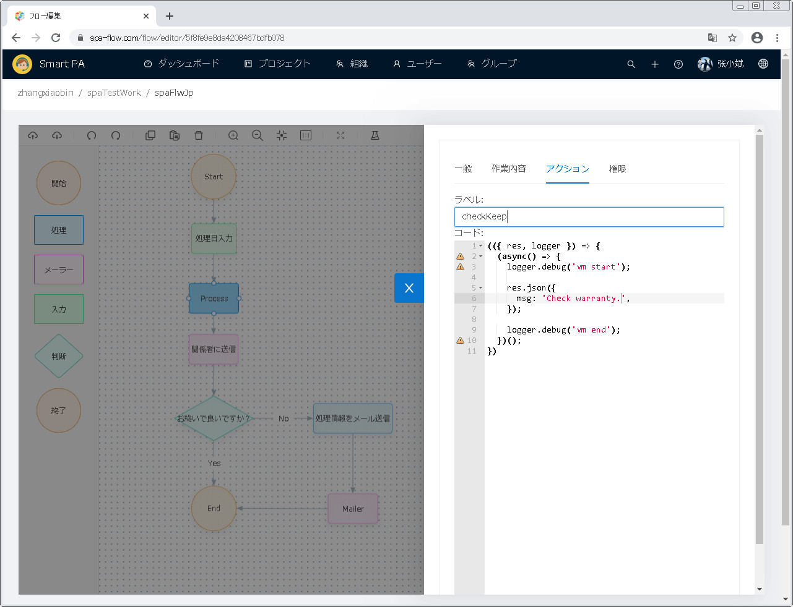
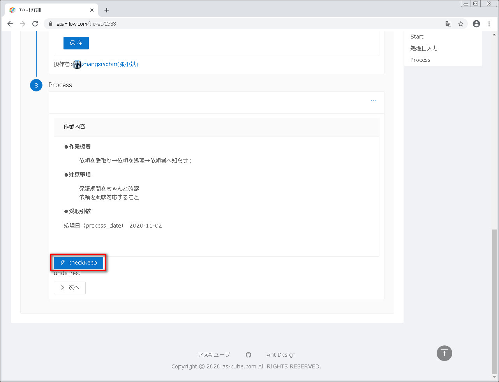

## 前書き
Smart PA は会社に向くワークフローソリューションです。普通のワークフローは文字列で定義されますが、Smart PAはウェブ画面で
チャートでワークフローを作ります。これでワークフローの作り方は柔軟、直観的となれます。

## 機能説明
Smart PA は下記の機能を持ちます：
```text
- 組織管理
  - 各レベル組織管理
  - 各組織の下位組織管理
  - 各組織メンバーの管理
- ユーザー管理
  - ユーザー管理
  - ユーザー総合情報管理
    - ユーザー所属グループの管理
    - ユーザーのプロジェクト、ワークフローとチケットの管理
- グループ管理
  - 各レベルグループ管理管理
  - 各グループの下位グループ管理
  - 各グループメンバーの管理
  - 各グルーのプロジェクト管理
- プロジェクト管理
  - 個人プロジェクト、関連プロジェクトと公開プロジェクトの管理
  - プロジェクト総合情報管理
    - プロジェクトのワークフローとチケットの管理
    - プロジェクトのメンバーとグループの管理
- ダッシュボード
  - チャートで最近一カ月のチケットの進捗状態を表します
  - ユーザーのプロジェクトをリストアップします
  - 最近よく使うワークフローをリストアップします
  - 最近のアクティビティをリストアップします
```

##製品特長
Smart PAは下記の製品特長を持ちます：
- チャートでワークフローを作れます
- ワークフローの各ノードがかかった時間を統計出来ます
- 面倒くさい作業は、人間の代わりに、プログラムで実行することで効率を向上できます

###チャートでワークフローを作ります
下図の通りで、フローエディターを利用することによりチャートの形でワークフローを作れます

各フローノードの作業内容、期待時間等を設定できます。


###各フローノードがかかった時間を統計できます
下図の通りで、チャートで各フローノードの期待時間と実にかかった時間を表示します。期待時間と実にかかった時間との差異を
直観的に確認できます。差異を分析してからワークフローを改善出来ます。


###プログラムにより作業効率を向上します
各ノードが掛かった時間の統計と分析により、人間の代わりにプログラムで面倒くさい作業を実行し、効率を向上できます。
下図の通りで、ノードの設定画面に、アクションの設定があります。ラベルはアクションボタン名で、コードは機能を実現するソースコードです。

後はチケットで、このアクションボタンが表示され、ボタンをクリックしたら、ソースコードの機能を実行できます。


##適用者
当ワークフローソリューションはワークフローが多い会社に適用され、例えばコールセンターです。

##使用準備
ココンピューターにウェブブラウザ(googleブラウザが推薦です)をインストールするだけでいいです。