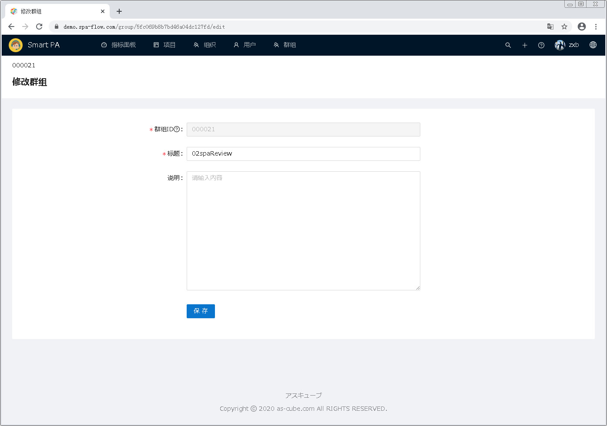
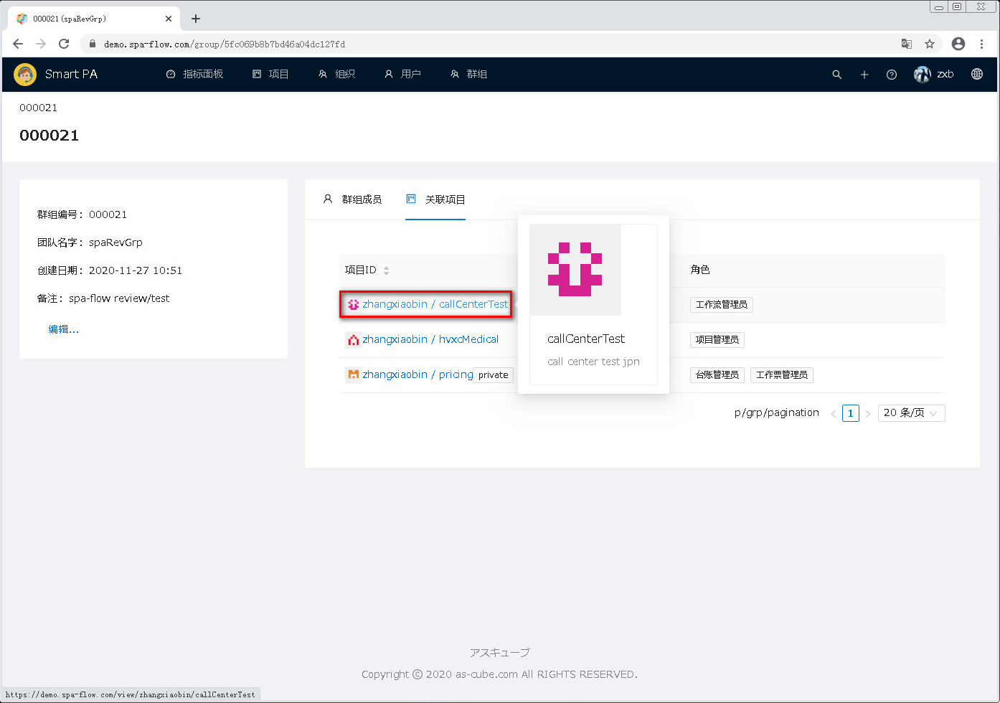

---
#群组管理
---

##1 进入群组管理模块

点击页面顶部菜单栏的 <u>群组</u> ，即可进入群组管理模块。  

##2 新建群组
新建群组有两种方式。
&emsp;第一种是点击页面左栏群组列表下面的 <u>新建...</u> 按钮。
&emsp;第二种是点击页面右栏的概要标签的下面的 <u>新建...</u> 按钮。
二者的不同之处是：
&emsp;第一种：新建群组页面里的上级群组一项的默认值为空。
&emsp;第二种：新建群组页面里的上级群组一项的默认值为当前选择的群组。

以下分别说明两种新建群组的方法。

##2.1 点击页面左栏群组列表下面的 <u>新建...</u> 按钮来新建群组
点击页面左栏群组列表下面的 <u>新建...</u> 按钮

进入新建群组页面。注意上级群组一项为空，没有默认值。

输入要新建的群组信息后，点击<u>保存</u>按钮。
[注意]&emsp;上级群组若不输入，则建立的群组为顶级群组。

保存后，页面跳转到一览页面，在一览中，可以看到刚才新建的群组。

##2.2 点击页面右栏的概要标签的下面的 <u>新建...</u> 按钮来新建群组
选择一个群组，点击其概要标签页下面的<u>新建...</u> 按钮

进入新建群组页面。注意上级群组一项具有默认值，其默认值为当前选中的群组。

输入要新建的群组信息后，点击<u>保存</u>按钮。

保存后，页面跳转到一览页面，在一览中，可以看到刚才新建的群组。

##3.编辑群组
从页面左栏的群组树中，点击选择要修改的群组。页面右栏则显示被选择的群组信息。
群组信息分为<u>概要</u>、<u>群组成员</u>、<u>下级群组</u>、<u>关联项目</u> 四部分。

###3.1群组概要信息的编辑
点击概要下面的<u>编辑...</u>按钮，即可进入群组修改页面。

进入群组编辑页面。

修改群组信息后，点击<u>保存</u>按钮。

保存后，页面跳转至群组一览页面，可以看到刚才修改的群组的信息。

###3.2群组成员的管理
点击群组成员标签，进入群组成员一览页面。在此页面，可添加和移除群组成员。

####3.2.1添加群组成员
点击<u>添加</u>按钮，

弹出添加用户的页面。  

在输入框中输入要添加的用户名。输入时，与输入文字部分匹配的用户将自动列出，可从列表中点击选择。  

选择好要添加的用户后，点击OK按钮即可。若要放弃本次操作，则点击取消按钮即可。

点击OK按钮后，页面跳转到用户一览画面，可以看到刚才添加的用户出现在列表中。

####3.2.2移除群组成员
选中要移除的用户前面的复选框，

之后用户列表上方出现已选中条数的信息和<u>移除</u>按钮,

选中要移除的用户后，点击<u>移除</u>按钮,

用户一览刷新，可以看到被移除的用户已经从一览中消失。

###3.3下级群组的管理
点击下级群组，进入下级群组一览页面，在此页面，可删除下级群组和查看下级群组的详细信息。

####3.3.1删除下级群组
通过点选最前面的复选框选中要删除的下级群组，之后下级群组列表上方出现已选中条数的信息和<u>删除</u>按钮。

选中要删除的下级群组后，点击<u>删除</u>按钮。出现删除确认的对话框。
点击<u>OK</u>按钮，即可进行删除。点击<u>取消</u>按钮，则放弃本次删除操作。

之后，下级群组一览刷新。可以看到刚才删除的下级群组已经从一览中消失。

####3.3.2查看下级群组详细信息
点击要查看的群组的群组编号，进入下级群组详细信息页面，可查看其详细信息。

进入下级群组详细信息页面后，在页面左栏有<u>编辑...</u>、<u>新建...</u>按钮。
页面右栏则有群组成员、下级群组、关联项目3个标签页面。下面分别说明其操作功能。
&emsp;编辑按钮：点击进入群组编辑页面，操作请参见<u>###3.1群组概要信息的编辑</u>。
&emsp;新建按钮：点击进入群组新建页面，操作请参见<u>##2.2 点击页面右栏的概要标签的下面的 <u>新建...</u> 按钮来新建群组</u>。
&emsp;群组成员标签页：参见<u>###3.2群组成员的管理</u>。
&emsp;下级群组标签页：参见<u>###3.3下级群组的管理</u>。
&emsp;关联项目标签页：参见<u>###3.4关联项目的管理</u>。

###3.4关联项目的管理
点击关联项目，进入关联项目一览页面。

###3.4.1查看项目具体信息
点击要查看的项目，

进入项目详细页面。
