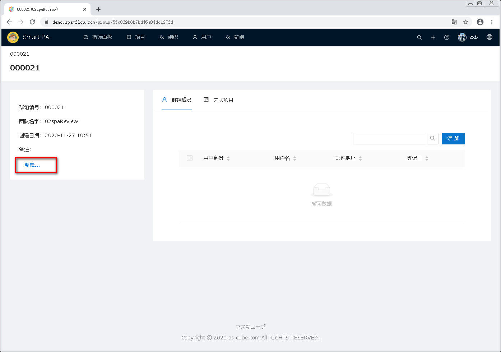
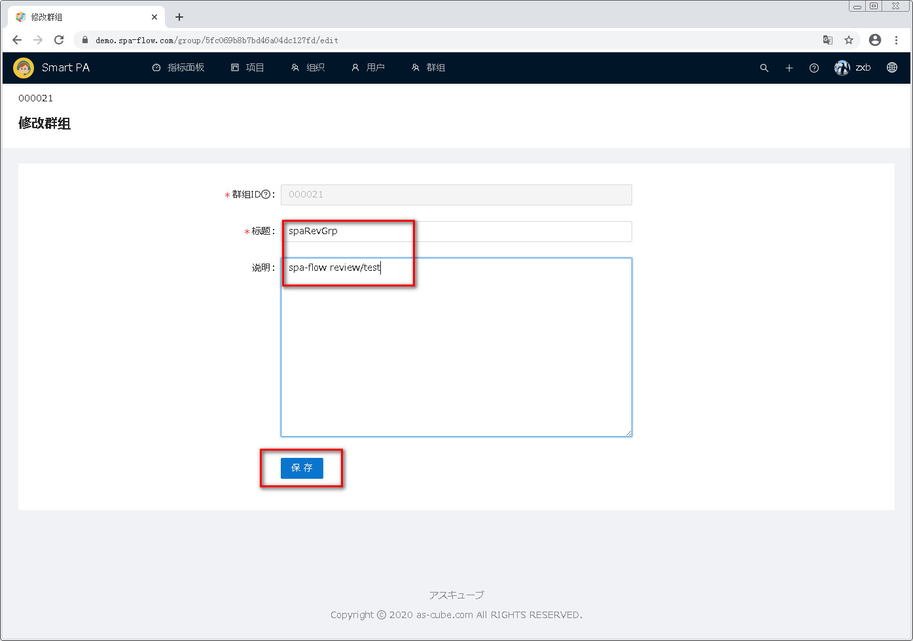
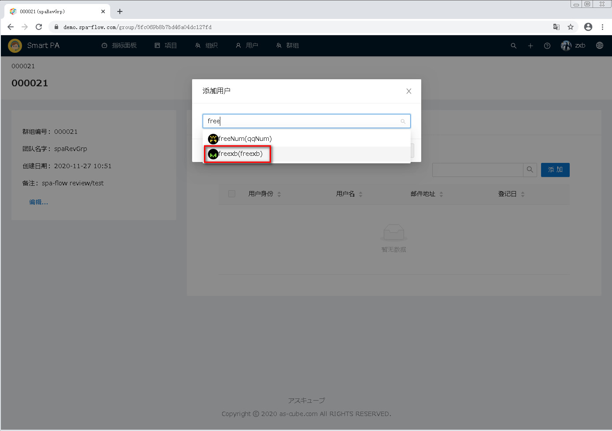
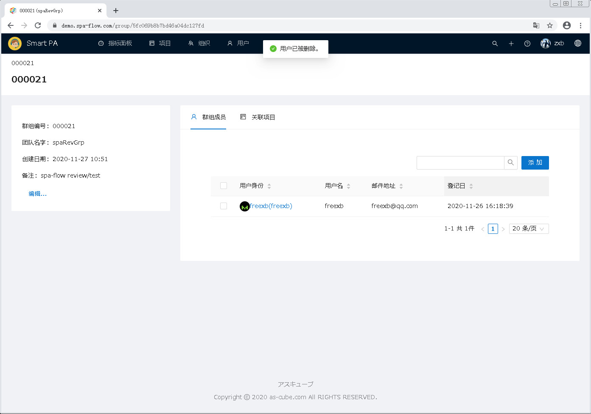

---
#群组管理
---

##1 进入群组管理模块

点击页面顶部菜单栏的 <u>群组</u> ，即可进入群组管理模块。  

##2 群组检索

##2.1 检索群组编号中包含检索文字的群组
如下图，群组列表上方有检索框，可通过它检索群组。
检索的匹配模式是部分包含匹配，即群组编号或团队名字中包含输入的检索文字的群组会被检索到。且检索文字不区分大小写。

首先，在检索框中输入检索文字。

然后点击检索按钮(即放大镜图标),或者按回车键(Enter键)。

群组编号或团队名字中包含检索文字的群组被检索出来。

##2.2 显示所有群组
如果想显示所有群组，则删除检索框中的所有文字，之后点击检索按钮(或者在键盘上点击回车键)，即可显示所有群组。

##3 下载群组信息一览
可以点击下载按钮，将群组信息一览以csv文件格式下载到本地电脑。

点击下载按钮。

下载完成后，页面底部显示下载状态栏，点击下载文件右边的箭头。

在弹出的菜单中，选择 <u>在文件夹中显示</u>。

下载文件所在的文件夹被打开，可以看到下载文件。

打开文件，确认文件里的群组信息。

##4 新建群组
新建群组有两种方式。
一种是点击<u>+新建</u>按钮，进入创建群组页面来新建群组。
另一种是通过点击上传按钮，通过上传csv文件来批量建立群组。

以下分别说明两种新建群组的方法。

###4.1 新建群组
点击群组列表左上方的 <u>+新建</u> 按钮,

进入新建群组页面,

输入要新建的群组信息后，点击<u>保存</u>按钮,

群组被创建，页面回到群组一览页面。

###4.2 上传csv文件批量建立群组
首先准备好群组csv文件,csv文件的内容和格式参见下图中的groupListUp.csv。

点击群组列表右上方的上载按钮。

弹出文件选择框。

选择准备的群组csv文件，之后点击<u>打开(O)</u>按钮。

页面回到群组一览页面，可以看到群组csv文件中的群组已显示在群组一览中。

##5 管理群组综合信息
从群组一览中，点击要管理的群组编号，即可进入此群组的综合信息管理页面。

在此页面，可编辑群组基本信息、管理群组成员、查看群组的关联项目。

###5.1 编辑群组基本信息
点击概要下面的<u>编辑...</u>按钮，即可进入群组修改页面。

进入群组编辑页面。

修改群组信息后，点击<u>保存</u>按钮。

保存后，页面跳转至群组一览页面，可以看到刚才修改的群组的信息。

###5.2 管理群组成员
在群组成员标签页，可以添加或删除群组所属成员

####5.2.1添加群组成员
点击<u>添加</u>按钮。

弹出添加用户的页面。  

在输入框中输入要添加的用户名。输入时，与输入文字部分匹配的用户将自动列出，可从列表中点击选择。  

选择好要添加的用户后，点击OK按钮即可。若要放弃本次操作，则点击取消按钮即可。

点击OK按钮后，页面跳转到用户一览画面，可以看到刚才添加的用户出现在列表中。

####5.2.2删除群组成员
删除群组成员，并非删除用户信息，只是将用户从群组中移出。

选择要删除用户前面的复选框。

选中用户后，列表上方出现已选中条数的信息和<u>删除</u>按钮。

点击<u>删除</u>按钮。

用户一览刷新，可以看到被删除的用户已经从一览中消失。

###5.3关联项目的管理
点击关联项目，进入关联项目一览页面。

###5.3.1查看项目具体信息
点击要查看的项目。

进入项目详细页面。

##6.删除群组
要删除群组，首先在群组一览里选择要删除的群组。当一览中群组数过多时，可利用检索缩减列表中的群组数。

选中后，一览的上方出现选中件数信息和删除按钮。

点击删除按钮。

弹出删除确认对话框。

点击对话框上的OK按钮即可(若想放弃删除，则点击取消按钮)。

群组被删除，从一览中消失。
