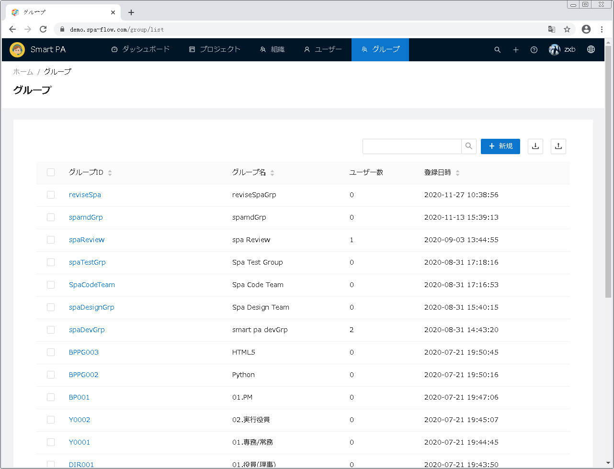
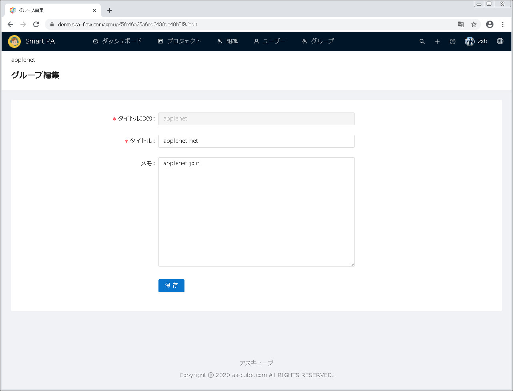
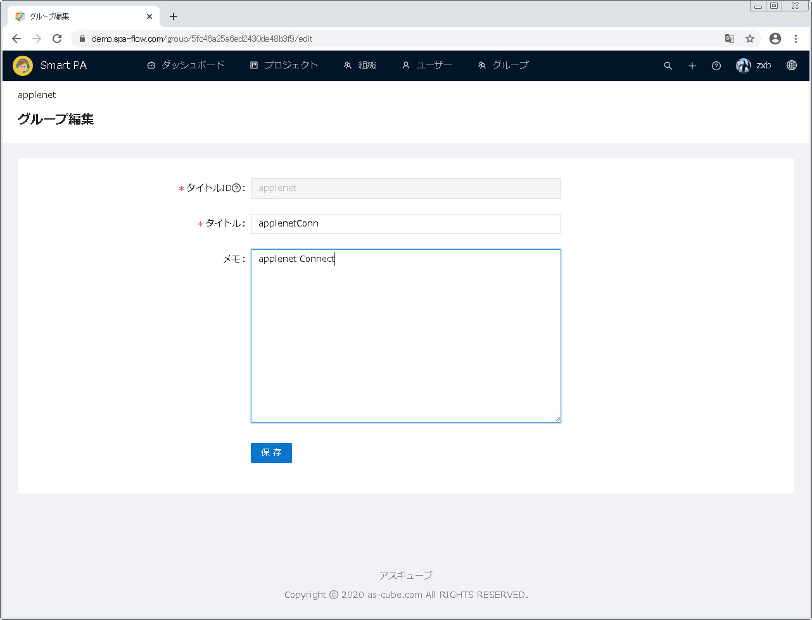
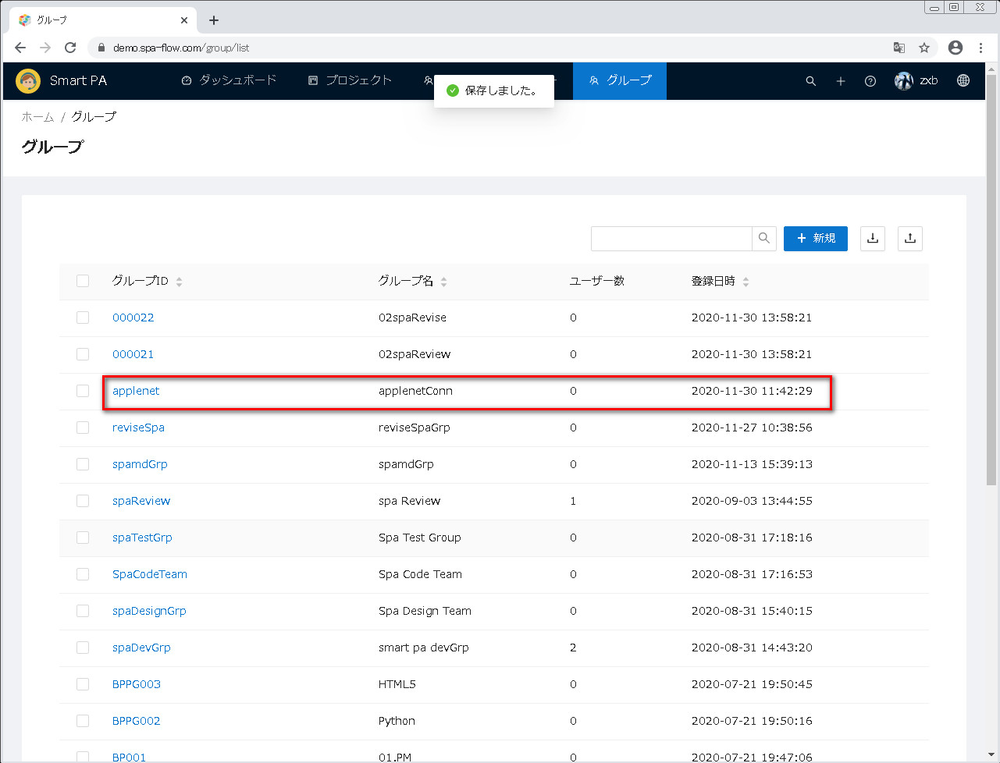
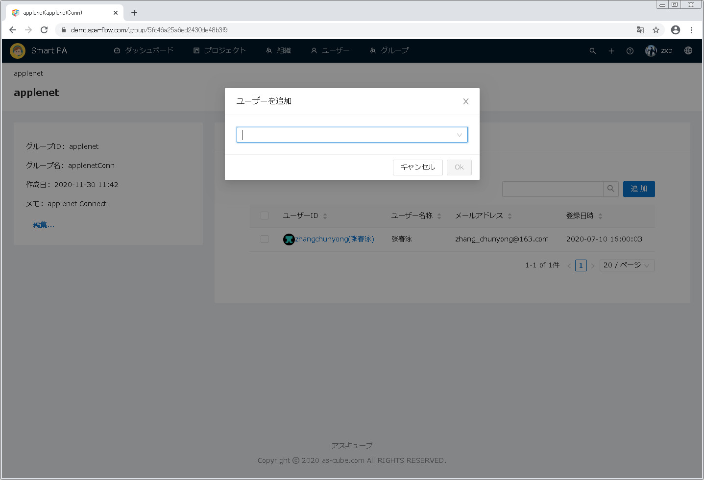
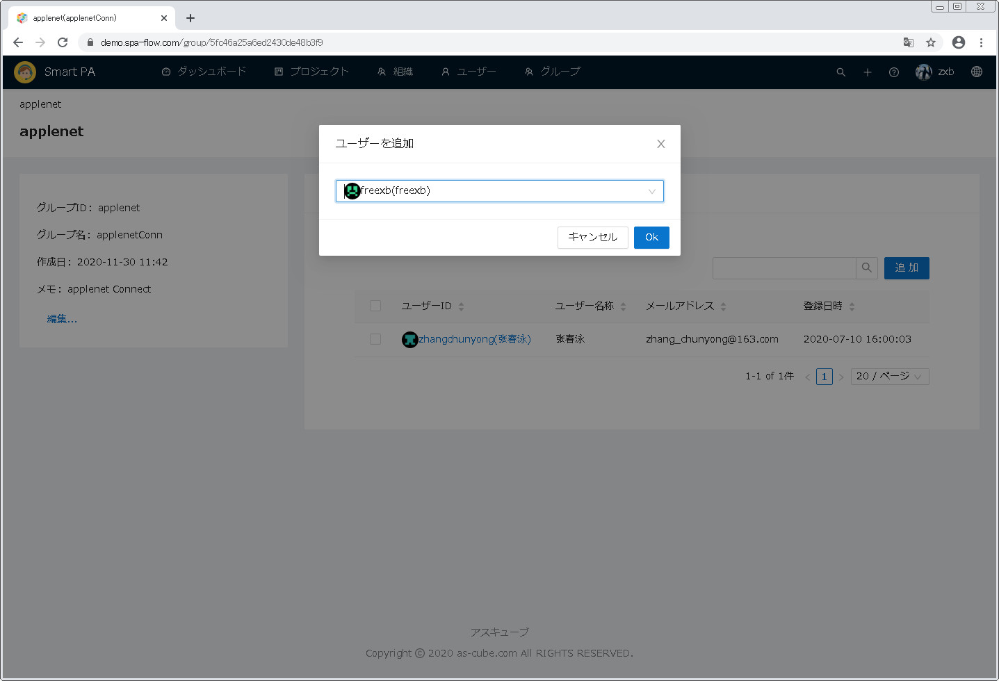
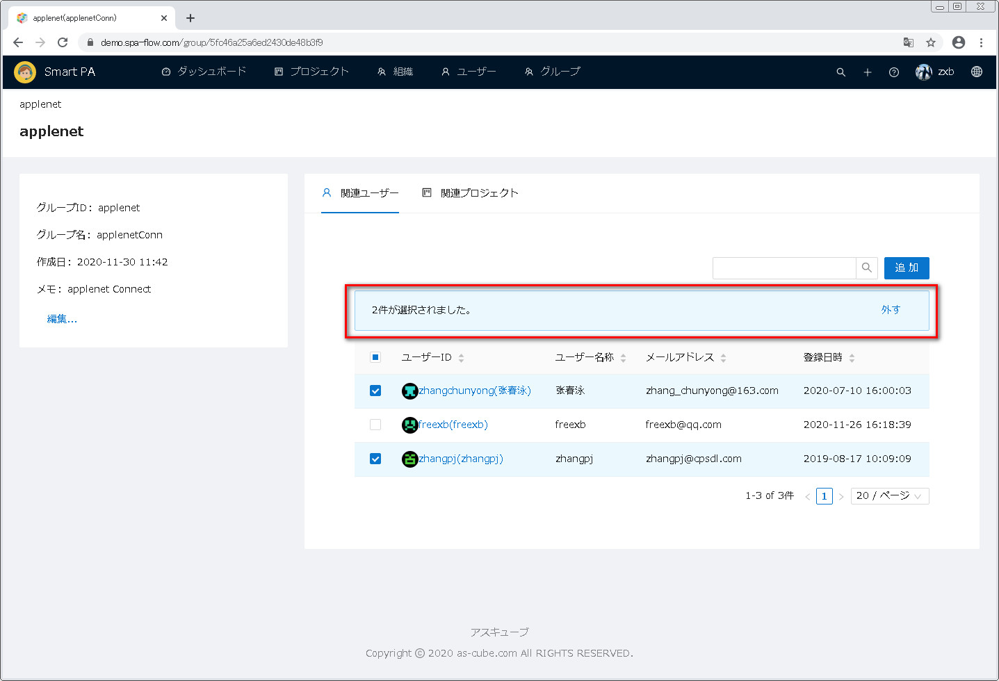
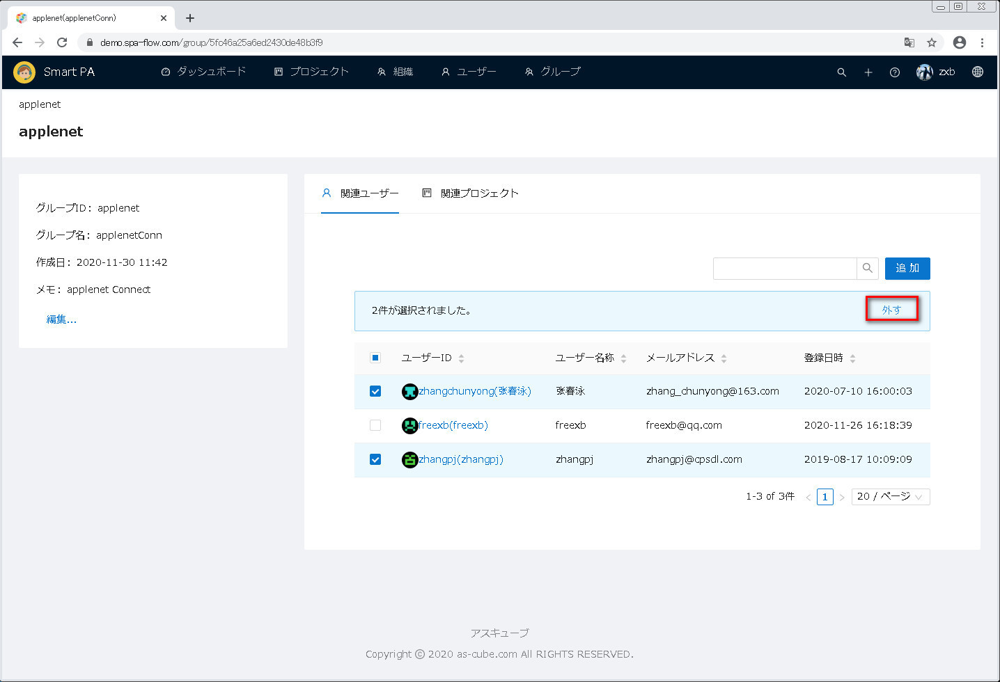

---
#グループ管理機能
---

##1 グループ管理画面を開きます
画面上の方の機能メニューから <u>グループ</u> をクリックし、グループ管理画面が表示されます。  

##2 グループ新規
グループ新規に両方法があります。
&emsp;方法一：画面の左の方のグループ一覧の下にある <u>新規...</u> ボタンをクリックします。
&emsp;方法二：画面の右の方の概要タグの下にある <u>新規...</u> ボタンをクリックします。
両方の違いは下記通りです：
&emsp;方法一：グループ新規画面を開いた時に、上位グループの暗黙値が空です。
&emsp;方法二：グループ新規画面を開いた時に、上位グループの暗黙値が現在選択したグループです。

下記で両方法を別々に説明します。

##2.1 画面の左の方のグループ一覧の下にある <u>新規...</u> ボタンをクリックして &emsp;&ensp;グループを新規します
画面の左のグループ一覧の下にある <u>新規...</u> ボタンをクリックします。

グループ新規画面が表示されます。上位グループの暗黙値が空となります。

グループ情報を入力してから、<u>保存</u>ボタンをクリックします。
[備考]&emsp;上位グループを入力しないと、新規したグループがトップレベルグループとなります。

保存した後、グループ一覧画面へ戻ります。
画面の左の方のグループ一覧から新規したグループの上位グループをクリックしてから、
画面の右の方のサブグループのタグをクリックし、新規したグループがサブグループ一覧に表示されます。

##2.2 画面の右の方の概要タグの下にある <u>新規...</u> ボタンをクリックしてグループを &emsp;&ensp;新規します
左のグループ一覧からあるグループをクリックして、概要タグの下にある<u>新規...</u>ボタンをクリックします。

グループ新規画面が表示されます。上位グループの暗黙値が選択したグループとなります。

グループ情報を入力してから、<u>保存</u>ボタンをクリックします。

保存した後、グループ一覧画面へ戻ります。
画面の左の方のグループ一覧から新規したグループの上位グループをクリックし、
画面の右の方のサブグループのタグをクリックし、新規したグループがサブグループ一覧に表示されます。

##3 グループ編集
画面の左のグループ一覧から、編集するグループを選択し、画面の右の方に当グループ情報が表示され、
情報は 概要、関連ユーザー、サブグループ、関連プロジェクト の四部分に分かられます。

###3.1 グループ概要編集
概要タグの下にある<u>編集...</u>ボタンをクリックします。

グループ概要編集画面が表示されます。

画面でグループ情報を編集してから、<u>保存</u>ボタンをクリックします。

グループ一覧画面へ戻り、直された情報が再表示されます。

###3.2 関連ユーザー管理
関連ユーザーのタブをクリックし、当グループの関連ユーザー一覧画面が表示されます。
この画面で、関連ユーザーを追加すること、関連ユーザーを外すことが出来ます。

####3.2.1 関連ユーザーを追加します
関連ユーザー一覧右上の<u>追加</u>ボタンをクリックします。

ユーザー追加ダイアログが表示されます。

追加するユーザー名を入力します。
入力しているうちに入力した文字列と名前がマッチしたユーザーがリストアップしますので、リストから選択してよいです。 

追加するユーザーを入力してから、OKボタンをクリックします。(追加を取り消したい時に、キャンセルボタンをクリックします）。

関連ユーザー一覧画面に戻ります。追加したユーザーが関連ユーザー一覧に表示されます。

####3.2.2 関連ユーザーを外します
外すユーザー前のチェックボックスをチェックオンします。

関連ユーザー一覧の上に選択した件数と<u>外す</u>ボタンが表示されます。

外すボタンをクリックします。

関連ユーザー一覧が再表示され、外されたユーザーが一覧から無くなります。

###3.3 サブグループ管理
サブグループのタグをクリックしてサブグループ一覧画面が表示されます。
当画面で、下記の機能が提供されます：
&emsp;サブグループを削除します
&emsp;サブグループの詳細情報を確認します

####3.3.1 サブグループを消します
サブグループ一覧から、消すサブグループをチェックオンします。

サブグループ一覧の上に選択件数と削除ボタンが表示されます。

削除ボタンをクリックし、削除確認ダイアログが表示されます。
OKボタンをクリックします。(削除を取り消したい時にキャンセルボタンを押す)。

サブグループ一覧が再表示されます。削除されたサブグループが一覧から無くなります。

####3.3.2 サブグループの詳細情報を確認します
サブグループ一覧から、詳細情報確認するサブグループIDのリンクをクリックし、サブグループの詳細情報画面が表示されます。

当画面で、左の方に<u>編集...</u>と<u>新規...</u>の両ボタンがあり、右の方に関連ユーザー、サブグループと関連プロジェクト
の三タグ画面があります。各機能は下記通りです：
&emsp;編集ボタン：当ボタンをクリックしたら、グループ編集画面が表示されます（###3.1グループ概要の編集を参照）。
&emsp;新規ボタン：当ボタンをクリックしたら、グループ新規画面が表示されます(##2.2画面の右の方の概要タグの下にある
&emsp;&emsp;&emsp;&emsp;&emsp;&emsp;&emsp;<u>新規...</u> ボタンをクリックしてグループを新規しますを参照)。
&emsp;関連ユーザー：<u>###3.2関連ユーザー管理</u>を参照。
&emsp;サブグループ：<u>###3.3サブグループ管理</u>を参照
&emsp;関連プロジェクト：<u>###3.4関連プロジェクト管理</u>を参照

###3.4 関連プロジェクト管理
関連プロジェクトをクリックし、関連プロジェクト管理一覧画面が表示されます。

###3.4.1プロジェクト詳細情報を確認します
詳細情報を確認するプロジェクトIDのリンクをクリックします。

プロジェクト詳細画面が表示されます。
