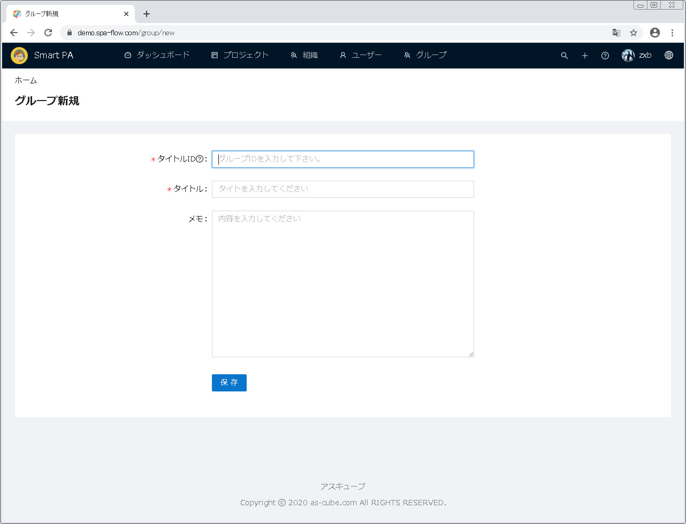
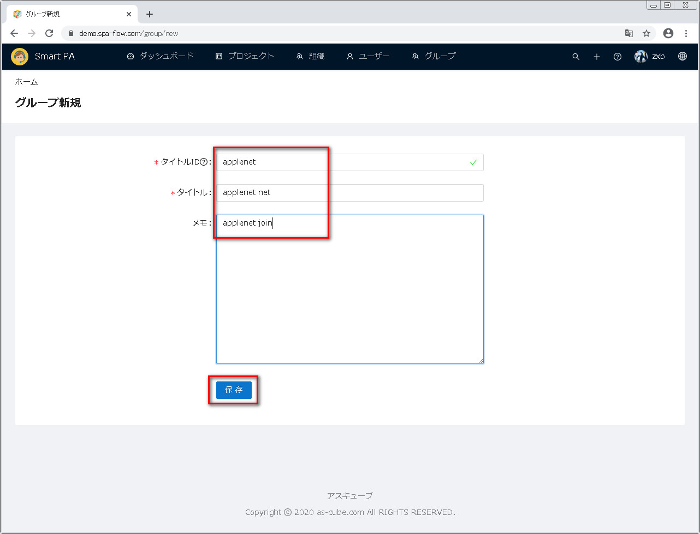
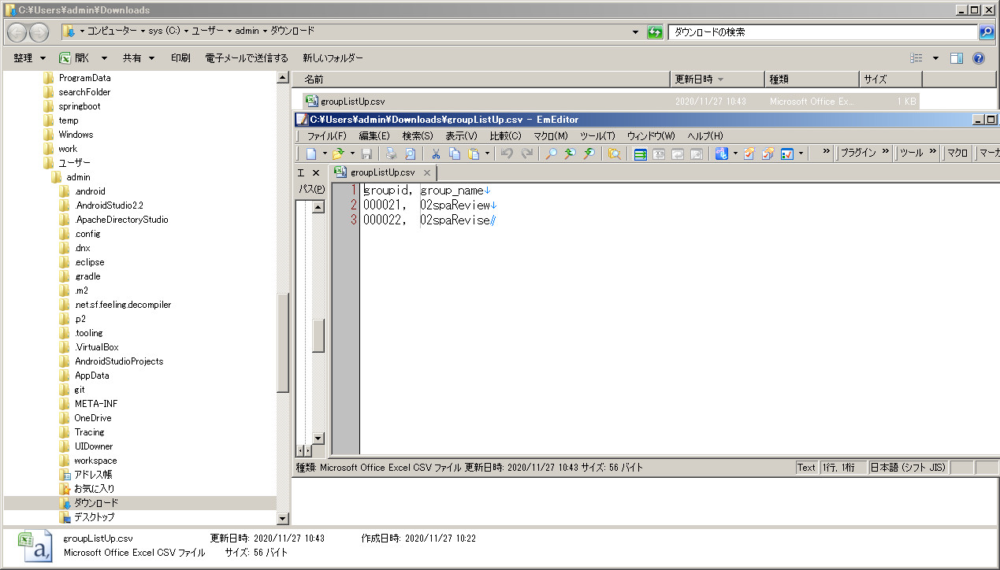
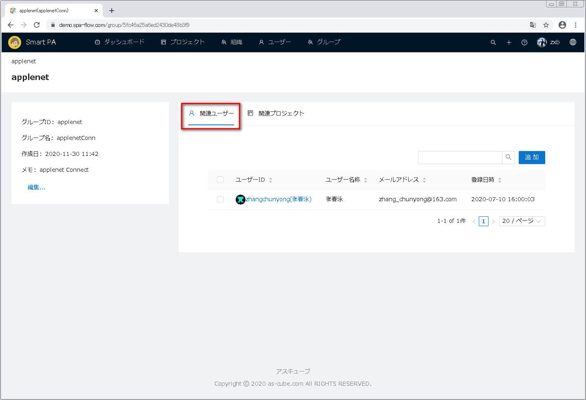
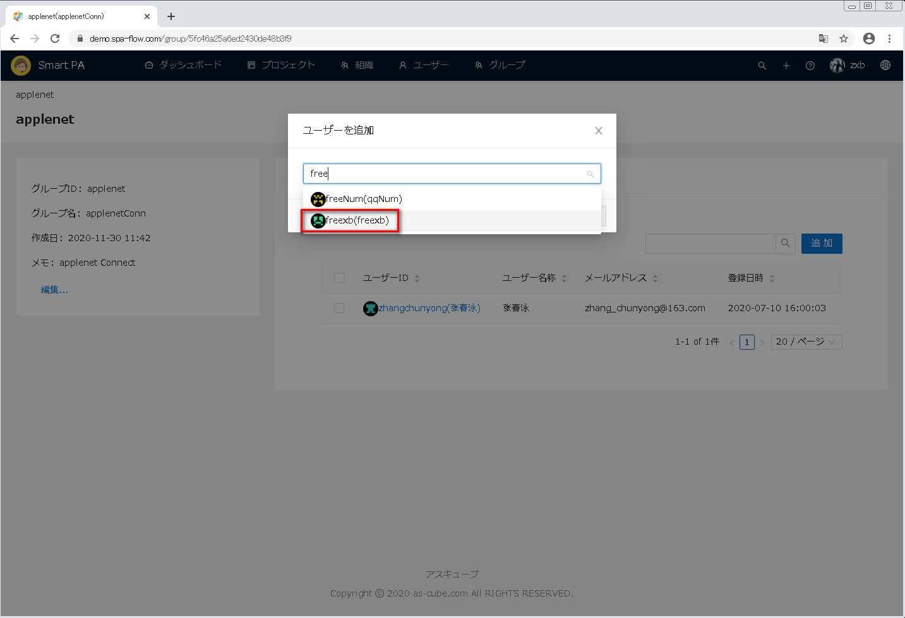
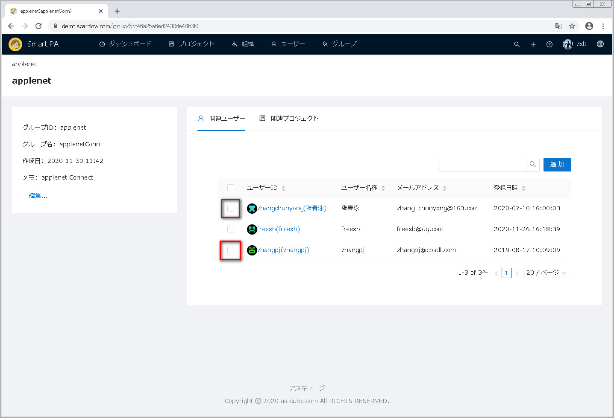
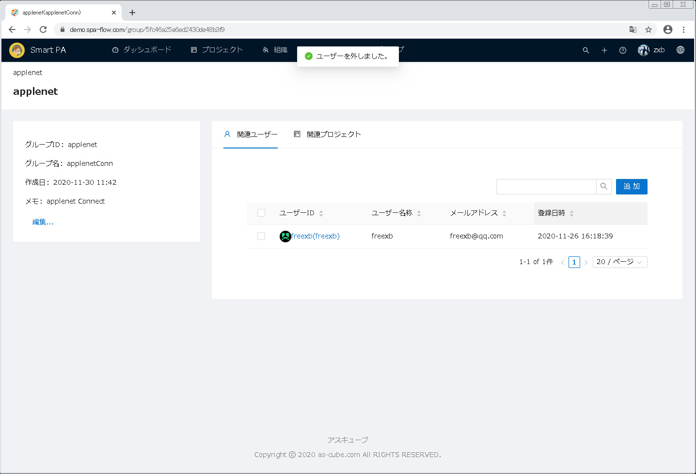
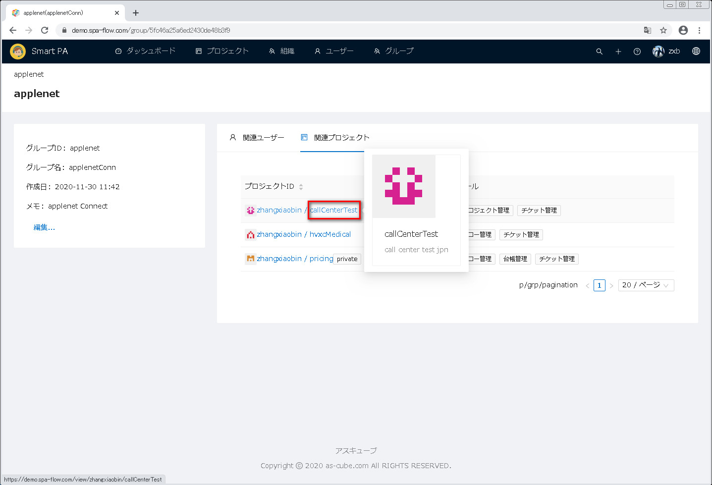
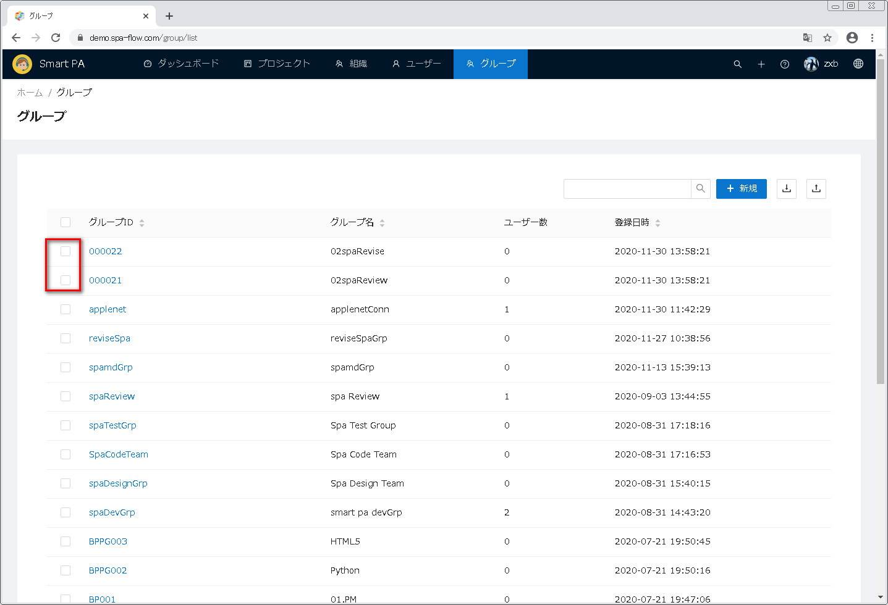

---
#グループ管理機能
---

##1 グループ管理画面を開きます

画面上の方の機能メニューから <u>グループ</u> をクリックし、グループ一覧画面が表示されます。   

##2 グループ検索

##2.1 グループID又はグループ名に検索文字列が含まれるグループを検索します
グループ一覧の上に検索ボックスがあり、これを利用してグループ検索ができます。
マッチパターンは部分一致で、つまりグループID又はグループ名に検索文字列を含むグループが該当されます。
それに大文字と小文字は区別されません。

まず、検索ボックスに検索文字列を入力します。

検索ボタン（拡大鏡のアイコン）或いはEnterキーをクリックします。

該当したグループが検索され、一覧に表示されます。

##2.2 グループ全件を表示します
グループ全件を表示するには、検索ボックスに入力した文字列を全部消してから、検索ボタン（拡大鏡のアイコン）或いはリターン(Enter)キーをクリックします。

##3 グループ情報をダウンロードします
ダウンロードボタンを押すことで、グループ情報一覧をCSVファイルとしてダウンロードできます。

ダウンロードボタンをクリックします。

ダウンロードが完了したら、ダウンロード状態欄にダウンロード済みのファイルが表示され、そばの矢印をクリックします。

表示されるメニューから、<u>フォルダを開く</u>をクリックします。

フォールダが開かれ、ダウンロードされたファイルが表示されます。

ファイルを開き、グループ情報を確認出来ます。

##4 グループ新規
グループ新規に両方法があります。
方法一はグループ一覧上の<u>新規</u>ボタンをクリックします。
方法二はアップロードボタンをクリックし、グループ情報のCSVファイルをアップロードしてグループを新規します。
方法二により複数グループを一回で新規出来ます。

下記は両方法を別々に説明します。

###4.1 新規ボタンでグループを新規します
グループ一覧の上の<u>新規</u>ボタンをクリックします。

グループ新規画面が表示されます。

新規グループの情報を入力してから、保存ボタンをクリックします。

グループ一覧に戻り、一覧に新規したグループが表示されます。

###4.2 CSVファイルをアップロードしてグループを新規します
グループ情報のcsvファイルを用意しておきます。ファイル内容と形式は下図の通りです。

グループ一覧の右上のアップロードボタンをクリックします。

ファイル選択ダイアログボックスが表示されます。

事前に用意したcsvファイルを選択してから、開くボタンをクリックします。

グループ一覧画面が再表示され、csvファイルに書かれたグループが一覧に表示されます。

##5 グループ総合情報管理
グループ一覧に管理するグループIDをクリックします（一覧に表示するグループ件数が多い時に検索により表示件数を縮めて良いです）。

当画面で、グループ基本情報の編集、関連ユーザーの管理と関連プロジェクトの確認ができます。

###5.1 グループ基本情報を編集します
画面左側の<u>編集</u>ボタンをクリックします。

グループ編集画面が表示されます。

グループ情報を直してから、保存ボタンをクリックします。

グループ一覧画面に戻り、直されたグループ情報が再表示されます。

###5.2 関連ユーザー管理
関連ユーザーのタブをクリックし、当グループの関連ユーザー一覧画面が表示されます。
この画面で、関連ユーザーを追加すること、関連ユーザーを外すことが出来ます。

####5.2.1 関連ユーザーを追加します
関連ユーザー一覧右上の<u>追加</u>ボタンをクリックします。

ユーザー追加ダイアログが表示されます。

追加するユーザー名を入力します。
入力しているうちに入力した文字列と名前がマッチしたユーザーがリストアップしますので、リストから選択してよいです。 

追加するユーザーを入力してから、OKボタンをクリックします。(追加を放棄する時に、キャンセルボタンをクリックします）。

関連ユーザー一覧画面に戻ります。追加したユーザーが関連ユーザー一覧に表示されます。

####5.2.2 関連ユーザーを外します
外すユーザー前のチェックボックスをチェックオンします。

関連ユーザー一覧の上に選択した件数と<u>外す</u>ボタンが表示されます。

外すボタンをクリックします。

関連ユーザー一覧が再表示され、外されたユーザーが一覧から無くなります。

###5.3 関連プロジェクト確認
関連プロジェクトをクリックし、関連プロジェクト管理一覧画面が表示されます。

###5.3.1プロジェクト詳細情報を確認します
詳細情報を確認するプロジェクトIDのリンクをクリックします。

プロジェクト詳細画面が表示されます。

##6. グループ削除
グループ一覧から消すグループを選びます。一覧に表示するグループ数が多すぎ時に、検索で表示数を縮まられます。

消すグループを選択したら、一覧の直上に選択件数と削除ボタンが表示されます。

削除ボタンをクリックします。

削除確認ダイアログボックスが表示されます。

確認ダイアログボックスでOKボタンをクリックします(削除を放棄する場合にキャンセルボタンをクリックします)。

グループ削除が終わりです。
