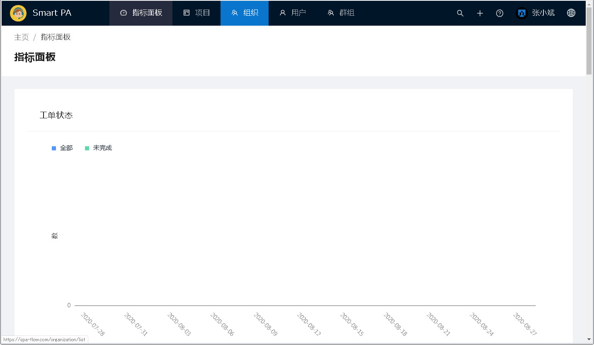

---
#组织管理
---

##1 进入组织管理模块

点击页面顶部菜单栏的 <u>组织</u> ，即可进入组织管理模块。  

##2 新建组织
新建组织有两种方式。
&emsp;第一种是点击页面左栏组织列表下面的 <u>新建...</u> 按钮。
&emsp;第二种是点击页面右栏的概要标签的下面的 <u>新建...</u> 按钮。
二者的不同之处是：
&emsp;第一种：新建组织页面里的上级组织一项的默认值为空。
&emsp;第二种：新建组织页面里的上级组织一项的默认值为当前选择的组织。

以下分别说明两种新建组织的方法。

##2.1 点击页面左栏组织列表下面的 <u>新建...</u> 按钮来新建组织
点击页面左栏组织列表下面的 <u>新建...</u> 按钮

进入新建组织页面。注意上级组织一项为空，没有默认值。

输入要新建的组织信息后，点击<u>保存</u>按钮。
[注意]&emsp;上级组织若不输入，则建立的组织为顶级组织。

保存后，页面跳转到一览页面，在一览中，可以看到刚才新建的组织。

##2.2 点击页面右栏的概要标签的下面的 <u>新建...</u> 按钮来新建组织
选择一个组织，点击其概要标签页下面的<u>新建...</u> 按钮

进入新建组织页面。注意上级组织一项具有默认值，其默认值为当前选中的组织。

输入要新建的组织信息后，点击<u>保存</u>按钮。

保存后，页面跳转到一览页面，在一览中，可以看到刚才新建的组织。

##3.编辑组织
从页面左栏的组织树中，点击选择要修改的组织。页面右栏则显示被选择的组织信息。
组织信息分为<u>概要</u>、<u>组织成员</u>、<u>下级组织</u> 三部分。

###3.1组织概要信息的编辑
点击概要下面的<u>编辑...</u>按钮，即可进入组织修改页面。

进入组织编辑页面。

修改组织信息后，点击<u>保存</u>按钮。

保存后，页面跳转至组织一览页面，可以看到刚才修改的组织的信息。

###3.2组织成员的管理
点击组织成员标签，进入组织成员一览页面。在此页面，可添加和移除组织成员。

####3.2.1添加组织成员
点击上图中的<u>添加</u>按钮(页面右端)，弹出添加用户的页面。  

在输入框中输入要添加的用户名。输入时，与输入文字部分匹配的用户将自动列出，可从列表中点击选择。  

选择好要添加的用户后，点击OK按钮即可。若要放弃本次操作，则点击取消按钮即可。

点击OK按钮后，页面跳转到用户一览画面，可以看到刚才添加的用户出现在列表中。

####3.2.2移除组织成员
选中要移除的用户，之后用户列表上方出现已选中条数的信息和<u>移除</u>按钮。

选中要移除的用户后，点击<u>去掉</u>按钮。移除后，用户一览刷新，移除的用户已经从列表中消失。

###3.3下级组织的管理
点击下级组织，进入下级组织一览页面，在此页面，可删除下级组织和查看下级组织的详细信息。

####3.3.1删除下级组织
通过点选最前面的复选框选中要删除的下级组织，之后下级组织列表上方出现已选中条数的信息和<u>删除</u>按钮。

选中要删除的下级组织后，点击<u>删除</u>按钮。出现删除确认的对话框。
点击<u>OK</u>按钮，即可进行删除。点击<u>取消</u>按钮，则放弃本次删除操作。

之后，下级组织一览刷新。可以看到刚才删除的下级组织已经从一览中消失。

####3.3.2查看下级组织详细信息
点击要查看的组织的组织编号，进入下级组织详细信息页面，可查看其详细信息。

进入下级组织详细信息页面后，在页面左栏有<u>编辑...</u>、<u>新建...</u>按钮。
页面右栏则有组织成员、下级组织、关联项目3个标签也。
下面分别说明其操作功能：

|功能|说明|
|  ----  | ----  |
|编辑按钮|参考3.1组织概要信息的编辑|
|新建按钮|参考2.2 点击页面右栏的概要标签的下面的 <u>新建...</u> 按钮来新建组织|
|组织成员标签页|参考3.2组织成员的管理|
|下级组织标签页|参考3.3下级组织的管理|