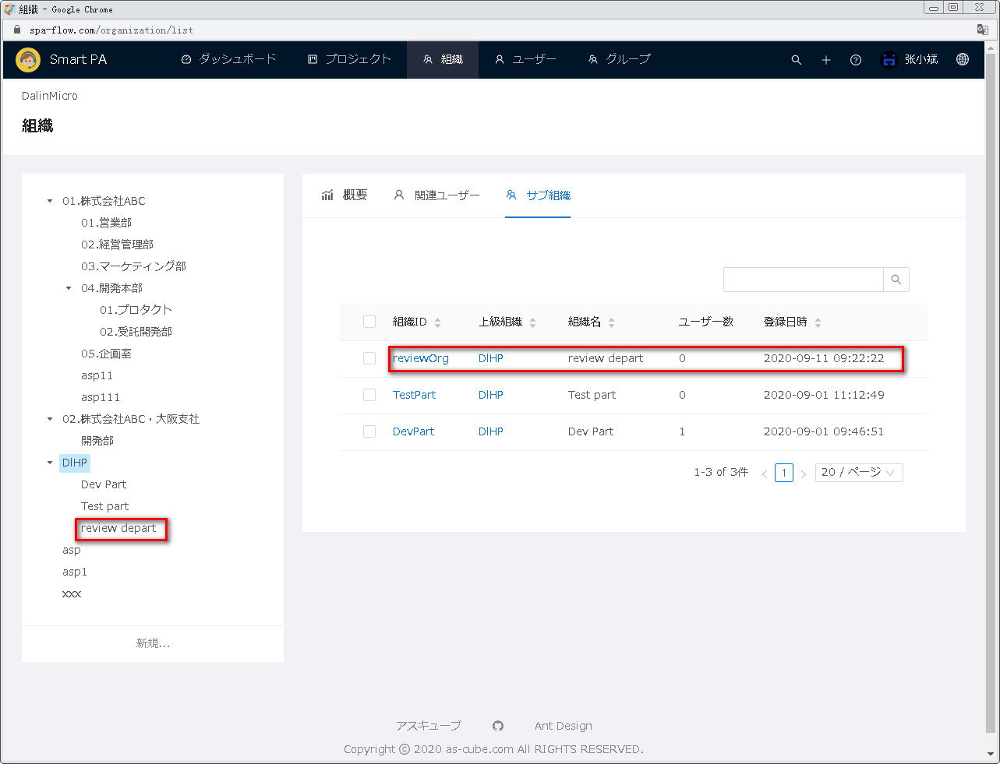
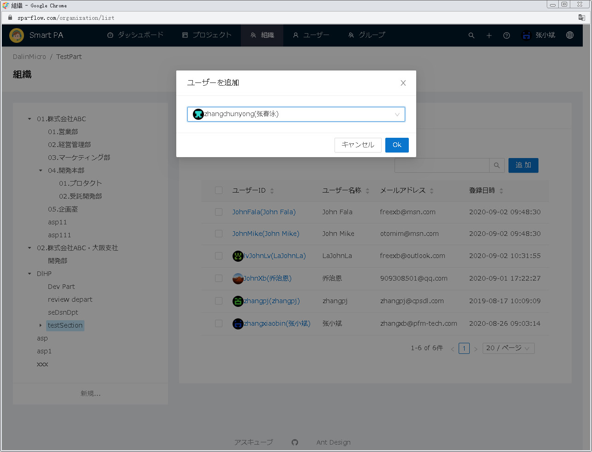

---
#組織管理
---

##1 組織管理画面を開く

画面の上の機能メニューから<u>組織</u>をクリックし、組織管理画面が表示されます。  

##2 組織新規
組織新規に両方法があります。
&emsp;方法一：画面の左側の組織ツリーの下にある<u>新規...</u>をクリックします。
&emsp;方法二：画面の右側の概要タグの下にある<u>新規...</u>をクリックします。
両方の違いが下記通りです：
&emsp;方法一：組織新規画面を開いた時に上級組織の暗黙値が空です。
&emsp;方法二：組織新規画面を開いた時に上級組織の暗黙値が現在選択した組織です。

下記で両方法を別々に説明します。

###2.1 画面の左側の組織ツリーの下にある新規ボタンをクリックして組織を新規します
画面の左側の組織ツリーの下にある<u>新規...</u>をクリックします。

組織新規画面が表示されます。上級組織の暗黙値が空です。

組織情報を入力してから、保存ボタンをクリックします。
「備考」上位組織を入力しないと、新規した組織がトップレベル組織となります。

組織一覧画面に戻ります。画面左側の組織ツリーから新規した組織の上位組織をクリックしてから、
画面右側のサブ組織のタグをクリックし、一覧に新規した組織が表示されます。

###2.2 画面の右側の概要タグの下にある新規ボタンをクリックして組織を新規します。
画面の左側の組織ツリーからある組織をクリックし、画面の右側にある概要タグの下の新規ボタンをクリックします。

組織新規画面が表示されます。上位組織の暗黙値が現在選択した組織です。

組織情報を入力してから、保存ボタンをクリックします。
「備考」上位組織を入力しないと、新規した組織がトップレベル組織となります。

組織一覧画面に戻ります。画面左側の組織ツリーから新規した組織の上位組織をクリックしてから、
画面右側のサブ組織のタグをクリックし、一覧に新規した組織が表示されます。

##3 組織編集
画面の左側の組織ツリーから編集する組織をクリックします。画面の右側に当組織の情報が表示されます。
情報は概要、関連ユーザーとサブ組織の3つの部分に分けられます。

###3.1 組織概要情報編集
概要タグの下側の編集ボタンをクリックします。

組織編集画面が表示されます。

組織情報を直してから、保存ボタンをクリックします。

組織一覧画面に戻ります。画面の左側の組織ツリーから直した組織をクリックし、
右側の概要タグに直した情報が再表示されます。

###3.2 関連ユーザーの管理
関連ユーザータグをクリックして、関連ユーザー一覧画面が表示されます。
当タグで、関連ユーザーを追加することと関連ユーザーを外すことがができます。

####3.2.1 関連ユーザーを追加します
ユーザー一覧の右上の追加ボタンをクリックし、ユーザー追加ダイアログが表示されます。

追加ユーザーを入力します。入力しているうちに入力した文字列とユーザー名がマッチしたユーザーがリストアップしますので、
リストから選択してもよいです。

OKボタンをクリックします。(追加を取り消したい時にキャンセルボタンをクリックします)。

関連ユーザー一覧画面に戻ります。追加したユーザーが一覧に表示されます。

####3.2.2 関連ユーザーを外します
外すユーザーの前のチェックボックスをチェックオンし、一覧の上に選択した件数と外すボタンが表示されます。

外すボタンをクリックし、ユーザー一覧が再表示し、外したユーザーが一覧に無くなります。

###3.3 サブ組織の管理
サブ組織タグをクリックし、サブ組織一覧画面が表示されます。
当タグでサブ組織を消すこと、サブ組織の詳細情報を確認することができます。

####3.3.1 サブ組織削除
消すサブ組織前のチェックボックスをチェックオンし、サブ組織一覧の上に選択した件数と削除ボタンが表示されます。

削除ボタンをクリックし、削除確認ダイアログが表示されます。
OKボタンをクリックします。（削除を取り消したい時にキャンセルボタンをクリックします）。

サブ組織一覧が再表示され、消されたサブ組織が一覧に無くなります。

####3.3.2 サブ組織詳細情報確認
詳細情報確認するサブ組織IDのリンクをクリックし、サブ組織詳細情報画面が表示されます。

当画面で、左側に編集と新規の両ボタンがあり、右側に関連ユーザーとサブ組織の両タグがあります。
下記で、各機能を説明します：

|機能|説明|
|  ----  | ----  |
|編集ボタン|3.1組織概要情報編集を参照となります|
|新規ボタン|2.2画面の右側の概要タグの下にある新規ボタンをクリックして組織を新規します。を参照となります|
|関連ユーザー|3.2関連ユーザーの管理を参照となります|
|サブ組織|3.3サブ組織の管理を参照となります|
