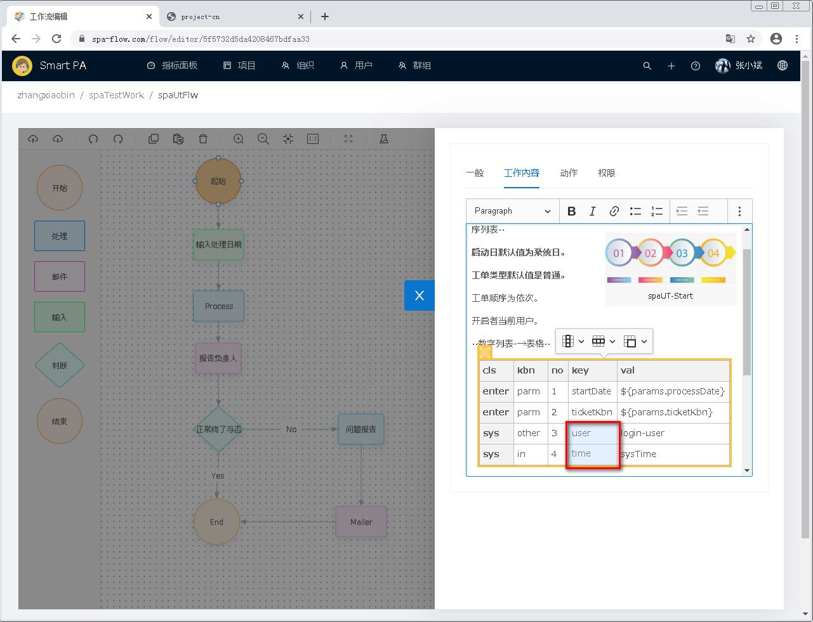
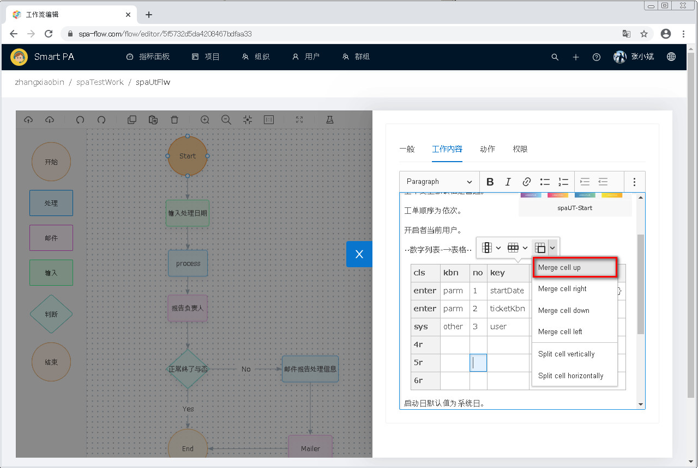
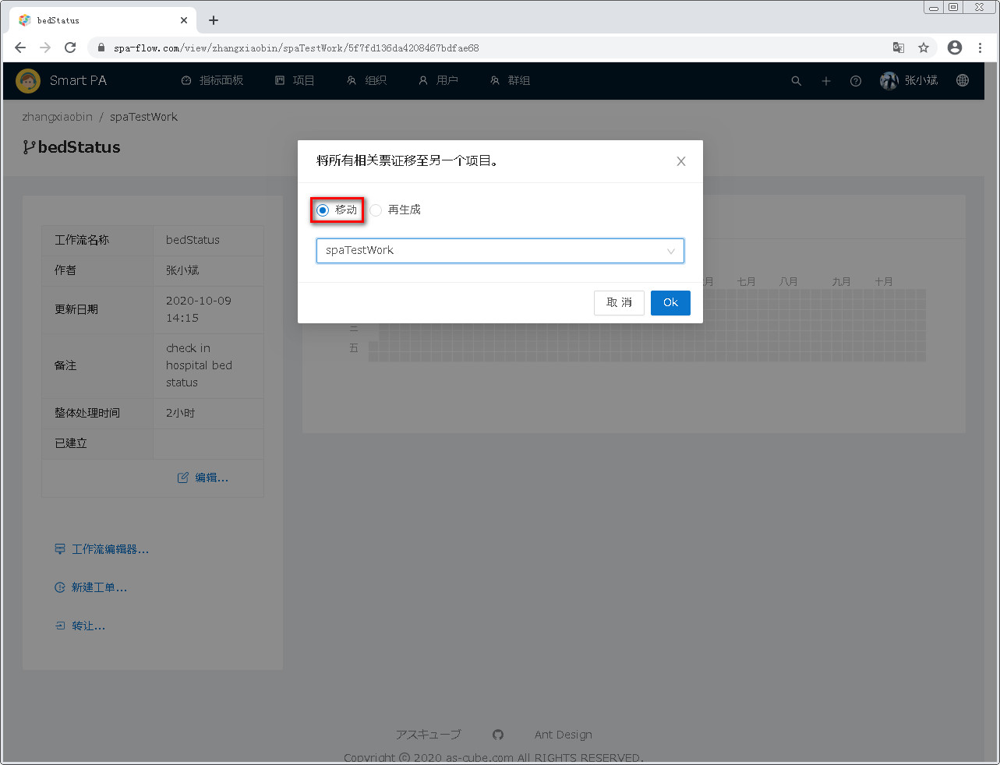
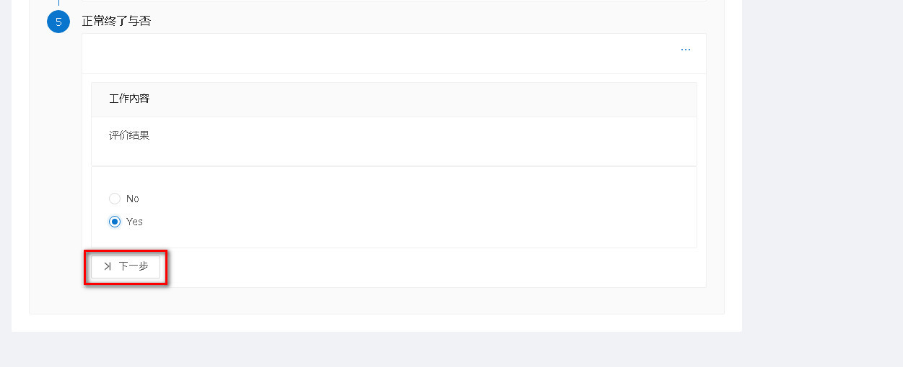
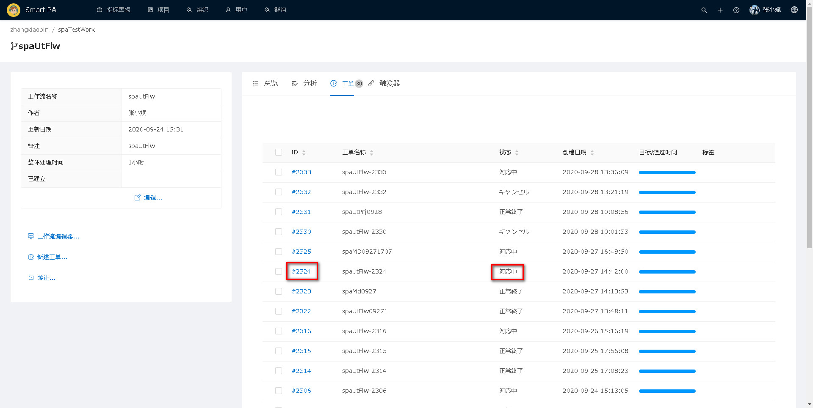
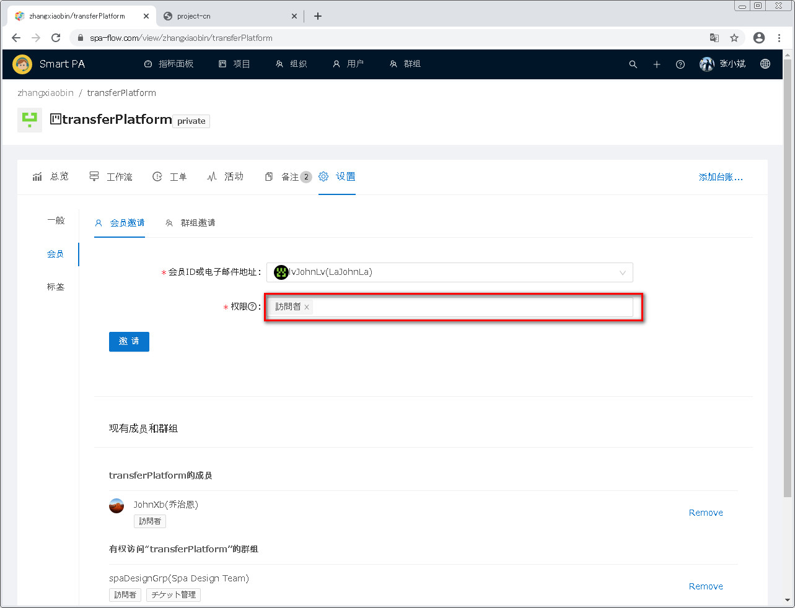

---
#项目管理
---

##1 进入项目管理模块

点击页面顶部菜单栏的 <u>项目</u> ，即可进入项目管理模块。 
projViewFlowEditorSaveToCloundDelJoinLine

项目类型分为我的项目、关联项目和公开项目。
- 我的项目：用户自己创建，且属于用户私有的项目。
- 关联项目：项目成员包含用户的项目。
- 公开项目：所有用户可见的项目。

注意项目一览的第一列(即项目一列)为<u>项目所有人</u>和<u>项目编号</u>用"/"拼接在一起的文字内容。 

###1.1 项目的检索
当项目较多时，可通过项目一览左上方的检索框，缩小一览中的项目表示条数。
检索匹配模式为部分包含，即项目编号中包含所输入的检索文字的项目被检索出来，且检索文字不区分大小写。

如下图,检索框中输入检索文字,

然后点击检索按钮(即放大镜图标),或者按回车键(Enter键)，

项目编号中包含检索文字的项目被检索出来。

**[备注]**当想要显示所有项目时，则删除检索框中的所有文字，然后点击检索按钮(即放大镜图标),或者按回车键(Enter键)即可。

###1.2 新建项目
当想要新建一个项目时，则点击项目一览右上方的<u>+新建</u>按钮，

页面跳转到新建项目页面，

输入项目信息后，点击<u>保存</u>按钮，
[公开]一项的说明：选为公开，则项目成为公开项目，选为非公开，则成为用户私有项目。

页面跳转到项目综合信息管理页面，

点击页面顶部菜单栏的 <u>项目</u>，

再次进入项目一览页面，可以看到新建的项目已显示在一览中。

###1.3 删除项目
从项目一览中，点击要删除项目的前面的复选框，

选中后，项目一览上方显示选中的条数以及<u>删除</u>按钮，

点击删除按钮，

弹出删除确认对话框，点击OK按钮，(若想放弃删除，则点击取消即可)，

项目一览刷新，可以看到删除的项目已从一览中消失。

###1.4 项目综合信息管理
进入项目综合信息管理页面的方法有两种，一种是新建项目后会自动进入项目综合信息管理(参见1.2 新建项目)。
另一种是在项目一览中，点击某一项目的项目编号，

进入项目综合信息管理页面。此页面含有总览、工作流、工单、活动、备注和设置共六个子功能页面。

####1.4.1 总览
在总览标签页，可以编辑项目基本信息和查看工单信息。

#####1.4.1.1 修改项目基本信息
点击总览页面左栏下方的 <u>编辑</u> 按钮，

进入项目基本信息修改页面(页面项目说明请参见下面的 <u>项目基本信息的项目说明</u>)，
,
修改项目信息后，点击 <u>保存</u> 按钮，

返回项目总览标签页面，可以看到项目信息已被修改。

<u>项目基本信息的项目说明</u>
(1) 禁用
&ensp;如果此项目被设为禁用，则在项目一览中此项目的状态显示为禁用状态(项目编号上有删除线)

#####1.4.1.2 查看工单信息
总览页面右栏的日期方格表，表示工单的概要信息。

(1) 查看某日的工单件数
&ensp;把鼠标移至某一绿色方格上，

&ensp;会显示鼠标所指日期的工单件数。

(2) 查看某日的工单创建信息
&ensp;单击某个绿色日期方格，

日期方格表下方将显示点击日期的工单创建信息。

####1.4.2 工作流
在项目综合信息管理页面，点击 <u>工作流</u> 标签页，即可进入工作流一览页面。

#####1.4.2.1 工作流新建
在工作流一览画面，点击工作流一览右上方的<u>+新建</u>按钮。

进入工作流新建画面。

输入各项目值，之后点击保存按钮。

进入工作流综合管理页面。页面左侧可以看到所建工作流的基本信息。

点击工作流综合管理页面左上方的项目链接。

回到项目综合管理页面，点击 <u>工作流</u> 标签页。

进入工作流一览页面，可以看到所建的工作流显示在一览中。

#####1.4.2.2 工作流编辑
要编辑工作流的基本信息，要首先进入工作流综合管理页面。进入此页面有两种方法，
一种是新建工作流后就会自动跳转到此页面(参见1.4.2.1 工作流新建的第四步)。
另一种是在工作流一览中点击要编辑的工作流。

进入工作流综合管理页面。

点击页面左侧的工作流基本信息下面的编辑按钮。

进入工作流编辑页面。

修改工作流后，点击保存按钮。

回到工作流综合管理页面，页面左侧可以看到工作流基本信息已被修改。

#####1.4.2.3 工作流禁用
在工作流编辑页面里，有禁用一项，将此项目设为禁用，则工作流的状态变为禁用。

#####1.4.2.4 工作流编辑器
当建立一个工作流后，此工作流就有了一个系统默认的工作流程模板。
之后，可以根据具体需求修改工作流程模板。
在工作流综合信息管理页面的左栏，有一个<u>工作流编辑器...</u>按钮，点击此按钮，可进入工作流程编辑页面。

工作流编辑器分为四个区域，顶部为编辑工具栏，左侧为工作流基本图形，中间为工作流编辑区。
右侧还有一个隐藏的工作流程设定区域，双击某一工作流图形或者选中某一工作流图形后点击齿轮图标即可显示。

######1.4.2.4.1 工作流基本图形
工作流编辑器的最左侧，是工作流基本图形。共有六种基本图形。
- 开始：开始一个新的工单。
- 处理：工作处理内容模板。
- 邮件：邮件发送功能。
- 输入：输入此工作流所需的参数。
- 判断：进行某种判断，且根据判断结果进行分歧处理。
- 结束：结束工单。

######1.4.2.4.2 工作流编辑器的工具栏
工作流编辑器的顶端，是编辑工具栏。下面分别介绍工具栏中各工具的功能。

(1) 保存到云
把鼠标移到第一个工具上，会显示<u>保存到云</u>的提示。此工具功能是保存修改。
即对工作流或者节点有任何增删改后，必须点此按钮，才能保存修改。

(2) 从云取得
把鼠标移到第二个工具上，会显示<u>从云取得</u>的提示。此工具是取得最近一次所保存的工作流模板，以替代现在的模板。
使用它时必须注意的是，它会导致从上次保存到现在为止期间的修改丢失。

(3) Undo与Redo
Undo和Redo，是撤销和重做。与我们常用的Office软件的撤销和重做功能相同。撤销是撤销刚才的操作，而重做则是恢复撤销的操作。

(4) Copy和Paste
Copy和Paste是拷贝和粘贴。选中某节点后，点击Copy，然后再点击Paste，就可以对选中的节点进行复制粘贴。

如下图，点击某节点的图形。

图形被选中，背景色变深，并且边框上显示中心圆点。

点击Copy。

再点击Paste。

选中的节点图形被复制。

(4) Delete
Delete是删除。选中某节点图形后，点击Delete即可将其删除。

如下图，点击某节点的图形。

节点图形被选中。

点击Delete。

选中的节点被删除。

(5) 扩大和缩小
扩大和缩小可以放大和缩小流程图。

如下图，点击扩大按钮。

流程图被放大。

若要缩小流程图，则点击缩小按钮。

流程图被缩小。

(6) 自动缩放
自动缩放是按照当前页面大小调整流程图大小。

如下图，点击自动缩放。

流程图则根据当前页面大小自动调整尺寸。

(7) 重设缩放
重新缩放是将流程图恢复到原始大小。

如下图，流程图在被缩小的状态下，点击重设缩放。

流程图恢复到原始大小。

(8) 全屏
全屏是将流程图编辑器放大为全屏显示。

如下图，点击全屏。

流程图编辑器全屏显示。

要退出全屏显示，则在键盘上按下Esc键，或者再次点击全屏按钮即可。

退出全屏显示。

(9) 测试
测试是创建一个虚拟工单，以测试工作流是否能正常进行。

点击测试按钮。

显示一个测试工作流程。在此测试工作流程上，可以逐步填写工单，测试工作流是否能正常进行。

如果要关闭测试，点击返回。

返回工作流编辑器页面。

######1.4.2.4.3 工作流程图的绘制
流程图的绘制，主要介绍基本节点图形的添加和节点图形的连线。需要注意的是绘制完成后，一定要点击
工作流编辑器的工具栏中的保存到云按钮，否则绘制会丢失。

(1) 添加节点图形
在页面左侧的工作流基本图形栏，将鼠标移至要添加的图形上，鼠标的样式变为手形。

按下鼠标左键并拖动至页面中间的工作流编辑区后，松开鼠标左键，则图形被添加到工作流编辑区。

最后点击保存到云。

(2) 节点之间的连接
点击要连接的节点图形。

此节点被选中，背景色变深，且边框上显示边线中点。

将鼠标移至要连接的边线中点上，连节点的背景色变为深蓝色，鼠标样式变为十字形。

按下鼠标左键，开始拖动，拖动过程中，所有的节点图形的边线中点都会显示。

将鼠标拖动至要连接的另一个节点图形的边线中点上，松开鼠标左键。

连接完成。

最后点击保存到云。

(3) 删除节点间连接线
如果要删除节点间的连线，则将鼠标移至要删除的连线上，此时连线的颜色会变为蓝色。

单击一下鼠标左键，此时连线又恢复为灰色，但颜色变得略深，线也变得略粗。

点击编辑工具栏的删除按钮，或者在键盘上点击Delete键。

连线被删除。

最后点击保存到云。

(4) 修改节点间的连线
如果要改变连线的起点或终点，则将鼠标移至要改变的点上。

鼠标形状变为十字型。

按下鼠标左键并拖动，拖动过程中，所有的节点图形的边线中点都会显示。

拖至目标点后，松开鼠标左键。

修改完成。

最后点击保存到云。

######1.4.2.4.4 工作流程图的设定
流程图的节点和连线绘制完后，可对流程图整体和各节点以及连线进行内容、动作、权限等设定。
需要注意的是任何设定完成后，一定要点击工作流编辑器的工具栏中的保存到云按钮，否则设定会丢失。

(1)工作流整体设定
在工作流程图编辑区的空白处双击，或者空白处单击后点击设定按钮(齿轮按钮)，即可弹出设定页面。

弹出工作流整体设定页面。页面分为一般、变量和版本三个子页面。

(1.1)一般设定
一般设定中，可修改流程图名称，导出导入流程图。
·修改流程图名称
注意此处的流程图是伦理名，而工作流编辑页面和工作流一览页面中显示的工作流名称为物理名(相当于编号)。
在流程图名称输入框中，修改流程图名称。

点击设定关闭按钮(X按钮)，或者单击工作流编辑区空白处。

设定页面关闭，之后点击保存到云。

修改被保存。

·导出流程图
点击导出流程图，即可将流程图以zip文件格式下载至本地。注意导出的是最近一次保存到云端的流程图，而非现在显示的流程图。
点击导出按钮。

文件下载完成。

之后会自动打开此zip文件。

·导入流程图
点击导入流程图，即可将保存在本地的流程图导入系统。注意导入是导入云端，不会显示在当前页面上。
所以导入后，要再点击从云取得，才能显示在页面上。
点击导入按钮。

显示文件选择框。

选择本地保存的流程图文件，之后点击打开按钮。

点击从云取得按钮。

显示导入的工作流程图。

(1.2)变量设定
变量设定是设定工作流所需的输入参数。在此设定的输入参数，之后通过基本图形中的输入来接受操作者的输入。

·添加变量
点击添加按钮。

变量列表的最上方添加一个空白行。

输入变量名和默认值，之后点击操作栏里的是按钮。如果要取消此变量的添加，则点击操作栏里的取消按钮。

添加变量完成，出现在变量列表里。

最后点击保存到云。

·删除变量
如果要删除某一变量，则在变量列表里，点击要删除的变量的一行中的操作栏的删除按钮。

变量被删除，从变量列表里消失。

最后点击保存到云。

·修改变量
如果要修改某一变量，则在变量列表里，点击要修改的变量的一行中的操作栏的编辑按钮。

此行变量变为可编辑状态，且操作栏中的按钮变为是和取消。

修改变量，之后点击操作栏里的是按钮(若想放弃修改，则点击取消即可)。

修改完成，变量变为不可修改状态，操作栏中的按钮变为编辑和删除。

最后点击保存到云。

(1.3)版本
在版本页面，可以查看此工作流的版本历史。
·版本历史列表

·修改和删除
?？ Bug

(2)开始节点的设定
开始节点，是工作流的第一个节点，代表一个工作流程的开始。
单击开始节点，使其处于选中状态，之后点击设置按钮(齿轮按钮)。或者双击开始节点。

打开设定页面。设定分为四个部分：一般、工作内容、动作和权限。
- 一般：设定节点的标签和规定时间。
- 工作内容：记述节点的工作内容。
- 动作：可自动执行一定功能的代码。
- 权限：是将此节点的工作转交给其他用户或组。

(2.1)一般设定
一般设定，是设定节点的表示标签和此节点的规定完成时间，以及节点的备注信息。
绘制节点后，标签和目标时间就具有默认值。可根据实际需求修改。
修改各项目信息。

点击设置关闭按钮。或者单击工作流编辑区的空白处。

设置页面关闭。之后点击保存到云按钮。

设定被保存。

(2.2)工作内容
工作内容是记述节点的工作内容。此处设定的内容将显示在工单相应的节点处。
工作内容的编辑器是一个富文本编辑器。可写入文字并设置文字格式，插入图片、表格和多媒体。
编辑器顶部是文字格式设置工具栏。

而点击工具栏最右端的显示更多按钮，则会显示插入图片、引用块、插入表格、插入多媒体、撤销和重做这六个工具。

(2.2.1)文字的输入和格式设置
在文本编辑中输入文字，之后若要设置文字格式，则选中要设置格式的文字，然后使用文本编辑器顶部的工具栏进行设定。
工具栏里的文字格式设置从左至右依次为段落、粗体、斜体、链接、无序列表、编号列表、增加缩进、减少缩进。

·段落
选中要设置格式的文字行。若是单行文字，不选中也可以，将编辑光标放在要设置的文字行即可。

点击格式设置工具栏中的段落。

弹出段落设置的下拉列表，从其中选择要设置的格式。

设置完毕。

如果要取消文字格式，则选中要取消格式的文字行。若是单行文字，不选中也可以，将编辑光标放在要取消设置的文字行即可。

点击格式设置工具栏中的段落，弹出段落设置的下拉列表，从其中选择第一项Paragraph。

选中文字的段落格式被取消。

·粗体
选中要设置粗体的文字。

点击格式设置工具栏中的粗体。

设置完毕。

如果要取消文字的粗体，则选中要取消粗体的文字。

点击格式设置工具栏中的粗体。

选中文字的粗体格式被取消。

·斜体
?? Bug32
选中要设置斜体的文字。

点击格式设置工具栏中的斜体。

设置完毕。

如果要取消文字的斜体，则选中要取消斜体的文字。

点击格式设置工具栏中的斜体。

选中文字的斜体格式被取消。

·链接
如果要给文字添加链接，则首先选中要加链接的文字。

点击格式设置工具栏中的链接，或者在键盘同时按下Ctrl和k键。

弹出链接地址输入对话框。

输入链接地址。

点击对号(若想放弃输入，则点击X号。)

链接添加完成。

若想修改链接，则单击链接文字。

弹出链接地址修改对话框。

点击修改按钮。

链接地址变为可修改状态。

输入新的链接地址。

之后点击对号(若想放弃修改，则点击X号)。

链接修改完成。

若想删除文字的链接，则单击链接文字。

弹出链接地址修改对话框。

点击链接删除按钮。

文字的链接被删除。

·无序列表
？？bug33 无序列表和数字列表使用效果无差别
·数字列表
？？bug33 无序列表和数字列表使用效果无差别

·增加缩进
·减少缩进
？？bug34 无序列表和数字列表使用效果无差别

(2.2.2)插入图片
·插入图片
将编辑光标放置于要插入图片的位置。

点击工具栏的插入图片按钮。

弹出图片选择对话框。

选择图片。

点击图片选择对话框的打开按钮。

图片插入完成。

·删除图片
若想删除图片，则鼠标左键点击图片。

图片显示蓝色边框，处于被选中状态。之后在键盘上按下Delete键。

图片被删除。

·图片显示格式
图片插入后，可设置其显示方式。单击图片。

弹出图片设置工具条。

图片设置工具，从左至右依次为全尺寸图像、边侧图像、图片加载失败替代文字。图像默认显示方式为全尺寸图像。
在图片下方，还有图像说明文字设置框。

若要设为全尺寸图像显示，则左键单击图片。

弹出图片设置工具条。

点击全尺寸图像按钮。

图片的显示变为全尺寸图像方式。

若要设为边侧图像，则左键单击图片。

弹出图片设置工具条。

点击边侧图像按钮。

图片的显示变为边侧图像方式。

若要设置图片加载失败替代文字，则左键单击图片。

弹出图片设置工具条。

点击图片加载失败替代文字按钮。

弹出图片加载失败替代文字的输入对话框。

输入替代文字。

点击文字输入对话框的对号(若想放弃替代文字的设置，则点击X号)。

图片加载失败替代文字设置完成。

若想设置图片说明文字，则左键单击图片。

图片下方显示图片说明文字输入框。

在输入框中输入图片说明。

将编辑光标从输入框中移出，即完成说明文字的设置。

(2.2.3)引用块
若要将某些文字设为引用块，则选中要设置的文字行(若是单行，则将编辑光标放在要设置的文字行即可)。

点击引用块按钮。

块引用设置完成。

若要取消引用块，则选中要取消的文字行(若是单行，则将编辑光标放在要取消的文字行即可)。

点击引用块按钮。

文字行的块引用被取消。

(2.2.4)表格
·插入表格
首先将编辑光标置于要插入表格的位置。

点击插入表格按钮。

弹出行数列数设置器。

在行数列数设置器上移动鼠标，行列数设置器下方会显示已选择的行数和列数。当行列数达到目标值时，单击鼠标左键。

表格被插入。表格插入后，可以进一步对表格进行设置和修改，下面逐项说明。

·删除表格
将鼠标移至要删除的表格上，表格周围会出现黄色边框，且左上角出现一个小方块，鼠标左键点击这个小方块。

表格的边框变为蓝色，表示表格已被选中。

在键盘上按下删除键(Delete)，即可删除表格。

·表格内的文字编辑
表格内的文字编辑，和常用的办公表格相似。并可以利用键盘上的Tab键和上下左右键进行光标的移动。

·列头设置
在任意一行，将光标置于要设为列头的最后一列(列头可为多列)。如下所示，如果要将前两列设为列头，则将光标置于第二列。

表格上方自动弹出表格设置工具栏，点击其中的列设置菜单。

在弹出的列设置菜单中，点击列头(Header column)开关按钮。

列头设置完成。

将光标移出表格，表格设置工具栏消失，可以确认列头设置的效果。

·取消列头设置
若要取消列头的设置，则在任意一行，将光标置于要取消列头设置的第一列。
如下图中，前三列为列头，若要取消第二三列的列头设置，则将光标置于任一行的第二列。

在弹出的表格设置工具栏中，点击列设置菜单。

在弹出的列设置菜单中，点击列头(Header column)开关按钮。

列头取消完成。

将光标移出表格，表格设置工具栏消失，可以确认列头取消的效果。

·左侧插入列
若要在某列的左侧插入一列，则将光标放在此列。

在表格设置工具栏的列设置菜单中，点击左侧插入列(Insert column left)。

列插入完成。

·右侧插入列
若要在某列的右侧插入一列，则将光标放在此列。

在表格设置工具栏的列设置菜单中，点击右侧插入列(Insert column right)。

列插入完成。

·删除列
若要删除单列，将光标置于要删除的列即可。若要删除连续多列，则将光标置于要删除列的第一列。

在键盘上按住Shift键，点击要删除的最后一列，然后松开Shift键。此时要删除的列呈现蓝色，表示被选中。

在表格设置工具栏中的列设置菜单中，点击删除列(Delete column)。

列删除完成。

·选中列
若要选中单列，将光标置于要选中的列即可。若要选中连续多列，则将光标置于要选中的第一列。

在键盘上按住Shift键，将光标移至要选中的最后一列后，然后松开Shift键。要选中的列呈现蓝色，表示被选中。

在表格设置工具栏中的列设置菜单中，单击选择列(Select column)。

列被选中。列选中之后，可进行其它的删除插入等操作。

·行头设置
在任意一列，将光标置于要设为行头的最后一行(行头可为多行)。如下所示，如果要将前两行设为行头，则将光标置于第二行。

表格上方自动弹出表格设置工具栏，点击其中的行设置菜单。

在弹出的行设置菜单中，点击行头(Header row)开关按钮。

行头设置完成。

将光标移出表格，表格设置工具栏消失，可以确认行头设置的效果。

·取消行头设置
若要取消行头的设置，则在任意一列，将光标置于要取消行头设置的第一行。
如下图中，前三行为行头，若要取消第二三行的行头设置，则将光标置于任一列的第二行。

在弹出的表格设置工具栏中，点击行设置菜单。

在弹出的行设置菜单中，点击行头(Header rowumn)开关按钮。

行头取消完成。

将光标移出表格，表格设置工具栏消失，可以确认行头取消的效果。

·上方插入行
若要在某行的上方插入一行，则将光标放在此行。

在表格设置工具栏的行设置菜单中，点击上侧插入行(Insert row above)。

行插入完成。

·下方插入行
若要在某行的下方插入一行，则将光标放在此行。

在表格设置工具栏的行设置菜单中，点击下侧插入行(Insert row below)。

行插入完成。

·删除行
若要删除单行，将光标置于要删除的行即可。若要删除连续多行，则将光标置于要删除行的第一行。

在键盘上按住Shift键，将光标移至要删除行的最后一行后，然后松开Shift键。此时要删除的行呈现蓝色，表示被选中。

在表格设置工具栏中的行设置菜单中，点击删除行(Delete row)。

行删除完成。

·选中行
若要选中单行，将光标置于要选中的行即可。若要选中连续多行，则将光标置于要选中的第一行。

在键盘上按住Shift键，将光标移至要选中的最后一行后，然后松开Shift键。此时要删除的行呈现蓝色，表示被选中。

在表格设置工具栏中的行设置菜单中，单击选择行(Select row)。

行被选中。行选中之后，可进行其它的行的删除插入等操作。

·选定范围单元格合并
将光标至于要合并范围的起始单元格。

键盘上按住Shift键，点击要合并范围的终了单元格之后，松开Shift键。选定范围的单元格背景色变为蓝色。

点击表格设置工具栏的合并单元格。

选定范围的单元格被合并。

·合并上方单元格
若要合并某一单元格上方的单元格，则将光标置于此单元格内。

点击单元格合并工具旁边的下拉箭头。

弹出单元格合并分割菜单列表，点击其中的合并上方单元格(Merge cell up)。

上方单元格被合并。

·合并右方单元格
若要合并某一单元格右方的单元格，则将光标置于此单元格内。

点击单元格合并工具旁边的下拉箭头。

弹出单元格合并分割菜单列表，点击其中的合并右方单元格(Merge cell right)。

右方单元格被合并。

·合并下方单元格
若要合并某一单元格下方的单元格，则将光标置于此单元格内。

点击单元格合并工具旁边的下拉箭头。

弹出单元格合并分割菜单列表，点击其中的合并下方单元格(Merge cell down)。

下方单元格被合并。

·合并左方单元格
若要合并某一单元格左方的单元格，则将光标置于此单元格内。

点击单元格合并工具旁边的下拉箭头。

弹出单元格合并分割菜单列表，点击其中的合并左方单元格(Merge cell left)。

左方单元格被合并。

·竖直拆分单元格
若要将某个单元格拆分为左右两个单元格，则将光标置于此单元格内。

点击单元格合并工具旁边的下拉箭头。

弹出单元格合并分割菜单列表，点击其中的竖直拆分(Split cell vertically)。

单元格被拆分为左右两个单元格。

·水平拆分单元格
若要将某个单元格拆分为上下两个单元格，则将光标置于此单元格内。

点击单元格合并工具旁边的下拉箭头。

弹出单元格合并分割菜单列表，点击其中的水平拆分(Split cell horizontally)。

单元格被拆分为上下两个单元格。

(2.2.5)多媒体
?? bug40 URL路径：this media URL is not supported.

(2.2.6)撤销(Undo)和重做(Redo)
与我们常用的Office软件的撤销和重做功能相同。撤销是撤销刚才的操作，而重做则是恢复撤销的操作。

(2.3)动作的设定
动作，是能实现一些功能的代码。在工单中，点击动作的按钮，便可执行其功能。
例如用浏览器打开特定地址的网页、连接特定数据库读取数据、打开特定文件并处理内容等。
这样便可将繁琐的工作，从人工处理转由代码自动处理，可明显提高工作效率。

设置标签和代码。
标签是动作在工单中的按钮名称。动作则是实现一定功能的代码。
如下图，设置标签并编写代码(功能是输出一个简单语句Hello World)。

之后，在工单的节点中，就会显示动作设定的按钮，按钮的名称是动作设定中的标签。

点击此按钮，就可执行动作中设定代码的功能。

(2.4)权限
?? bug28 某节点权限加入其它用户后，工作流到达其节点后，其它用户操作出错

(3)输入节点的设定
输入节点，是用来接收用户的输入。而输入的内容为工作流整体设定中的变量。
输入节点的设置，分为一般、工作内容、入力项目和权限四个部分。
其中一般、工作内容和权限三部分与开始节点的相同，请参考开始节点的说明。以下仅说明输入节点特有的入力项目。

(3.1)入力项目
入力项目的设定页，有一个下拉列表框，点击此下拉列表框。

下拉列表中的项目，是工作流整体设定时所设的变量。从其中选择此节点要输入的变量。

入力项目选定。

设定完后，保存到云。之后建立工单时，在此节点，就会出现输入框，接收用户的输入。输入后，点击输入框下方的保存按钮。

(4)处理节点的设定
处理节点的设点与开始节点相同，请参考开始节点的说明。

(5)邮件节点的设定
邮件节点，以邮件形式将工作情况及时通告给工作关系人。
其设定分为一般、工作内容、邮件和权限四个部分。其中一般、工作内容和权限三部分与开始节点的相同，请参考开始节点的说明。
以下仅说明邮件节点特有的邮件这部分的设定。

(5.1)邮件
邮件部分的设定，与常用的邮件相同。可在收件人、抄送和秘送上预设常用收件人。主题和邮件内容也可预设模板内容。

编辑器中各项预设值，在工单中，作为默认值显示，可根据实际需要修改，确定无误后，点击送信即可发送邮件。

(6)判断节点的设定
判断节点，是依据不同情况进行不同的分歧处理。
其设定分为一般、工作内容、动作、判断和权限五部分。其中一般、工作内容、动作和权限与开始节点的相同，请参考开始节点的说明。
以下仅说明判断部分的设定。

(6.1)判断
?? 判断里的下拉列表项目是工作流参数，有何用？怎么用？

(6)结束节点的设定
结束节点标志着工作的结束。
其设定分为一般、工作内容、动作和权限四部分，与开始节点的相同，请参考开始节点的说明。

(7)连接线的设定
节点之间的连接线，可以设置其标签和形状。
双击某一连接线，或者单击后点击设置按钮(齿轮)。

弹出连接线设置页面。

标签项目用以设定连接线上显示的文字。形状则是设置连接线的形状，从上至下分别是
- Smooth：平滑曲线
- Polyline：折线
- Polyline Round：圆角折线

(7.1)标签
在标签输入框设定标签后，按下键盘上的回车键(Enter)，即可显示在连接线上。

(7.2)形状
以下三图分别是Smooth(平滑曲线)、Polyline(折线)和Polyline Round(圆角折线)的显示效果。

#####1.4.2.5 工作流删除
在工作流一览页面，点击要删除的工作流前面的复选框。

工单一览上面出现选中件数和删除按钮。

点击删除按钮。

弹出删除确认对话框，点击OK按钮，(若想放弃删除，则点击取消即可)。

被删除的工作流从一览中消失。

#####1.4.2.6 新建工单
参见1.4.3.1 工单新建。

#####1.4.2.7 转让
转让是将工作流及相应工单转至另外一个项目。
转让有两种方式，一是移动，而是再生成。
&ensp;移动：将工作流及其相应工单转移到另一个项目。
&ensp;再生成：将工作流及其相应工单复制到另一个项目。

######1.4.2.7.1 移动
在工作流综合管理页面，点击左侧的转让按钮。

弹出转让目标项目对话框。转让目标项目的初始值是现在工作流所属项目。

选择移动单选按钮。

输入转让目标项目。当输入时，会自动列出与输入文字部分一致的项目，从中选择即可。

点击OK按钮即可(如果想放弃转让，则点击取消按钮)。

转移完成。

在原属项目的工作流一览里，此工作流已不在列表里。

在转移目标项目里的工作流一览里，则出现此工作流。

工单也一并被转移。

######1.4.2.7.2 再生成
？？ Error bug24

#####1.4.2.8 工作流综合信息管理
工作流综合管理页面，包括以下功能
- 总&emsp;览：查看工单概要信息
- 分&emsp;析：显示工单每个步骤的规定时间与实际所用时间
- 工&emsp;单：此工作流的工单一览
- 触发器：

######1.4.2.8.1 总览
总览页面右栏的日期方格表，表示工单的概要信息。

(1) 查看某日的工单件数
&ensp;把鼠标移至某一绿色方格上，

&ensp;会显示鼠标所指日期的工单件数。

(2) 查看某日的工单创建信息
&ensp;单击某个绿色日期方格，

日期方格表下方将显示点击日期的工单创建信息。

######1.4.2.8.2 分析
在工作流综合信息管理页面，点击<u>分析</u>标签。

打开分析标签页面。此页面以柱状图显示工单各步骤的期待时间和实际所用时间。
纵轴为工作流的各步骤。横轴为时间，蓝色为期待时间，绿色为实际所用时间，单位为秒。

把鼠标移至某工作步骤的柱状图上，则显示此步骤的期待时间和实际平均所用时间。

######1.4.2.8.3 工单
在工作流综合信息管理页面，点击<u>工单</u>标签。

进入此工作流的工单一览页面。在此页面，可以查看工单的所用时间，或者点击工单ID进入工单详细页面。

(1)点击工单ID进入工单详细信息页面
在工单一览中，点击要查看的工单ID，进入工单详细信息。

在工单详细信息页面，可以查看工单详细信息，或者继续填写工单。

(2)查看工单所用时间
工单一览中的目标/经过时间一列，是以棒状图表示的。将鼠标移至某一工单的棒状图上时，
将会显示此工单的历经时间。

(3)删除工单
在工单一览中，点击要删除的工单前面的复选框。

工单一览上面出现选中件数和删除按钮。

点击删除按钮。

弹出删除确认对话框，点击OK按钮，(若想放弃删除，则点击取消即可)。

被删除的工单从一览中消失。

####1.4.3 工单
在项目综合信息管理页面，点击 <u>工单</u> 标签页，即可进入工单一览页面。

#####1.4.3.1 工单新建
要新建一个工单，首先要进入工作流一览画面，从工作流一览中选择新建工单的模板，点击工作流名称一列。

进入工作流综合信息画面。

点击画面左下方的<u>新建工单...</u>按钮。

如果所用工作流有初始输入参数，则会显示工单初始参数输入对话框，参数具有默认值。
如果所用工作流无初始输入参数，则不会显示这个对话框，而是直接进入工单填写画面。

如果要改变参数的默认值，则点击编辑(如果不改变参数的默认值，则直接点击OK按钮即可)。

参数变为可编辑状态，同时操作栏的按钮变为是和取消。

修改参数，之后点击是按钮(如果想放弃参数的修改，则点击取消即可)。

修改的参数被保存，参数重新变为不可修改状态，操作栏的按钮重新变回编辑。

点击OK按钮(如果想放弃工单创建，则点击取消即可)。

工单被创建，进入工单填写画面。

#####1.4.3.2 工单填写
工单创建后，就可以参照工作流的步骤，根据工作实际进度，逐步填写工单。
工单画面，分为两个部分，步骤详细和工作流图。步骤详细是填写工单的部分，工作流图则是工作流程图。

(1)工单名称
工单被创建后，工单名称有默认值，可以修改。

(2)工单经过时间
画面的右上方的经过时间，是工单自被创建后至今的经过时间。据此可判断工单耗时是否已经超过工作流的整体处理时间。

(3)某工作步骤所用时间
某个工作步骤所耗时间，显示在步骤名称下面。分为左右两个部分，左边是文字形式的，右边是横柱形式。
把鼠标移至横柱上，可显示规定时间和实际所用时间。如果超时，横柱则为红色，若未超时，则为蓝色。

(4)工单填写
当某一步骤完成后，依据实际工作进度填写，之后点击下一步，进入工单的下一个步骤。
以下图中的工单为例说明工单的填写。
第一步是开始，显示工单创建时输入的参数(参见1.4.3.1工单新建的工单初始参数输入)。点击下一步按钮。

进入第二步(处理日期参数输入)。若有必要，再次可以修改此参数，修改后点击保存。之后点击下一步。

进入第三步(处理工作)。点击下一步。

进入第四部(报告负责人)，从收件人到邮件内容均可修改。邮件各项信息确定后，点击送信。送信完毕后，点击下一步。

进入第五步(判断是否正常完工)。若判断是正常完工，则点击单选按钮Yes，下一步按钮变为可用，点击此按钮。

进入最后一步(结束)。点击关闭按钮，则此工单将完结。

#####1.4.3.3 工单的取消
对于尚未完工的工单，可以取消。
在工单填写画面，点击画面右上角的取消按钮。

弹出取消原因下拉列表，从其中点击选择取消的原因。

工单被取消，其状态变为取消。此工单即被废弃。

在工单一览里，被取消的工单也显示为取消状态。

#####1.4.3.4 工单的暂停和再开
对于正在进行中的工单，可以暂停。
在工单填写画面，点击画面右上方的暂停按钮。

工单变为暂停状态，暂停按钮变为重新开始，工单下方出现暂时停止的记录。

在工单一览里，被暂停的工单也显示为暂停状态。

如果要重新开始暂停的工单，则在工单一览中点击要重新开始的工单的ID。

进入工单填写画面，点击重新开始按钮。

工单重新开始，重新开始按钮变为暂停按钮，工单下方显示重新开始的记录。

#####1.4.3.5 工单填写或查看工单详细信息
如果要继续填写某个正在进行中的工单，或者是查看某工单的详细内容，在一览里点击工单的编号。

进入工单填写画面。可以根据工作进度填写工单。

#####1.4.3.6  工作流图里的进度显示
工单画面中的工作流图，可以显示当前的工作进度。
灰色的为尚未开始的步骤，而非灰色则是已经完成或已经开始的工作步骤。

#####1.4.3.7  当前已进行的步骤列表
在步骤详细和工作流图的右端，有当前已完成或已开始的步骤的列表。由此可知当前的工作进度。

#####1.4.3.8 工单删除
点击要删除的工单前面的复选框。

工单一览上面出现选中件数和删除按钮。

点击删除按钮。

弹出删除确认对话框，点击OK按钮，(若想放弃删除，则点击取消即可)。

被删除的工单从一览中消失。

####1.4.4 活动
在项目综合信息管理页面，点击 <u>活动</u> 标签页，即可进入活动标签页面。

进入此项目的活动一览页面。此页面可以查看此项目的操作历史。

####1.4.5 备注
在项目综合信息管理页面，点击 <u>备注</u> 标签页，即可进入备注标签页面。

进入项目备注一览页面。

#####1.4.5.1 新建备注
点击一览右上方的 <u>+新建</u> 按钮，

进入项目备注新建页面，

填写备注的各信息后，点击 <u>保存</u> 按钮，

进入项目备注详情页面。

要回到备注一览页面，可点击项目备注详情页面的<u>项目</u>链接，

页面跳转到项目综合信息管理页面，

点击备注标签页，

回到备注一览标签页面，可以看到新建的备注显示在一览中。

#####1.4.5.2 修改备注
要修改项目备注，需要首先进入项目备注详情页面，之后在此页面点击编辑按钮，即可进入备注修改页面。
而要进入项目备注详情页面有两种方法。
一是新建一个备注后，就会自动跳转至此页面，参见1.4.5.1 新建备注的第四步骤。
二是从备注一览中，点击要修改的备注的标题一列的链接，

进入项目备注详情页面,

点击 <u>编辑...</u> 按钮,

进入项目备注修改页面，

修改备注信息后，点击 <u>保存</u> 按钮，

页面跳回项目备注详情页面，可以看到备注信息已被修改。

#####1.4.5.3 删除备注
从项目备注一览中，点击要删除项目备注的前面的复选框，

选中后，项目备注一览上方显示选中的条数以及<u>删除</u>按钮，

点击删除按钮，

弹出删除确认对话框，点击OK按钮，(若想放弃删除，则点击取消即可)，

项目备注一览刷新，可以看到删除的项目备注已从一览中消失。

####1.4.6 设置
在项目综合信息管理页面，点击 <u>设置</u> 标签页，即可进入设置标签页面。

进入项目设置页面。在此页面，可进行项目的名称、所有者、公私、会员、群组以及工作流与工单标签的设定。

#####1.4.6.1 一般设定
一般设定里，可修改项目名称，改变项目所有者和公私设定，以及删除项目。

######1.4.6.1.1 变更名称
初期的改名按钮是不可用的。

修改项目名称。修改之后改名按钮变为可用，点击改名即可。

######1.4.6.1.2 所有权转让
点击<u>将项目所有权转让给其他人</u>，将其展开。

初期显示现在的项目所有人。此时转让按钮不可用。

输入新的项目所有人。输入时，会自动列出与输入文字部分匹配的用户，可以从其中选择。

输入新的项目所有人后，转让按钮变为可用，点击转让按钮即可。

转让完成。

######1.4.6.1.3 在公用和私用之间切换
点击<u>在公用和私用之间切换</u>，将其展开。

显示现在的设定值。此时交换按钮不可用。

点击开关按钮。

项目的公用私用设定被改变，交换按钮变为可用。点击交换按钮即可。

转换完成。

######1.4.6.1.4 删除
点击<u>删除</u>，将其展开。

显示删除按钮和警告信息。

点击删除按钮。

弹出删除确认对话框，点击OK即可（若不想删除，则点击取消按钮）。

？？？？？错误？？？？：项目未被删除

#####1.4.6.2 会员
在设置画面里，点击左栏的<u>会员</u>，即可打开会员管理。

如下图所示，此画面有2个子画面，分别为会员邀请和群组邀请。画面下方为现有成员和群组列表。

######1.4.6.2.1 会员邀请
输入邀请会员的ID活着邮件地址。当输入时，和输入文字部分匹配的用户会自动列出，可从列表中选择。

设定会员的权限。点击权限下拉框。

显示权限列表。

从权限列表中，单点要添加的权限，即可将其加入。可多选。选中的权限右侧将显示✓。

若要删除已经添加的权限，可以点击权限旁边的 <u>x</u> ,即可将其删除。

或者在下拉列表中，再次单击已选权限，单击后其右侧的✓将消失，表示此权限已被排除。

输入会员ID和权限后，邀请按钮变为可用，点击邀请按钮即可。

现有成员和群组一览中显示所邀会员。。此项目成为被邀会员的关联项目。

######1.4.6.2.2 会员删除
现有成员和群组列表中，每个成员后面都有一个Remove按钮，点击此按钮即可删除会员。

######1.4.6.2.3 群组邀请
点击<u>群组邀请</u>。

显示群组邀请的项目。

输入要邀请的群组编号。输入时，会自动列出与输入文字部分匹配的群组，可从其中选择。

设置所邀群组的权限(参见会员邀请的权限设置)

输入群组编号和权限后，邀请按钮变为可用。点击邀请按钮即可。

现有成员和群组一览中显示所邀群组。此项目成为被邀群组的关联项目。

######1.4.6.2.4 群组删除
现有成员和群组列表中，每个群组后面都有一个Remove按钮，点击此按钮即可删除会员。

#####1.4.6.3 标签
点击<u>标签</u>。

标签，又分为工作流标签和工单标签2个部分。

######1.4.6.3.1 工作流标签
(1) 添加标签
点击添加按钮

标签一览中将出现一条新的标签，且各列具有默认值。

点击标签颜色列。

弹出颜色选择对话框，选定颜色后，点击确定即可。

输入标签和备注。

点击保存按钮。若想放弃添加，点击取消按钮即可。

标签被保存，变为不可编辑的状态。操作栏里的按钮变为编辑和删除。

(2) 编辑标签
点击要编辑的标签的操作栏里的编辑按钮。

标签变为可修改状态。操作栏里的按钮变为保存和取消。

修改各列信息后，点击保存按钮。若想放弃修改，点击取消按钮即可。

编辑完成。记录重新变为不可修改的状态。

(3) 删除标签
点击要删除的标签的操作栏里的删除按钮。

被删除的标签从一览中消失。

######1.4.6.3.2 工单标签
在标签画面，点击<u>工单</u>，即可进入工单的标签设定画面。

(1) 添加标签
点击添加按钮

标签一览中出现一条新的标签，且各列具有默认值。

点击标签颜色列。

弹出颜色选择对话框，选定颜色后，点击确定即可。

输入标签和备注。

点击保存按钮。若想放弃添加，点击取消按钮即可。

标签被保存，变为不可编辑的状态。操作栏里的按钮变为编辑和删除。

(2) 编辑标签
点击要编辑的标签的操作栏里的编辑按钮。

标签变为可修改状态。操作栏里的按钮变为保存和取消。

修改各列信息后，点击保存按钮。若想放弃修改，点击取消按钮即可。

编辑完成。记录重新变为不可修改的状态。

(3) 删除标签
点击要删除的标签的操作栏里的删除按钮。

被删除的标签从一览中消失。

