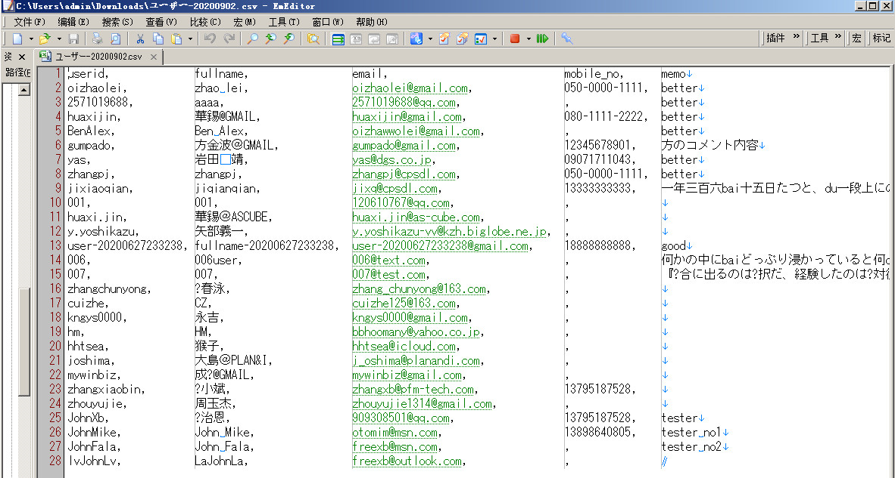
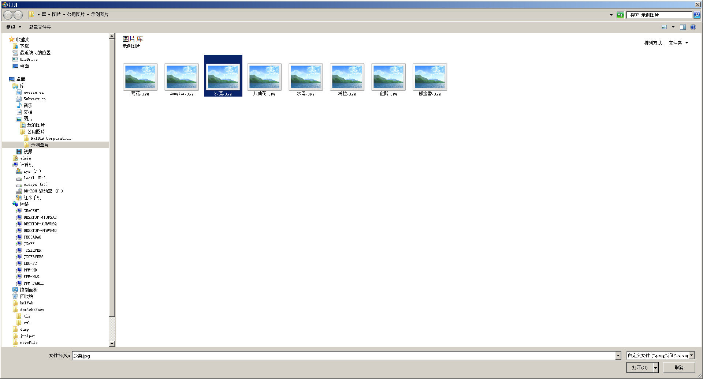

---
#用户管理
---

##1 进入用户管理模块

点击页面顶部菜单栏的 <u>用户</u> ，即可进入用户管理模块。  

##2 用户检索

###2.1 检索用户ID中包含输入文字的用户
如下图，用户列表上方有检索框，可通过它检索用户。
检索的匹配模式是部分包含匹配，即用户ID中包含输入的检索文字的用户会被检索到。且检索文字不区分大小写。

首先，在检索框中输入检索文字，

然后点击检索按钮(即放大镜图标),或者按回车键(Enter键)，

用户ID中包含检索文字的用户被检索出来。

###2.2 显示所有用户
如果想显示所有用户，则删除检索框中的所有文字，之后点击检索按钮，即可显示所有用户。

##3 下载用户信息一览
可以点击下载按钮，将用户信息一览以csv文件格式下载到本地电脑。

点击下图红框中的下载按钮，

下载完成后，浏览器底部显示下载完成的文件，点击文件右边的箭头，

在弹出的菜单中，选择 <u>在文件夹中显示</u> ,

下载文件的所在文件夹被打开，可以看到下载文件，

打开文件，确认文件里的用户信息。

##4 新建用户
新建用户有两种方式。
&emsp;第一种是点击用户列表左上方的的 <u>+新建</u> 按钮(参见下图的第一个红框)。
&emsp;第二种是点击上传按钮，通过上传的csv文件批量新建用户(参见下图的第二个红框)。

以下分别说明两种新建用户的方法。

###4.1 点击用户列表左上方的 <u>+新建</u> 按钮来新建用户
点击用户列表左上方的 <u>+新建</u> 按钮,

进入新建用户页面,

输入要新建的用户信息后，点击<u>保存</u>按钮,

页面跳转到用户信息详情页面。可继续进行用户其它信息的设定。

<u>**用户图片设定的说明：**</u>
如下图，点击上载，

弹出文件选择框，

选择一个图片文件，之后点击<u>打开(O)</u>按钮，

图片上载并显示。

当要改变用户图片时，则将鼠标移动到图片上，则会出现下图中的眼睛图标和垃圾箱图标。

点击眼睛图标，可以放大图片

若要关闭放大，则点击放大框的右上角的 <u>X</u> 即可。

更改用户图片时，则点击垃圾箱图标

则设定的图片被删除。删除后，若想重新设定，则可点击<u>上载</u>重新选择图片。

###4.2 通过上传的csv文件批量新建用户
首先准备好用户csv文件,csv文件的内容和格式参见下图中的newUserList.csv，

点击用户列表右上方的上载按钮，

弹出文件选择框，

选择准备的用户csv文件，之后点击<u>打开(O)</u>按钮，

画面回到用户一览页面，可以看到用户csv文件中的用户已显示在用户一览中。

##5.用户综合信息管理
点击要修改的用户的用户ID(当用户较多时，可通过检索缩小一览里的用户条数)，

进入用户综合信息管理画面,此页面提供以下功能：
- 编辑：用户基本信息修改
- 总览：用户工单完成情况一览
- 群组会员：用户所属群组一览、删除群组
- 项目：用户项目一览、新建项目和删除项目
- 工作流：用户工作流一览和删除
- 工单：用户工单一览、删除工单
- 活动：用户操作记录一览
- 备注：用户项目备注一览
     

###5.1 修改用户基本信息
若要修改用户基本信息，则点击用户综合信息管理页面左上方的 <u>编辑</u> 按钮,

进入用户基本信息修改页面，

修改用户信息，之后点击 <u>保存</u> 按钮,

返回用户综合信息管理页面，可以看到用户信息已被修改。

###5.2 用户总览标签页
进入用户综合信息管理页面后，页面右栏的第一个就是用户总览标签页。
如果在其它标签页，点击<u>用户总览</u>标签，切换到用户总览标签页。
图中的方格是日期方格，绿色方格表示有工作，灰色方格表示空闲。

将鼠标移至要查看的日期方格上，会显示此格的日期以及工单件数。

鼠标单击要查看的日期方格，则会总览标签页下部显示工单详情列表。

###5.3 群组会员标签页
点击群组会员标签，

进入此用户的所属群组会员一览页面。

####5.3.1 用户所属群组的检索
当群组较多时，可通过群组一览左上方的检索框，缩小一览中的群组表示条数。
检索匹配模式为包含模式。即群组编号中包含所输入的检索文字的群组被检索出来。且检索文字不区分大小写。

例如下图,检索框中输入检索文字,

然后点击检索按钮(即放大镜图标),或者按回车键(Enter键)，

群组编号中包含检索文字的群组被检索出来。

**[备注]**当想要显示所有群组时，则删除检索框中的所有文字，然后点击检索按钮(即放大镜图标),或者按回车键(Enter键)即可。

####5.3.2 用户所属群组的删除
从群组一览中，点击要删除群组的前面的复选框，

选中后，群组一览上方显示选中的条数以及<u>删除</u>按钮，

点击删除按钮，

弹出删除确认对话框，点击OK按钮，(若想放弃删除，则点击取消即可)，

群组一览刷新，可以看到删除的群组已从一览中消失。

###5.4 项目标签页
点击项目标签，

进入此用户的项目一览页面。注意一览的第一列(即项目一列)为<u>项目所有人</u>和<u>项目编号</u>用"/"拼接在一起的文字内容。

####5.4.1 用户项目的检索
当项目较多时，可通过项目一览左上方的检索框，缩小一览中的项目表示条数。
检索匹配模式为包含模式。即项目编号中包含所输入的检索文字的项目被检索出来。且检索文字不区分大小写。

例如下图,检索框中输入检索文字,

然后点击检索按钮(即放大镜图标),或者按回车键(Enter键)，

项目编号中包含检索文字的项目被检索出来。

**[备注]**当想要显示所有项目时，则删除检索框中的所有文字，然后点击检索按钮(即放大镜图标),或者按回车键(Enter键)即可。

####5.4.2 新建用户项目
当想要新建一个此用户的项目时，则点击项目一览右上方的<u>+新建</u>按钮，

页面跳转到新建项目页面，

输入项目信息后，点击<u>保存</u>按钮，

页面跳转到项目总览页面，

重新回到用户综合信息管理页面的项目标签页(打开此页面的方法请参见 ##1 进入用户管理模块->##5.用户综合信息管理->###5.4 项目标签页 ),
可以看到新建的项目已显示在项目一览中。

####5.4.3 用户项目的删除
从项目一览中，点击要删除项目的前面的复选框，

选中后，项目一览上方显示选中的条数以及<u>删除</u>按钮，

点击删除按钮，

弹出删除确认对话框，点击OK按钮，(若想放弃删除，则点击取消即可)，

项目一览刷新，可以看到删除的项目已从一览中消失。

###5.5 工作流标签页
点击工作流标签，

进入此用户的工作流一览页面。

####5.5.1 用户工作流的检索
当工作流较多时，可通过工作流一览左上方的检索框，缩小一览中的工作流的表示条数。
检索匹配模式为包含模式。即工作流名称中包含所输入的检索文字的工作流被检索出来。且检索文字不区分大小写。

例如下图,检索框中输入检索文字,

然后点击检索按钮(即放大镜图标),或者按回车键(Enter键)，

工作流名称中包含检索文字的工作流被检索出来。

**[备注]**当想要显示所有工作流时，则删除检索框中的所有文字，然后点击检索按钮(即放大镜图标),或者按回车键(Enter键)即可。

####5.5.2 工作流的删除
从工作流一览中，点击要删除的工作流的前面的复选框，

选中后，工作流一览上方显示选中的条数以及<u>删除</u>按钮，

点击删除按钮，

弹出删除确认对话框，点击OK按钮，(若想放弃删除，则点击取消即可)，

工作流一览刷新，可以看到删除的工作流已从一览中消失。

###5.6 工单标签页
点击工单标签，

进入此用户的工单一览页面。

####5.6.1 工单一览说明 
(1) 工作流
将鼠标移至某工作流的工作流一列上时，将显示此工作流的概要信息。

(2) 目标/经过时间
工单一览中的目标/经过时间一列，是以柱状图表示的。将鼠标移至某一工单的柱状图上时，
将会显示此工单的历经时间。

####5.6.2 工单的删除
从工单一览中，点击要删除的工单的前面的复选框，

选中后，工单一览上方显示选中的条数以及<u>删除</u>按钮，

点击删除按钮，

弹出删除确认对话框，点击OK按钮，(若想放弃删除，则点击取消即可)，

工单一览刷新，可以看到删除的工单已从一览中消失。

####5.7 活动标签页
点击活动标签

进入此用户的工单一览页面。此页面可以查看用户的操作历史。

####5.8 备注标签页
点击备注标签,

进入此用户的项目备注一览页面。

#####5.8.1 备注详情
点击一览的标题，

进入备注详情页面。

如果想修改备注信息，可以点击<u>编辑...</u>按钮，

进入备注修改页面，

修改备注信息，之后点击<u>保存</u>按钮，

保存修改后，页面会转回备注详情页面。可以看到备注已被修改。

#####5.8.1 备注的删除
从备注一览中，点击要删除的备注的前面的复选框，

选中后，备注一览上方显示选中的条数以及<u>删除</u>按钮，

点击删除按钮，

弹出删除确认对话框，点击OK按钮，(若想放弃删除，则点击取消即可)，

备注一览刷新，可以看到删除的备注已从一览中消失。

##6.删除用户
要删除用户，首先在用户一览里选中要删除的用户。当一览中用户数过多时，可利用检索缩减列表中用户数。

选中后，一览的上方出现选中件数信息和删除按钮。

点击删除按钮。

弹出删除确认对话框。

点击对话框上的OK按钮即可(若想放弃删除，则点击取消按钮)。

用户被删除，从一览中消失。

