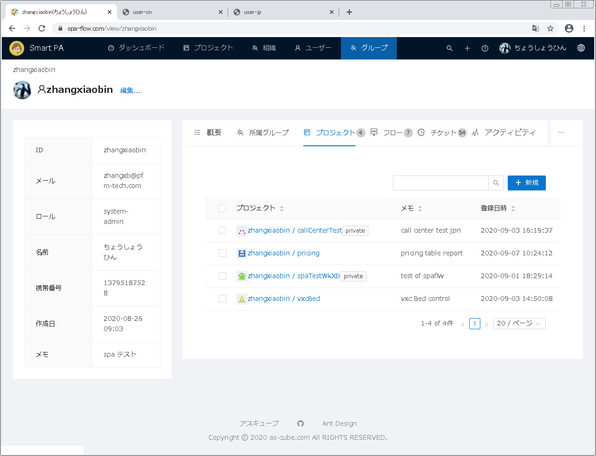
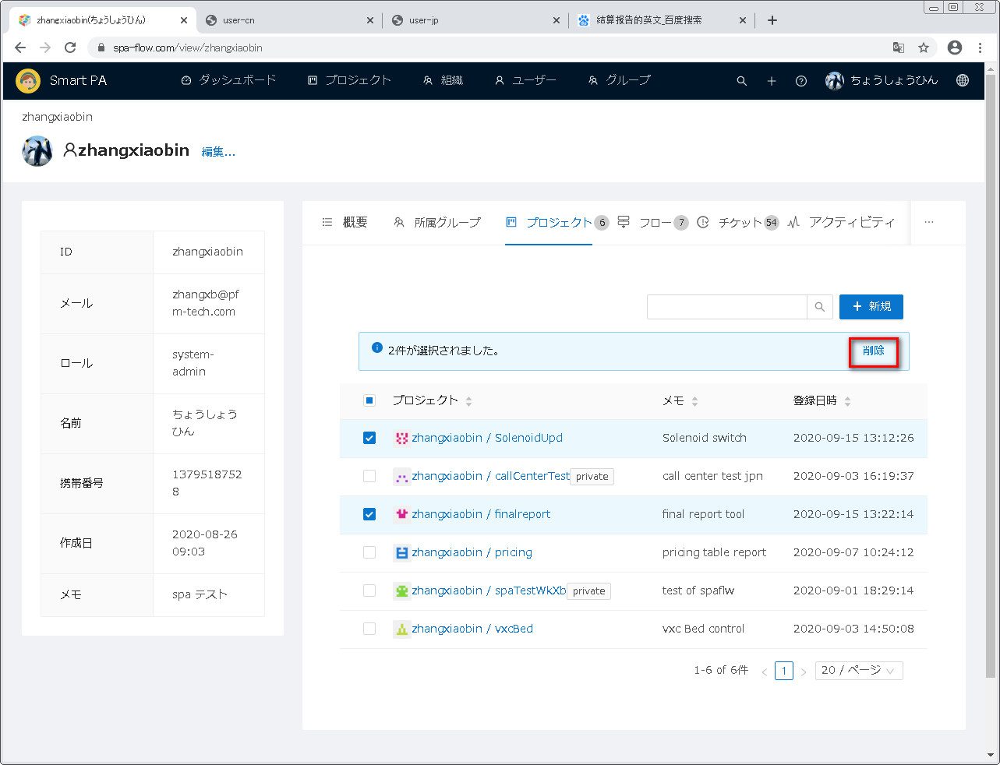
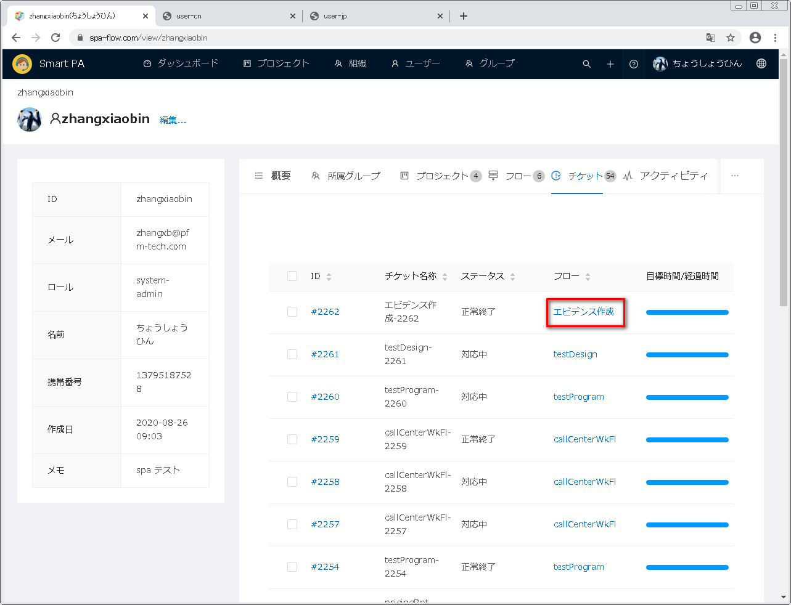
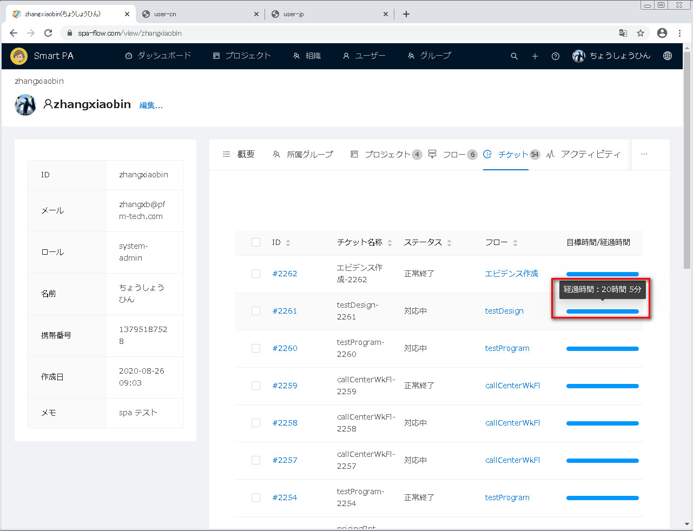
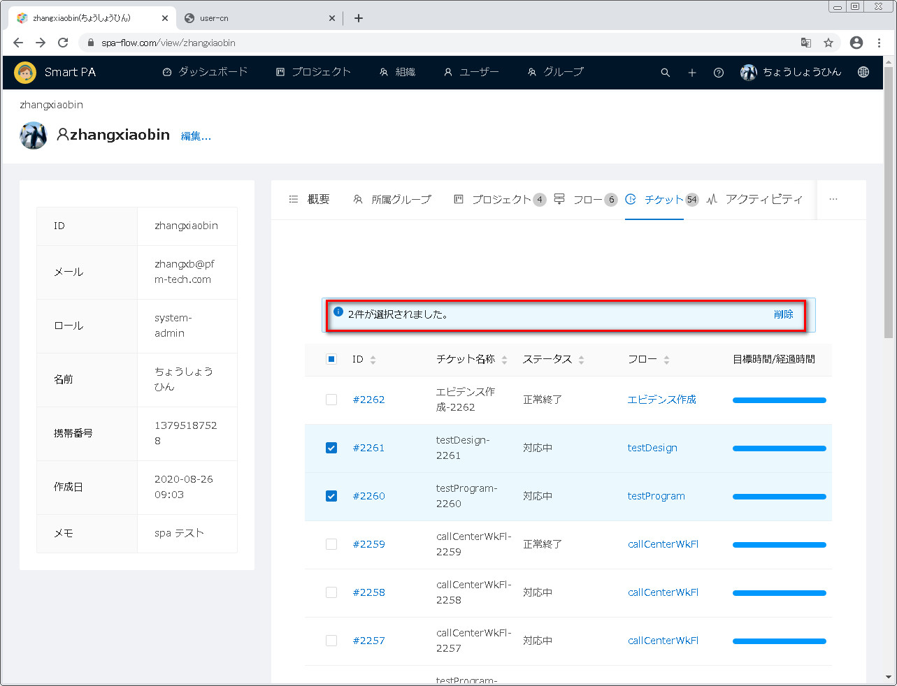

---
#用户管理ユーザー管理
---

##1 ユーザー管理画面を開く

画面上の方の機能メニューに<u>ユーザー</u>をクリックし、ユーザー管理画面が表示されます。

##2 ユーザー検索

###2.1 ユーザーIDに入力した文字列が含まれるユーザーを検索します
下図通りで、ユーザー一覧の上に検索ボックスがあり、これを利用してユーザー検索ができます。
マッチパターンは部分一致で、つまりユーザーIDに検索した文字列を含むユーザーが該当されます。
それに大文字と小文字は区別されません。

まず、検索ボックスに検索文字列を入力します。

検索ボタン（拡大鏡のアイコン）或いはEnterキーをクリックします。

該当したユーザーが検索され、一覧に表示されます。

###2.2 ユーザー全員を表示します
ユーザー全員を表示するには、検索ボックスに入力した文字列を全部消してから、検索ボタン（拡大鏡のアイコン）
或いはEnterキーをクリックします。

##3 ユーザー情報をダウンロードします
ダウンロードボタンを押すことで、ユーザー情報一覧をCSVファイルでダウンロードできます。

赤枠中のダウンロードアイコンをクリックします。

ダウンロードが完了してから、画面底にダウンロード済みのファイルが表示され、そばの矢印をクリックします。

表示されるメニューから、<u>フォルダを開く</u>をクリックします。

フォールダが開かれ、ダウンロードされたファイルが表示されます。

ファイルを開き、ユーザー情報を確認出来ます。

##4 ユーザー新規
ユーザー新規に両方法があります。
&emsp;方法一：ユーザー一覧上の<u>新規</u>ボタンをクリックします
&emsp;方法二：アップロードボタンをクリックし、ユーザー情報のCSVファイルをアップロードしてユーザーを新規します。
&emsp;&emsp;&emsp;&emsp;当方法により複数ユーザーを一回で新規出来ます。

下記で両方法を別々に説明します。

###4.1 ユーザー一覧上の<u>新規</u>ボタンをクリックしてユーザーを新規します
ユーザー一覧上の<u>新規</u>ボタンをクリックします。

ユーザー新規画面が表示されます。

新規するユーザーの情報を入力してから、保存ボタンをクリックします。

ユーザー総合情報管理画面が表示され、当画面で他のユーザー関連情報を確認又は設定できます。

ユーザー一覧に戻り、一覧に新規したユーザーが表示されます。

<u>**ユーザー画像設定の説明：**</u>
下図通りで、アップロードをクリックします。

ファイル選択ダイアログ ボックスが表示されます。

設定する画像を選択してから、開くボタンをクリックします。

画像がアップロードされ、表示されます。

ユーザー画像を変更するには、マウスを画像に移動すると、目のアイコンとゴミ箱にアイコンが表示されます

目のアイコンをクリックすると、画像を拡大できます。

元のサイズに戻すには、拡大枠の右上の×ボタンをクリックしていいです。

画像を変更するには、ゴミ箱のアイコンをクリックして現在の画像を消します。

画像枠にアップロードが再表示され、アップロードをクリックして画像を再設定できます。

###4.2 CSVファイルをアップロードしてユーザーを新規します
ユーザー情報のcsvファイルを用意しておきます。ファイル内容と形式は下図に示すcsvを参照となります。

ユーザー一覧右上のアップロードアイコンをクリックします。

ファイル選択ダイアログボックスが表示されます。

用意したcsvファイルを選択してから、開くボタンをクリックします。

ユーザー一覧画面が再表示され、csvファイルに書かれたユーザーが一覧に表示されます。

##5.ユーザー総合情報管理
確認するユーザーIDをクリックします（ユーザーが多い時に検索により表示件数を縮めて良いです）。

ユーザー総合情報管理画面が表示されます。当画面で下記の機能を提供します。
- 編集：ユーザー基本情報を編集します
- 概要：ユーザーチケットの進捗を確認できます
- 所属グループ：ユーザー所属グループを確認と削除できます
- プロジェクト：ユーザーのプロジェクトを確認、新規と削除できます
- フロー：ユーザーのフローを確認と削除できます
- チケット：ユーザーのチケットを確認と削除できます
- アクティビティ：ユーザー操作の履歴を確認できます
- スニペット：ユーザープロジェクトの備考を確認と削除できます
     

###5.1 ユーザー基本情報を編集します
ユーザー基本情報を編集するには、画面左上の<u>編集</u>ボタンをクリックします。

ユーザー編集画面が表示されます。

ユーザー情報を編集してから、保存ボタンをクリックします。

ユーザー総合情報管理画面に戻り、直されたユーザー情報が再表示されます。

###5.2 概要タグ
ユーザー総合情報管理画面で<u>概要</u>タグをクリックし、概要タグが表示されます。
下図のように日付セルで組まれたテーブルがあり、灰色セルはチケットがない日付で、緑セルはチケットがある日付です。

マウスを確認する日付セルに移動すると、当セルの日付とチケット件数が表示されます。

確認する日付セルをクリックすると、タグの下の方に当日付のチケット進捗が表示されます。

###5.3 所属グループ
所属グループのタグをクリックします。

所属グループ一覧が表示されます。

####5.3.1 所属グループの検索
所属グループ一覧件数が多い時に、一覧右上の検索ボックスで表示件数を縮められます。
マッチパターンが部分一致で、つまりグループIDに入力された検索文字列が含まれるグループが該当されます。

下図通りで、検索ボックスに検索文字列を入力します。

検索ボタン（拡大鏡のアイコン）、又はEnterキーをクリックします。

該当されるグループが検索出来て、一覧に表示されます。

「備考」グループ全件を表示するには、検索ボックスに入力された文字列を全部消してから、
&emsp;&emsp;&emsp;&emsp;検索ボタン（拡大鏡のアイコン）、又はEnterキーをクリックします。

####5.3.2 所属グループの削除
所属グループ一覧から、消す所属グループ前のチェックボックスをチェックオンします。

所属グループの上に選択された件数を削除ボタンが表示されます。

削除ボタンをクリックします。

削除確認ダイアログボックスが表示され、OKボタンをクリックします
（削除を取り消したい時にキャンセルボタンをクリックします）。

所属グループが再表示され、消された所属グループが一覧に無くなりました。

###5.4 プロジェクトタグ
プロジェクトタグをクリックします。

ユーザーのプロジェクト一覧が表示されます。

####5.4.1 プロジェクト検索
プロジェクト件数が多い時に、一覧上の検索ボックスを利用して表示件数を縮められます。
マッチパターンは部分一致で、それに大文字小文字を区別しません。

下図の通りで、検索ボックスに検索文字列を入力します。

検索ボタン（拡大鏡のアイコン）或いはEnterキーをクリックします。

該当したプロジェクトが検索され、一覧に表示されます。

「備考」プロジェクト全件を表示するには検索ボックスに入力した文字列を全部消してから、
&emsp;&emsp;&emsp;&emsp;検索ボタン（拡大鏡のアイコン）、又はEnterキーをクリックします。

####5.4.2 プロジェクト新規
プロジェクトを新規するには、プロジェクト一覧右上の新規ボタンをクリックします。

プロジェクト新規画面が表示されます。

プロジェクト情報を入力してから、保存ボタンをクリックします。

プロジェクト総合管理画面が表示されます。

画面左上のユーザー名のリンクをクリックします。

ユーザー総合情報管理画面に戻り、プロジェクトタグをクリックします。

プロジェクトタグ画面が表示され、新規したプロジェクトがプロジェクト一覧に表示されます。

####5.4.3 プロジェクト削除
プロジェクト一覧から消すプロジェクト前のチェックボックスをチェックオンします。

プロジェクト一覧の上に選択した件数を削除ボタンが表示されます。

削除ボタンをクリックします。

削除確認ダイアログボックスが表示され、OKボタンをクリックします
（削除を取り消したい時にキャンセルボタンをクリックします）。

プロジェクト一覧が再表示され、消されたプロジェクトが一覧に無くなりました。

###5.5 フロータグ　
フロータグをクリックします。

当ユーザーのフロー一覧が表示されます。

####5.5.1 フロー検索
フロー件数が多い時に、一覧上の検索ボックスを利用して表示件数を縮められます。
マッチパターンは部分一致で、それに大文字小文字を区別しません。

下図通りで、検索ボックスに検索文字列を入力します。

検索ボタン（拡大鏡のアイコン）或いはEnterキーをクリックします。

該当したフローが検索され、一覧に表示されます。

「備考」フロー全件を表示するには検索ボックスに入力した文字列を全部消してから、
&emsp;&emsp;&emsp;&emsp;検索ボタン（拡大鏡のアイコン）、又はEnterキーをクリックします。

####5.5.2 フロー削除
フロー一覧に消すフロー前のチェックボックスをチェックオンします。

一覧の上に選択された件数と削除ボタンが表示されます。

削除ボタンをクリックします。

削除確認ダイアログボックスが表示され、OKボタンをクリックします
（削除を取り消したい時にキャンセルボタンをクリックします）。

フローが再表示され、消されたフローが一覧に無くなりました。

###5.6 チケットタグ
チケットタグをクリックします。

ユーザーのチケットタグ一覧が表示されます。

####5.6.1 チケット一覧の各列の説明
(1) フロー
マウスをフローに移動すると、当フローの概要情報が表示されます。

(2) 目標時間/経過時間
当列は、横バーチャットで表示されます。マウスをバーチャットに移動すると、
チケットの経過時間が表示されます。

####5.6.2 チケット削除
チケット一覧から消すチケット前のチェックボックスをチェックオンします。

チケット一覧の上に選択した件数と削除ボタンが表示されます。

削除ボタンをクリックします。

削除確認ダイアログボックスが表示され、OKボタンをクリックします
（削除を取り消したい時にキャンセルボタンをクリックします）。

チケット一覧が再表示され、消されたチケットが一覧に無くなりました。

####5.7 アクティビティタグ
アクティビティタグをクリックします。

アクティビティ一覧が表示され、ここでユーザーの操作履歴を確認できます。

####5.8 スニペットタグ
スニペットタグをクリックします。

スニペット一覧が表示されます。

#####5.8.1 スニペット詳細確認
スニペットのタイトルのリンクをクリックします。

スニペット詳細画面が表示されます。

スニペット情報を編集するには、編集ボタンをクリックします。

スニペット編集画面が表示されます。

スニペット情報を直してから、保存をクリックします。

スニペット詳細画面に戻り、スニペットが再表示されます。

#####5.8.1 スニペット削除
スニペット一覧から消すスニペットをチェックオンします。

スニペット一覧の上に選択した件数と削除ボタンが表示されます。

削除ボタンをクリックします。

削除確認ダイアログボックスが表示され、OKボタンをクリックします
（削除を取り消したい時にキャンセルボタンをクリックします）。

スニペット一覧が再表示され、消されたスニペットが一覧に無くなりました。

##6.ユーザー削除
ユーザー一覧から消すユーザーを選びます。一覧に表示するユーザー数が多すぎ時に、検索で表示数を縮まられます。

消すユーザーを選択したら、一覧の直上に選択件数と削除ボタンが表示されます。

削除ボタンをクリックします。

削除確認ダイアログボックスが表示されます。

確認ダイアログボックスでOKボタンをクリックします(削除を放棄する場合にキャンセルボタンをクリックします)。

ユーザー削除が終わりです。

